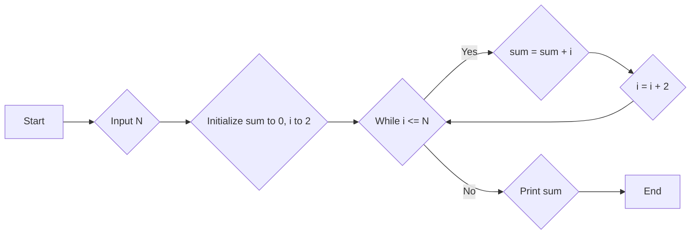

# Question 1:
 7×4=28 Marks

## Question - (a) 
What are the functions of various operational units of a computer system? What is von Neumann Architecture? How can you relate von Neumann architecture to an actual computer? Explain with the help of an example configuration.

**Answer** 
Functions of Operational Units and von Neumann Architecture (Based on General Knowledge)
**Functions of Operational Units:**

A computer system is comprised of various operational units that work together to process data and instructions. Here's a breakdown of some key units:

- **Central Processing Unit (CPU):** The "brain" of the computer, responsible for executing instructions and performing calculations.
- **Memory (RAM):** Holds data and instructions currently being processed by the CPU. It's volatile, meaning data is lost when power is off.
- **Input/Output (I/O) Devices:** Allow users to interact with the computer by providing input (e.g., keyboard, mouse) and displaying output (e.g., monitor, printer).
- **Control Unit (CU):** Fetches instructions from memory, decodes them, and controls the execution of those instructions in the CPU.
- **Arithmetic Logic Unit (ALU):** Performs arithmetic (addition, subtraction) and logical (AND, OR) operations on data.

**von Neumann Architecture:**

The von Neumann Architecture is a fundamental computer architecture model. It consists of the aforementioned units (CPU, memory, I/O, CU, ALU) connected by buses. These buses allow data and instructions to flow between units. 

**Relating von Neumann Architecture to an Actual Computer:**

Imagine a simple calculator. The user's input (pressing buttons) is the input. The display is the output device. The internal circuitry performs calculations (ALU) based on the user's input, following instructions stored in its memory (similar to CPU and RAM). This is a simplified analogy, but portrays the basic principles.

**Example Configuration:**

A typical desktop computer has a CPU like Intel Core i5, RAM like 16GB DDR4, storage like a 1TB hard disk drive (HDD), and various I/O devices like keyboard, mouse, monitor, etc. Each of these components plays a specific role in processing data and instructions according to the von Neumann architecture.


# Q - (b) Compare and contrast the characteristics and/or organization of the following: 

    (i) DRAM Vs. SRAM

    (ii) Access time on Magnetic disks Vs. access time on Magnetic tapes

    (iii) Pen Drive Vs. CD-RW

    (iv) ROM Vs. PROM


**Answer**

## Comparison of Storage Technologies

### (i) DRAM vs. SRAM

| Feature | DRAM | SRAM |
|---|---|---|
| Storage | Capacitors | Flip-flops (transistors) |
| Speed | Slower | Faster |
| Cost | Cheaper | More Expensive |
| Power Consumption | Lower | Higher |
| Volatility | Volatile (loses data when power off) | Volatile (loses data when power off) |
| Typical Use Cases | Main memory (RAM) | CPU cache |

### (ii) Access Time on Magnetic Disks vs. Magnetic Tapes

| Feature | Magnetic Disk | Magnetic Tape |
|---|---|---|
| Access Time | Faster (random access) | Slower (sequential access) |
| Data Organization | Accessed in sectors and tracks | Accessed sequentially, needs fast-forwarding/rewinding |
| Durability | More durable, can withstand some physical abuse | Less durable, susceptible to wear and tear |
| Cost per Unit Capacity | Higher | Lower |
| Typical Use Cases | Secondary storage (hard disk drives, SSDs) | Backup storage, large archives |

### (iii) Pen Drive vs. CD-RW

| Feature | Pen Drive (USB Flash Drive) | CD-RW (Rewritable Compact Disc) |
|---|---|---|
| Rewritability | Rewritable | Rewritable |
| Access Time | Faster | Slower |
| Capacity | Varies (typically 4GB - 2TB) | Typically 650MB - 700MB |
| Portability | Highly portable | Moderately portable |
| Durability | More durable | Less durable, susceptible to scratches |
| Typical Use Cases | Data transfer, portable storage | Data transfer, backup storage (less common than in the past) |

### (iv) ROM vs. PROM

| Feature | ROM (Read-Only Memory) | PROM (Programmable Read-Only Memory) |
|---|---|---|
| Read/Write Capability | Read-only | Programmable once, then read-only |
| Erasability | Not erasable | Not erasable after programming |
| Typical Use Cases | Storing system firmware, BIOS | Storing software, configuration settings |


## Question - (c) 

(c)Convert the following numbers as stated:

    (i) Decimal 64.005125 to binary

    (ii) Decimal 2376 to hexadecimal

    (iii) Character A and Z to ASCII and Unicode Hexadecimal CFE9A to binary


**Answer**
## Converting Numbers

### (i) Decimal 64.005125 to Binary

**Integer Part:**
* 64 / 2 = 32 remainder 0
* 32 / 2 = 16 remainder 0
* 16 / 2 = 8 remainder 0
* 8 / 2 = 4 remainder 0
* 4 / 2 = 2 remainder 0
* 2 / 2 = 1 remainder 0
* 1 / 2 = 0 remainder 1
* Reading the remainders from bottom to top: 1000000

**Fractional Part:**
* 0.005125 * 2 = 0.01025 (0)
* 0.01025 * 2 = 0.0205 (0)
* 0.0205 * 2 = 0.041 (0)
* 0.041 * 2 = 0.082 (0)
* 0.082 * 2 = 0.164 (0)
* 0.164 * 2 = 0.328 (0)
* 0.328 * 2 = 0.656 (0)
* 0.656 * 2 = 1.312 (1)
* 0.312 * 2 = 0.624 (0)
* ... (Continue the process until desired precision or a repeating pattern is observed)

Combining the integer and fractional parts: **1000000.000001** (approximately)

### (ii) Decimal 2376 to Hexadecimal

Using repeated division by 16:
* 2376 / 16 = 148 remainder 8 (8 = 8 in hexadecimal)
* 148 / 16 = 9 remainder 4 (4 = 4 in hexadecimal)
* 9 / 16 = 0 remainder 9 (9 = 9 in hexadecimal)

Reading the remainders from bottom to top: **948**

### (iii) Character A and Z to ASCII and Unicode Hexadecimal CFE9A to Binary

* **Character A:**
    - ASCII: 65
    - Unicode (UTF-8): 41 (hexadecimal)
    - Binary: 01000001
* **Character Z:**
    - ASCII: 90
    - Unicode (UTF-8): 5A (hexadecimal)
    - Binary: 01011010
* **Unicode Hexadecimal CFE9A to Binary:**
    - Convert each hexadecimal digit to its 4-bit binary equivalent:
        - C = 1100
        - F = 1111
        - E = 1110
        - 9 = 1001
        - A = 1010
    - Combine the binary digits: 11001111111010011010


# Question - (d) 

(d) What is an instruction? What are its components? What is the role of an instruction in a computer? Explain with the help of an example. Where does the instruction reside at the time of execution.

**Answer**
**An instruction is a command that tells the computer to perform a specific task.** It's the basic unit of work in a computer system.

**Components of an Instruction:**

1. **Opcode (Operation Code):** This specifies the operation to be performed (e.g., add, subtract, load, store).
2. **Operand(s):** These are the data or memory addresses on which the operation is to be performed.

**Role of an Instruction:**

* **Fetching:** The instruction is fetched from memory.
* **Decoding:** The CPU decodes the instruction to understand the operation and operands.
* **Execution:** The CPU executes the instruction, performing the specified operation on the operands.
* **Storing Result:** The result of the operation is stored in memory or a register.

**Example:**

Consider the following instruction: `ADD R1, R2`

* **Opcode:** `ADD` specifies the addition operation.
* **Operands:** `R1` and `R2` are registers, which hold data.

This instruction tells the CPU to add the values stored in registers R1 and R2 and store the result in one of the registers (usually R1).

**Instruction Residence:**

At the time of execution, the instruction is fetched from the main memory (RAM) into the CPU's instruction register. Once fetched, it's decoded and executed by the CPU's control unit.


# Question - (e)
(e) A 2.5 inch diameter disk has 8 platters with each platter having two
    data recording surfaces, each platter on disk has 4084 tracks, each
    track has 400 sectors and one sector can store 1 MB of data.
    Calculate the storage capacity of this disk in Bytes. If this disk
    has a seek time of 2 milli-seconds and rotates at the speed of 6000
    rpm, find the Access time for the disk. Make suitable assumptions,
    if any.


**Answer**

## Calculating Storage Capacity and Access Time

### Storage Capacity

**Given:**
* Number of platters = 8
* Number of surfaces per platter = 2
* Number of tracks per surface = 4084
* Number of sectors per track = 400
* Bytes per sector = 1 MB = 1024 * 1024 bytes

**Calculation:**
* Total number of surfaces = 8 platters * 2 surfaces/platter = 16 surfaces
* Total number of tracks = 16 surfaces * 4084 tracks/surface = 65344 tracks
* Total number of sectors = 65344 tracks * 400 sectors/track = 26,137,600 sectors
* Total storage capacity = 26,137,600 sectors * 1,048,576 bytes/sector = **27,487,790,656 bytes** or approximately **27 TB**.

### Access Time

**Given:**
* Seek time = 2 milliseconds
* Rotation speed = 6000 RPM (revolutions per minute)

**Calculation:**
* **Rotational Latency:**
  - Time for one complete rotation = 60 seconds / 6000 rotations = 0.01 seconds
  - Average rotational latency = 0.01 seconds / 2 = 0.005 seconds or 5 milliseconds
* **Total Average Access Time:**
  - Seek time + Rotational latency = 2 milliseconds + 5 milliseconds = 7 milliseconds

**Therefore, the average access time for the disk is 7 milliseconds.**

**Note:** This is an average access time. The actual access time can vary depending on factors like the specific location of the data on the disk.


# Question - (f)
(f) What are the uses of various components of motherboard of a
    computer? List at least four output devices and ports to which these
    devices can be connected. Explain the characteristics of these
    output devices and ports.


**Answer**
## Functions of Motherboard Components and Output Devices

### Motherboard Components

The motherboard is the backbone of a computer system, housing various components and facilitating communication between them. Here are some key components and their functions:

* **CPU Socket:** Holds the central processing unit (CPU), which performs calculations and controls other components.
* **Memory Slots:** Accommodate RAM (Random Access Memory) modules, which store data and instructions for the CPU.
* **Expansion Slots:** Allow for the addition of expansion cards like graphics cards, sound cards, and network cards.
* **Chipset:** Manages communication between the CPU, RAM, and other components.
* **BIOS Chip:** Contains firmware that initializes the system when it's powered on.
* **Storage Interfaces:** Connect to storage devices like hard drives and SSDs.
* **I/O Ports:** Provide connections for various input/output devices.

### Output Devices and Ports

1. **Monitor:** Displays visual information.
   * **Ports:** VGA, DVI, HDMI, DisplayPort
   * **Characteristics:** Different resolutions, refresh rates, and color depths.

2. **Printer:** Produces hard copies of documents.
   * **Ports:** USB, Parallel, Network
   * **Characteristics:** Different print speeds, resolutions, and color capabilities.

3. **Speakers:** Output audio signals.
   * **Ports:** 3.5mm audio jack
   * **Characteristics:** Different sound quality, power output, and frequency response.

4. **Projector:** Displays images on a large screen.
   * **Ports:** HDMI, VGA, DisplayPort
   * **Characteristics:** Different resolutions, brightness, and contrast ratios.

These are just a few examples of output devices and ports. The specific types and capabilities of these devices can vary depending on the computer system.


# Question (g)

(g) What are the uses of following software / utility:

    (i) Data Compression Utility

    (ii) Media Player

    (iii) Disk Defragmenter

    (iv) Disk checker


**Answer**

## Uses of Software and Utilities

### (i) Data Compression Utility

* **Reduces file size:** Makes files smaller, saving storage space and reducing transmission time.
* **Efficient data storage and transfer:** Allows for faster downloads and uploads.
* **Archiving:** Helps in creating compressed archives for backup and storage.
* **Secure data transmission:** Reduces the size of files to be transmitted over networks, improving security.

### (ii) Media Player

* **Plays multimedia files:** Supports various audio and video formats.
* **Organizes media libraries:** Manages and categorizes media files.
* **Provides playback controls:** Allows users to control playback speed, volume, and other settings.
* **Enhances media experience:** Offers features like equalization, surround sound, and visualization.

### (iii) Disk Defragmenter

* **Improves disk performance:** Rearranges fragmented files on a hard disk drive, making them more contiguous.
* **Faster access to data:** Reduces the time taken to access files and programs.
* **Boosts system responsiveness:** Improves overall system performance.

### (iv) Disk Checker

* **Scans for errors:** Detects and repairs file system errors and bad sectors.
* **Verifies data integrity:** Ensures data consistency and accuracy.
* **Optimizes disk performance:** Identifies and fixes issues that can impact disk performance.
* **Prevents data loss:** Helps prevent data loss by identifying and repairing potential problems.


# Question 2: 7×4=28 Marks


# Question - (a)
(a) Why do you need virus detection software? What are their drawbacks?
    What are the techniques to identify a virus? List any 4 latest virus
    for desktop systems.

**Answer**

## Why You Need Virus Detection Software

**Virus detection software is essential for protecting your computer system from malicious threats such as viruses, malware, ransomware, and spyware.** These threats can damage your system, steal personal information, or even hold your data hostage.

**Drawbacks of Virus Detection Software:**

* **Resource Intensive:** Antivirus software can consume system resources, slowing down your computer, especially during scans.
* **False Positives:** Sometimes, antivirus software may mistakenly identify legitimate files as threats, leading to unnecessary alerts and potential data loss.
* **Complex Configuration:** Some antivirus software can be complex to configure, especially for users who are not tech-savvy.

**Techniques to Identify a Virus:**

1. **Heuristic Analysis:** Analyzing the behavior of a program to identify malicious patterns.
2. **Signature-Based Detection:** Comparing files to known virus signatures.
3. **Behavioral Analysis:** Monitoring the behavior of running programs to detect suspicious activity.
4. **Cloud-Based Scanning:** Leveraging cloud computing to analyze files and detect threats using collective intelligence.

**4 Latest Virus Threats for Desktop Systems:**

1. **Ransomware:** Malicious software that encrypts your files and demands a ransom to decrypt them.
2. **Phishing Attacks:** Deceitful tactics used to trick users into revealing sensitive information.
3. **Zero-Day Exploits:** Exploits that target vulnerabilities in software before a patch is released.
4. **Cryptojacking:** Malicious software that uses your computer's resources to mine cryptocurrency without your consent.

By using reliable antivirus software and practicing safe computing habits, you can significantly reduce the risk of infection from these threats.


# Question - (b)
(b) Consider that you have to run several computer programs
    simultaneously on a computer. Each program takes input from a file
    and output information on a printer. How does different components
    of an Operating system (like memory management, I/O management,
    Process management, file system and user interface) will help in
    execution of these programs.
    
**Answer**
## How OS Components Facilitate Simultaneous Program Execution

**Memory Management:**
* **Allocates Memory:** Assigns specific memory blocks to each program.
* **Swapping:** Moves inactive programs to secondary storage to free up RAM for active ones.
* **Virtual Memory:** Creates the illusion of more memory than physically available, improving efficiency.

**I/O Management:**
* **Handles Input/Output Requests:** Manages data transfer between programs and devices (e.g., keyboard, mouse, printer).
* **Buffers Data:** Stores data temporarily, optimizing data transfer and reducing CPU wait times.
* **Schedules I/O Operations:** Prioritizes and schedules I/O requests to ensure efficient resource utilization.

**Process Management:**
* **Creates and Terminates Processes:** Manages the lifecycle of each program.
* **Schedules Processes:** Determines which process gets CPU time and for how long.
* **Context Switching:** Switches between processes to allow multitasking.
* **Handles Interrupts:** Responds to hardware interrupts and software signals.

**File System:**
* **Organizes Data:** Stores and retrieves files and directories.
* **Manages Disk Space:** Allocates and deallocates disk space efficiently.
* **Provides Access Control:** Controls who can access and modify files.

**User Interface:**
* **Provides User Interaction:** Allows users to interact with the system through a graphical user interface (GUI) or command-line interface (CLI).
* **Handles Input and Output:** Translates user input into commands and displays output on the screen or other devices.

**In essence, these components work together to:**

* **Share Resources:** Multiple programs can share system resources like CPU, memory, and I/O devices.
* **Efficient Scheduling:** The OS ensures that each program gets a fair share of CPU time.
* **Input/Output Handling:** The OS manages the flow of data between programs and devices.
* **Error Handling:** The OS detects and handles errors, protecting the system from crashes.

By effectively managing these tasks, the operating system allows multiple programs to run concurrently, improving overall system efficiency and user experience.


# Question - (c)

(c) Explain the differences between procedural programming and object
    oriented programming with the help of one example program of each.


**Answer**

## Procedural vs. Object-Oriented Programming

**Procedural Programming**

In procedural programming, the focus is on procedures or functions that perform specific tasks. Data and functions are separate entities.

**Example (C):**

```c
#include <stdio.h>

void add(int a, int b) {
    int sum = a + b;
    printf("Sum: %d\n", sum);
}

int main() {
    int num1 = 10, num2 = 20;
    add(num1, num2);
    return 0;
}
```

**Object-Oriented Programming (OOP)**

In OOP, the focus is on objects, which are instances of classes. Classes define the properties (attributes) and behaviors (methods) of objects. 

**Example (Java):**

```java
public class Car {
    private String color;
    private int mileage;

    public void start() {
        System.out.println("Car started.");
    }

    public void stop() {
        System.out.println("Car stopped.");
    }
}

public class Main {
    public static void main(String[] args) {
        Car car1 = new Car();
        car1.color = "Red";
        car1.mileage = 20000;
        car1.start();
        car1.stop();
    }
}
```

**Key Differences:**

| Feature | Procedural Programming | Object-Oriented Programming |
|---|---|---|
| Focus | Procedures/Functions | Objects |
| Data and Functions | Separate | Encapsulated within objects |
| Modularity | Less modular | Highly modular |
| Reusability | Lower reusability | Higher reusability |
| Problem-solving approach | Top-down approach | Bottom-up approach |

**In essence:**

* **Procedural programming** is like a recipe, where you follow a sequence of steps to achieve a result.
* **Object-oriented programming** is like building a house, where you create objects (like rooms) with specific properties (size, color) and behaviors (opening, closing). 

By understanding these fundamental differences, you can choose the appropriate programming paradigm for your specific project.


# Question - (d)

(d) Draw a flow chart of a program that adds N even numbers starting
    from 1. The value of N should be input by the user.

**Answer**


This flowchart visualizes the logic of the program:

1. **Start:** The program begins.
2. **Input N:** The user is prompted to enter the value of N.
3. **Initialize:** The variables `sum` and `i` are initialized to 0 and 2, respectively.
4. **While Loop:**
   - **Condition Check:** The loop continues as long as `i` is less than or equal to `N`.
   - **Sum Calculation:** The current value of `i` is added to the `sum`.
   - **Increment:** The value of `i` is incremented by 2 to consider only even numbers.
5. **Print Sum:** After the loop, the final value of `sum` is printed.
6. **End:** The program terminates.


# Question - (e)

(e) List the elements of a programming language. Explain the terms data
    type, expression, assignment; and logical, relational and equality
    operators with the help of an example each.

**Answer**

## Elements of a Programming Language

A programming language consists of various elements that work together to create executable code. Here are some of the key elements:

1. **Keywords:** Reserved words with special meanings in the language (e.g., `if`, `else`, `for`, `while`).
2. **Identifiers:** Names given to variables, functions, and other entities.
3. **Literals:** Constant values, such as numbers (e.g., `10`, `3.14`), characters (e.g., 'a'), and strings (e.g., "Hello, world!").
4. **Operators:** Symbols used to perform operations on data (e.g., `+`, `-`, `*`, `/`, `==`, `!=`).
5. **Punctuators:** Special characters that separate different parts of the code (e.g., `;`, `(`, `)`, `[`, `]`, `{}`).
6. **Comments:** Non-executable text used to explain the code (e.g., `// single-line comment`, `/* multi-line comment */`).

## Data Types, Expressions, Assignment, and Operators

**Data Types:**
* **Integer:** Represents whole numbers (e.g., `int`, `long`).
* **Floating-Point:** Represents real numbers with decimal points (e.g., `float`, `double`).
* **Character:** Represents a single character (e.g., `char`).
* **String:** Represents a sequence of characters (e.g., "Hello, world!").
* **Boolean:** Represents a logical value (true or false).

**Expressions:**
An expression is a combination of values, variables, operators, and function calls that evaluates to a single value. For example: `x + y * 2` is an expression that adds the product of `y` and 2 to the value of `x`.

**Assignment:**
An assignment statement assigns a value to a variable. For example: `x = 10` assigns the value 10 to the variable `x`.

**Operators:**
* **Arithmetic Operators:** `+` (addition), `-` (subtraction), `*` (multiplication), `/` (division), `%` (modulo)
  * Example: `result = 10 + 5;`
* **Relational Operators:** `==` (equal to), `!=` (not equal to), `<` (less than), `>` (greater than), `<=` (less than or equal to), `>=` (greater than or equal to)
  * Example: `if (x > y)`
* **Logical Operators:** `&&` (AND), `||` (OR), `!` (NOT)
  * Example: `if (x > 10 && y < 5)`

# Question - (f)

(f) What are the phases of project development in which project
    management software can help

Explain with the help of examples.

**Answer**
## Project Management Phases and the Role of Project Management Software

Project management software can significantly aid in managing projects throughout their various phases. Here's a breakdown of how project management software can be utilized in each phase:

### 1. **Initiation Phase**
* **Defining Project Scope:** Clearly define the project goals, objectives, and deliverables.
* **Identifying Stakeholders:** Identify all individuals or groups who may be affected by or have an interest in the project.
* **Creating a Project Charter:** Develop a formal document that outlines the project's objectives, scope, timeline, and budget.

**Project Management Software Role:**
* **Centralized Repository:** Stores project documentation, including the project charter, business case, and project plan.
* **Task Management:** Helps in breaking down the project into smaller, manageable tasks.
* **Collaboration:** Facilitates communication and collaboration among team members.

### 2. **Planning Phase**
* **Work Breakdown Structure (WBS):** Decomposes the project into smaller, manageable tasks.
* **Task Scheduling:** Creates a project schedule, assigning tasks to team members and setting deadlines.
* **Resource Allocation:** Allocates resources (human, financial, and physical) to tasks.
* **Risk Management:** Identifies potential risks and develops mitigation strategies.

**Project Management Software Role:**
* **Task Management:** Enables the creation of tasks, subtasks, and dependencies.
* **Time Tracking:** Allows for accurate time tracking and resource allocation.
* **Gantt Charts:** Provides visual representations of project timelines and dependencies.
* **Risk Management:** Helps in identifying, assessing, and mitigating risks.

### 3. **Execution Phase**
* **Task Execution:** Assigning tasks to team members and monitoring their progress.
* **Quality Control:** Ensuring that the project deliverables meet quality standards.
* **Communication:** Maintaining effective communication with the project team and stakeholders.

**Project Management Software Role:**
* **Task Management:** Tracks the progress of tasks and identifies potential bottlenecks.
* **Time Tracking:** Monitors the time spent on tasks.
* **Collaboration Tools:** Facilitates communication and collaboration among team members.
* **Document Management:** Stores and manages project documents.

### 4. **Monitoring and Control Phase**
* **Progress Tracking:** Monitoring the project's progress against the project plan.
* **Performance Measurement:** Measuring key performance indicators (KPIs) to assess project performance.
* **Issue Tracking:** Identifying and resolving issues and risks.

**Project Management Software Role:**
* **Reporting:** Generates reports on project progress, resource utilization, and financial performance.
* **Dashboards:** Provides visual representations of key project metrics.
* **Issue Tracking:** Allows for the tracking and resolution of issues and defects.

### 5. **Closure Phase**
* **Project Completion:** Finalizing the project deliverables.
* **Evaluation:** Assessing the project's success and identifying lessons learned.
* **Documentation:** Archiving project documentation for future reference.

**Project Management Software Role:**
* **Document Management:** Stores project documentation, including final reports and lessons learned.
* **Project Closure:** Provides tools to formally close the project and archive relevant information.

By effectively utilizing project management software, organizations can streamline their project management processes, improve efficiency, and increase the likelihood of project success.


# Question - (g)

(g) Explain the following with the help of an example/diagram, if
    needed:

    (i) Development Model for Open Source Software

    (ii) Tools for program development

    (iii) Use of functions and Macros

    (iv) Database and Database Management System

**Answer**
## (i) Development Model for Open Source Software

**Open Source Development Model** is a collaborative approach where source code is freely available to the public. This allows for community-driven development, where anyone can contribute to the project.

**Common Development Models for Open Source Software:**

1. **Fork-and-Pull Model:**
   - A developer forks the original repository.
   - Makes changes to the forked repository.
   - Submits a pull request to the original repository.
   - The original project maintainer reviews and merges the changes.

2. **Distributed Version Control:**
   - Uses tools like Git to manage code changes.
   - Developers can work on different branches simultaneously.
   - Changes are merged using a decentralized approach.

**Example:** The Linux kernel is a prominent example of open-source software developed using a distributed version control model. Developers around the world contribute to its development, and the community reviews and merges changes.

## (ii) Tools for Program Development

Various tools are used in program development:

* **Text Editors:** For writing and editing code (e.g., Vim, Emacs, Sublime Text, Visual Studio Code).
* **Compilers and Interpreters:** Convert human-readable code into machine-executable code.
* **Debuggers:** Help identify and fix errors in code.
* **Version Control Systems:** Manage changes to source code (e.g., Git, SVN).
* **Build Tools:** Automate the building and testing of software (e.g., Maven, Gradle).
* **Integrated Development Environments (IDEs):** Provide a comprehensive environment for coding, debugging, and testing (e.g., Eclipse, IntelliJ IDEA, Visual Studio).

## (iii) Use of Functions and Macros

**Functions:**
* Reusable blocks of code that perform a specific task.
* Improve code modularity and readability.
* Can take input parameters and return a value.

**Example (C):**

```c
int add(int a, int b) {
    return a + b;
}
```

**Macros:**
* Textual substitutions defined by the programmer.
* Can be used to define constants, common code snippets, or complex expressions.
* Preprocessor expands macros before compilation.

**Example (C):**

```c
#define PI 3.14159
#define SQUARE(x) (x * x)
```

## (iv) Database and Database Management System (DBMS)

A **database** is a structured collection of data. A **Database Management System (DBMS)** is a software system used to manage and organize databases.

**Key Components of a DBMS:**

* **Data Definition Language (DDL):** Used to define the structure of the database (e.g., creating tables, defining data types).
* **Data Manipulation Language (DML):** Used to manipulate data within the database (e.g., inserting, updating, deleting data).
* **Data Query Language (DQL):** Used to query the database and retrieve specific data (e.g., SELECT statement).
* **Data Control Language (DCL):** Used to control access to the database (e.g., granting and revoking permissions).

**Example:** A simple database for storing student information might have tables like `students` and `courses`. The `students` table could have columns for `student_id`, `name`, and `age`, while the `courses` table could have columns for `course_id`, `course_name`, and `instructor`.


# Question 3: 6×4=24 Marks

# Question - (a)

(a) Explain the characteristics of any two guided and any two unguided
    channels for data transmission.
    ## Guided and Unguided Channels

**Answer**

**Guided Channels**

Guided channels, also known as wired or bounded transmission media, use physical cables to transmit signals. They offer higher data rates, better security, and lower error rates.

**Examples:**

1. **Twisted Pair Cable:**
   * Composed of two insulated copper wires twisted together.
   * Used in Ethernet networks and telephone lines.
   * Low cost, easy to install, but susceptible to interference.

2. **Fiber Optic Cable:**
   * Uses light pulses to transmit data through thin strands of glass or plastic.
   * High bandwidth, low attenuation, and immunity to electromagnetic interference.
   * Used in long-distance communication and high-speed networks.

**Unguided Channels**

Unguided channels, also known as wireless or unbounded transmission media, transmit signals through the air. They offer flexibility and mobility but are more susceptible to interference and security risks.

**Examples:**

1. **Radio Waves:**
   * Used for radio and television broadcasts, as well as cellular networks.
   * Can travel long distances but are susceptible to interference and fading.

2. **Microwaves:**
   * High-frequency radio waves used for point-to-point communication, satellite communication, and radar systems.
   * High bandwidth, but can be affected by atmospheric conditions and obstacles.

**Key Differences:**

| Feature | Guided Media | Unguided Media |
|---|---|---|
| Physical Medium | Cables | Air |
| Data Rate | Higher | Lower |
| Security | More secure | Less secure |
| Interference | Less susceptible | More susceptible |
| Cost | Higher installation cost | Lower installation cost |

The choice of transmission media depends on factors such as distance, data rate, security requirements, and cost.


# Question - (b)

(b) Four branch offices of an organisation are located in four major
    cities of a vast country. Explain the characteristics of the network
    that will be needed for every branch office. All the four branch
    offices network should also be connected by another network. Explain
    the characteristics of this network also.

**Answer**

## Designing a Network for a Multi-Site Organization

### Understanding the Requirements
To effectively connect four branch offices across a vast country, we need to consider factors like distance, data transfer rates, security, and reliability.

### Network Characteristics for Branch Offices

**Each branch office would require a Local Area Network (LAN):**

* **High-Speed Connectivity:** Ethernet networks with Gigabit Ethernet or faster speeds are ideal for efficient data transfer within the office.
* **Wired and Wireless Networks:** A combination of wired (Ethernet cables) and wireless (Wi-Fi) networks can provide flexibility and convenience.
* **Security:** Strong security measures, such as firewalls, intrusion detection systems, and access control, are essential to protect sensitive data.
* **Scalability:** The network should be designed to accommodate future growth and expansion.

### Wide Area Network (WAN) Connecting Branch Offices

To connect the four branch offices, a Wide Area Network (WAN) is required. This WAN can be implemented using various technologies:

**1. Leased Line:**
   * **Dedicated connection:** A private, point-to-point connection between two locations.
   * **High bandwidth and reliability:** Suitable for high-bandwidth applications like video conferencing and file transfers.
   * **High cost:** Can be expensive, especially for long distances.

**2. Virtual Private Network (VPN):**
   * **Encrypted connection:** Creates a secure, private network over a public network (like the internet).
   * **Cost-effective:** Lower cost compared to leased lines, especially for long distances.
   * **Security:** Encrypts data to protect sensitive information.

**3. MPLS (Multiprotocol Label Switching):**
   * **High-performance network:** Provides efficient and reliable data transfer.
   * **Quality of Service (QoS):** Ensures prioritized delivery of critical traffic.
   * **Scalability:** Can handle large amounts of data and supports multiple protocols.

**Key Considerations:**

* **Bandwidth:** The WAN should provide sufficient bandwidth to handle the expected data traffic between branches.
* **Latency:** Low latency is crucial for real-time applications like video conferencing and remote desktop access.
* **Security:** Strong security measures, such as firewalls, intrusion detection systems, and encryption, should be implemented to protect sensitive data.
* **Reliability:** The network should be highly reliable to minimize downtime and ensure business continuity.
* **Scalability:** The network should be able to accommodate future growth and changes in business requirements.

By carefully considering these factors, organizations can design and implement a robust network infrastructure to connect their branch offices effectively.


# Question - (c)

(c) What is Internet? What are the major protocols used on Internet?
    What is an IP address? How can an IP address be related to a web
    address? Explain with the help of an example.
**Answer**
## The Internet: A Global Network

**What is the Internet?**

The Internet is a global network of interconnected computers that communicate with each other using a standardized set of protocols. It allows users to access information and services from anywhere in the world. 

**Major Protocols:**

* **TCP/IP:** This is the fundamental protocol suite for the Internet. It provides a reliable and efficient way to transmit data across networks.
    - **TCP (Transmission Control Protocol):** Ensures reliable data transmission by breaking data into packets, numbering them, and reassembling them in the correct order.
    - **IP (Internet Protocol):** Handles the addressing and routing of packets across the network.

* **HTTP (Hypertext Transfer Protocol):** Used for communication between web browsers and web servers. It defines how messages are formatted and transmitted.
* **FTP (File Transfer Protocol):** Used to transfer files between computers on a network.
* **SMTP (Simple Mail Transfer Protocol):** Used to send and receive email messages.
* **POP3 (Post Office Protocol 3) and IMAP (Internet Message Access Protocol):** Used to retrieve email messages from a mail server.

**IP Address:**

An IP address is a unique numerical label assigned to each device connected to a computer network. It's used to identify and locate devices on the network. There are two main types of IP addresses:

* **IPv4:** A 32-bit address represented in dotted decimal notation (e.g., 192.168.1.1).
* **IPv6:** A 128-bit address, designed to accommodate the growing number of devices on the internet.

**IP Address and Web Address:**

A web address (URL) is a human-readable address that corresponds to an IP address. When you type a URL into your web browser, your computer uses a Domain Name System (DNS) to translate the URL into an IP address.

For example, when you type `https://www.google.com` into your browser, your computer queries a DNS server to find the IP address associated with `google.com`. Once it has the IP address, your computer can send a request to the server hosting the Google website.


# Question - (d)

(d) What are the different features of a browser? If you want to perform
    Online Banking Transactions, what precautions will you take before
    performing a transaction?
**Answer**
## Features of a Web Browser

A web browser is a software application that allows users to access and interact with websites on the internet. Here are some of its key features:

* **URL Bar:** Allows you to enter the address of a website you want to visit.
* **Navigation Buttons:** Provides buttons to go back, forward, refresh, and home.
* **Address Bar:** Displays the URL of the current webpage.
* **Tabbed Browsing:** Enables you to open multiple webpages in different tabs.
* **Bookmarking:** Saves favorite websites for quick access.
* **History:** Keeps a record of recently visited websites.
* **Download Manager:** Downloads files from the internet.
* **Search Bar:** Allows you to search the web using a search engine.
* **Pop-up Blocker:** Prevents unwanted pop-up windows from opening.
* **Ad Blocker:** Blocks advertisements on websites.
* **Incognito Mode:** Enables private browsing without saving browsing history.
* **Extensions:** Allows you to add additional features and functionality to the browser.

## Precautions for Online Banking Transactions

When performing online banking transactions, it's crucial to take the following precautions:

1. **Strong, Unique Passwords:**
   * Use strong, unique passwords for your online banking account.
   * Avoid using easily guessable information like birthdays or pet names.
   * Consider using a password manager to generate and store strong passwords.

2. **Secure Connection:**
   * Ensure you're connected to a secure Wi-Fi network or use a VPN for public Wi-Fi.
   * Look for the HTTPS protocol in the URL, indicated by a padlock icon.

3. **Beware of Phishing Attacks:**
   * Be cautious of suspicious emails or messages that ask for personal information.
   * Never click on links or download attachments from unknown sources.
   * Verify the website's URL before entering any sensitive information.

4. **Keep Software Updated:**
   * Regularly update your operating system and web browser to patch security vulnerabilities.
   * Keep your antivirus software up-to-date to protect against malware.

5. **Use Two-Factor Authentication (2FA):**
   * Enable 2FA to add an extra layer of security to your account.
   * This typically involves entering a code sent to your phone or email in addition to your password.

6. **Monitor Your Account Activity:**
   * Regularly review your account statements and transaction history.
   * Report any suspicious activity to your bank immediately.

7. **Avoid Public Computers:**
   * Refrain from accessing your online banking account on public computers.
   * If you must use a public computer, clear the browsing history and cache after each session.

By following these precautions, you can significantly reduce the risk of unauthorized access to your online banking account.


# Question - (e)

(e) Describe the process of creating a web email account. What are the
    different components of a mail message? Explain with the help of a
    diagram.

**Answer**
## Creating a Web Email Account

Creating a web email account is a straightforward process that involves signing up with an email service provider like Gmail, Yahoo, or Outlook. Here's a general overview:

1. **Choose an Email Provider:** Select a reputable email provider based on your needs and preferences.
2. **Visit the Provider's Website:** Go to the website of your chosen provider (e.g., gmail.com, yahoo.com, outlook.com).
3. **Sign Up:** Click on the "Sign Up" or "Create Account" button and follow the on-screen instructions.
4. **Provide Information:** You'll typically need to provide your name, a desired email address, and a strong password.
5. **Verify Your Account:** Verify your account by following the instructions in the verification email or SMS.
6. **Start Using Your Email:** Once verified, you can access your inbox, compose emails, and manage your account settings.

## Components of an Email Message

An email message typically consists of the following components:

1. **Header:**
   - **Sender's Address:** The email address of the person sending the message.
   - **Recipient's Address:** The email address of the intended recipient(s).
   - **Subject:** A brief description of the message's content.
   - **Date and Time:** The date and time the email was sent.

2. **Body:**
   - The main content of the email, including text, images, and other multimedia elements.

3. **Attachments:**
   - Optional files attached to the email, such as documents, images, or spreadsheets.

4. **Footer:**
   - Optional section at the end of the email, often containing a signature, contact information, or disclaimers.

[Image of an email structure with header, body, attachments, and footer]

By understanding these components, you can effectively compose and send emails.


# Question - (f)

(f) Explain the following in the context of Internet and its
    applications, giving their features and uses:

    (i) Online Education

    (ii) eCommerce

**Answer**
## Internet Applications: Online Education and eCommerce

### (i) Online Education

**Online education** is a form of learning that uses electronic technologies to deliver educational courses over the Internet. It offers flexibility, accessibility, and a variety of learning experiences. 

**Key Features of Online Education:**

* **Asynchronous Learning:** Students can learn at their own pace, without the need for real-time interaction with instructors. 
* **Synchronous Learning:** Live, real-time interaction between instructors and students, often through video conferencing.
* **Flexible Learning:** Students can access course materials and complete assignments from anywhere with an internet connection.
* **Diverse Learning Materials:** Online courses often include a mix of text, video, audio, and interactive elements.
* **Community and Collaboration:** Online platforms enable students to interact with peers and instructors through discussion forums, chat rooms, and collaborative tools.

**Uses of Online Education:**
* **Distance Learning:** Students can access education from anywhere in the world.
* **Professional Development:** Professionals can continue their education and acquire new skills.
* **K-12 Education:** Online learning can supplement traditional classroom instruction.
* **Corporate Training:** Businesses can train employees remotely.

### (ii) eCommerce

**E-commerce** is the buying and selling of goods and services over the internet. It has revolutionized the way people shop and businesses operate. 

**Key Features of E-commerce:**

* **Online Stores:** Websites that allow customers to browse and purchase products.
* **Digital Payment Systems:** Secure methods for online transactions, such as credit cards, debit cards, and digital wallets.
* **Shopping Cart:** A virtual cart where customers can add items before checkout.
* **Customer Reviews and Ratings:** Provides feedback and recommendations from other customers.
* **Personalized Recommendations:** Uses algorithms to suggest products based on past purchases and browsing history.

**Uses of E-commerce:**

* **Retail:** Online stores selling a wide range of products, from clothing to electronics.
* **Services:** Online booking of travel, accommodation, and other services.
* **Digital Products:** Sale of digital products like software, music, and ebooks.
* **B2B Commerce:** Business-to-business transactions, such as wholesale and supply chain management. 
