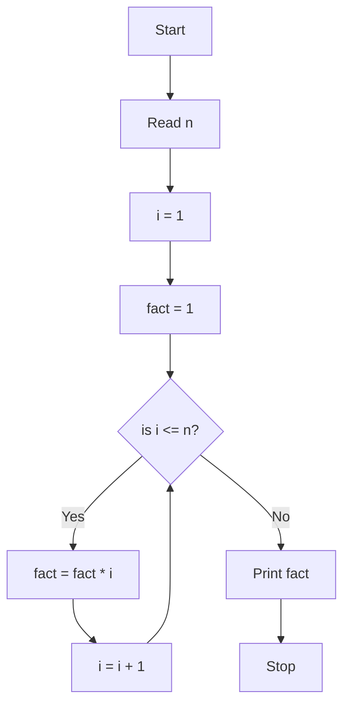

```mermaid
flowchart TD
    A[Start] --> B[Read n]
    B --> C[i = 1]
    C --> D[fact = 1]
    D --> E{is i <= n?}
    E -- Yes --> F[fact = fact * i]
    F --> G[i = i + 1]
    G --> E
    E -- No --> H[Print fact]
    H --> I[Stop]
```
