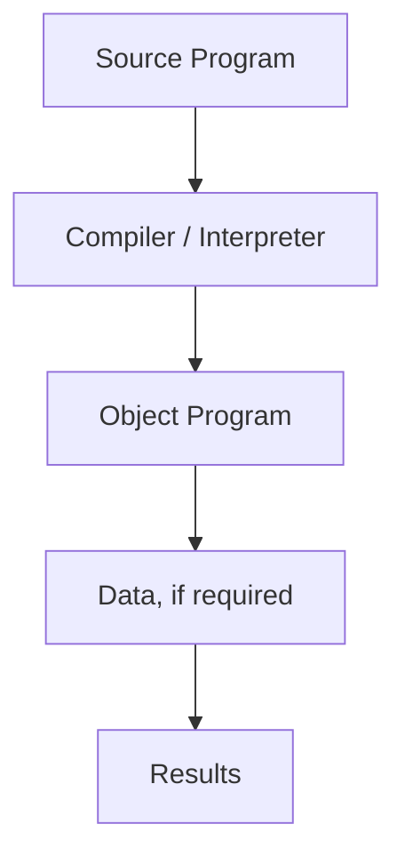
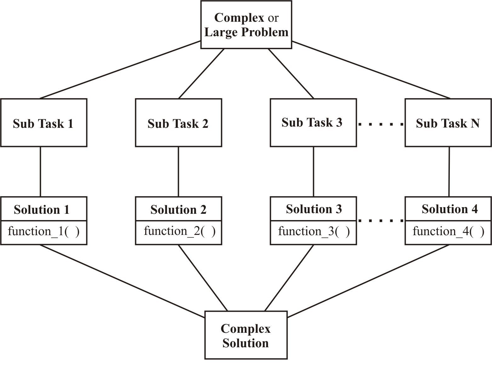
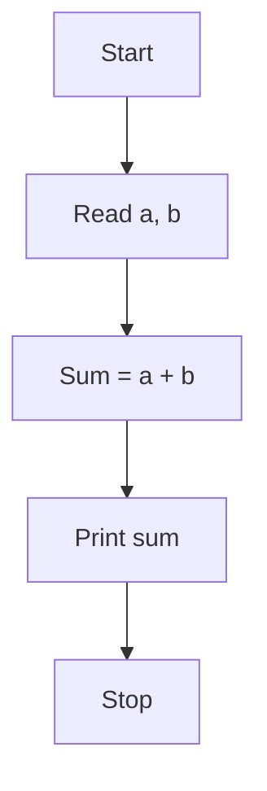
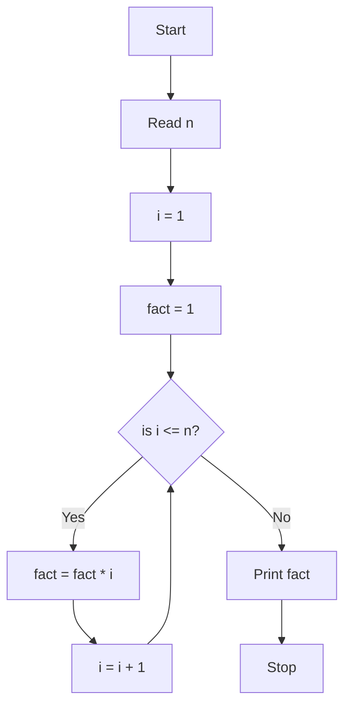
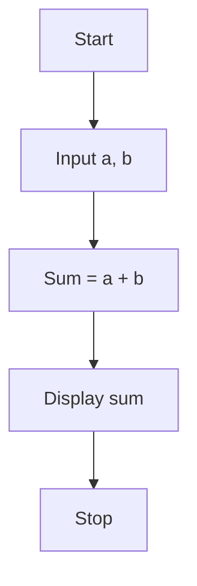
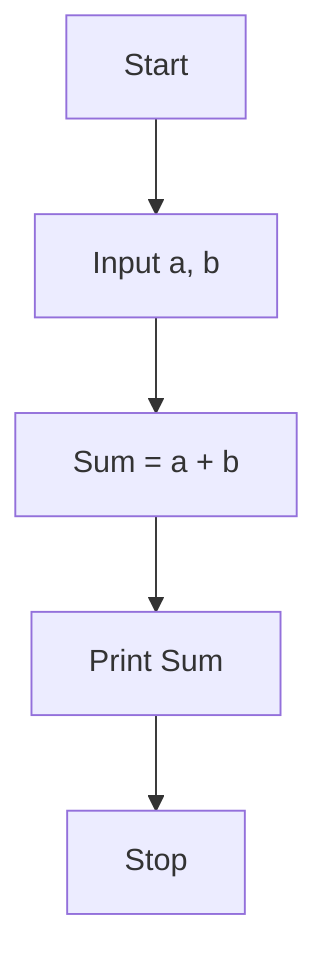

**MCS-201**

**Programming in C**

**and Python**

**Indira Gandhi National Open University**

**An introduction to C**

**1**

School of Computer and Information

Sciences (SOCIS)

> {width="1.7491666666666668in"
> height="0.7516666666666667in"}**MCS-201**

[**BLOCK 1** **AN INTRODUCTION TO** [**C**](#section)](block1.md#section)

[UNIT 1 Programming Fundamentals
block1.md#unit-1-programming-fundamentals[5](#unit-1-programming-fundamentals)](#unit-1-programming-fundamentals)

[UNIT 2 Data Types, Operators And Expressions
block1.md#section-1[33](#section-1)](#section-1)

[UNIT 3 Decision And Loop Control Statements [60](#unit-3)](block1.md#unit-3)

[UNIT 4 Arrays And Strings
block1.md#unit-4-arrays-and-strings[84](#unit-4-arrays-and-strings)](#unit-4-arrays-and-strings)

**BLOCK 2 FUNCTIONS, STRUCTURES, POINTERS**

**AND FILE HANDLING IN C**

UNIT 5 Functions 117

UNIT 6 Structures And Unions 139

UNIT 7 Pointers 155

UNIT 8 File Handling 177

**BLOCK 3 INTRODUCTION TO PYTHON**

**PROGRAMMING**

UNIT 9 Introduction To Python 199

UNIT 10 Data Structures And Control Statements In 213

Python

UNIT 11 Functions And Files Handling In Python 279

UNIT 12 Modules And Packages 300

**BLOCK 4 ADVANCED FEATURES IN PYTHON**

UNIT 13 Classes In Python 317

UNIT 14 Exception Handling In Python Programming 339

UNIT 15 Python-Advance Concepts 350

UNIT 16 Data Access Using Python 361


> **COURSE INTRODUCTION**
>
> This course introduces you the two most powerful programming languages
> i.e. C and Python. After completing this course you will be able to
> perform programming in both C and Python, the two are chosen to
> provide you the flavour of both conventional and modern programming.
> You will appreciate that both programming languages are equally
> powerful.
>
> To build the carrier path the skill of programming can be a fun and
> profitable way, but before starting the learning of this skill, one
> should be clear about the choice of programming language. Before
> learning any programming language, one should figure out which
> language suits best to the learner.
>
> This course makes you to compare the functionalities of both C and
> Python programming language, which may help the learners to analyse
> and generate a lot of opinions about their choice of programming
> language, from the comparison of C and Python, you will find that
> Python is an highlevel, general-purpose, interpreted programming
> language. It is dynamically typed and garbage-collected, and supports
> multiple programming paradigms like structured (particularly,
> procedural,) object-oriented, and functional programming, and due to
> its comprehensive standard library Python is often described as a
> \"batteries included\" language.
>
> Python programming is widely used in Artificial Intelligence, Machine
> Learning, Neural Networks and many other advanced fields of Computer
> Science. Ideally, It is designed for rapid prototyping of complex
> applications. Python has interfaces with various Operating system
> calls and libraries, which are extensible to C, C++ or Java. Many
> large companies like NASA, Google, YouTube, Bit Torrent, etc. uses the
> Python programming language for the execution of their valuable
> projects.
>
> This course gives you an exposure to both programming languages i.e. C
> and Python, based on your requirement you can choose your option to
> build your carrier in programming.
>
> **BLOCK INTRODUCTION**
This block is on Introduction to C programming language.

Problem-solving skills are recognized as an integral component of computer programming and in this block the primary focus of this course is to teach the basic programming constructs of C language. Emphasis is placed on developing the student's ability to apply problem-solving strategies to design algorithms and to implement these algorithms in a structured procedural programming language. This course includes a laboratory component also where the student gets hands-on experience. Basically, one must explore possible avenues to a solution one by one until they come across the right path to an optimized and efficient solution. In general, as one gains experience in solving problems, one develops their own techniques and strategies, though they are often intangible.
>
> This block consists of 4 units and is organized as follows:
>
> Unit- 1 provides an overview of problem solving techniques, algorithm
> design, top -- down design and basic C language features
>
> Unit -2outlines the overview of the various datatypes, operators and
> expressions in C.
>
> Unit -- 3 provides an overview of the decision and control loop
> statements in C language.
>
> Unit - 4 introduces you the concept of the Arrays and String-handling
> in the C programs.
>
> *Happy Programming!!*
>
> {width="0.44416666666666665in"
> height="0.3983333333333333in"} Indira Gandhi National Open University
> **MCS-201** School of Computer and Information Sciences
>
> **PROGRAMMING IN C AND PYTHON**
>
> Block

# 1 

> **AN INTRODUCTION TO C**

# UNIT 1 Programming Fundamentals 

**UNIT 2**

**Data Types, Operators and Expressions**

#  

# UNIT 3 

> **Decision and Loop Control Statements**

# UNIT 4 Arrays and Strings 

> **Programme / Course Design Committee**

+-----------------------------------+----------------------------------+
| > Prof. Sanjeev K. Aggarwal, IIT, | Prof. V.V. Subrahmanyam          |
| > Kanpur                          |                                  |
| >                                 | Director                         |
| > Prof. M. Balakrishnan, IIT ,    |                                  |
| > Delhi                           | SOCIS, IGNOU, New Delhi          |
| >                                 |                                  |
| > Prof Harish Karnick, IIT,       | Prof P. Venkata Suresh           |
| > Kanpur                          |                                  |
| >                                 | SOCIS, IGNOU, New Delhi          |
| > Prof. C. Pandurangan, IIT,      |                                  |
| > Madras                          | Dr. Shashi Bhushan               |
| >                                 |                                  |
| > Dr. Om Vikas, Sr. Director, MIT | Associate Professor              |
| >                                 |                                  |
| > Prof P. S. Grover, Sr.          | SOCIS, IGNOU, New Delhi          |
| > Consultant,                     |                                  |
| >                                 | Shri Akshay Kumar                |
| > Prof. (Retd.) S.K. Gupta IIT,   |                                  |
| > Delhi                           | Associate Professor              |
| >                                 |                                  |
| > Prof. T.V. Vijay Kumar          | SOCIS, IGNOU, New Delhi          |
| >                                 |                                  |
| > Dean,                           | Shri M. P. Mishra                |
| >                                 |                                  |
| > School of Computer & System     | Associate Professor              |
| > Sciences, JNU, New Delhi        |                                  |
| >                                 | SOCIS, IGNOU, New Delhi          |
| > Prof. Ela Kumar,                |                                  |
| >                                 | Dr. Sudhansh Sharma              |
| > Dean, Computer Science & Engg   |                                  |
| > IGDTUW, Delhi                   | Asst. Professor                  |
| >                                 |                                  |
| > Prof. Gayatri Dhingra           | SOCIS, IGNOU, New Delhi          |
| >                                 |                                  |
| > GVMITM, Sonipat, Haryana        |                                  |
| >                                 |                                  |
| > Mr. Milind Mahajani             |                                  |
| >                                 |                                  |
| > Vice President                  |                                  |
| >                                 |                                  |
| > Impressico Business Solutions   |                                  |
| > Noida UP                        |                                  |
+===================================+==================================+
| > **Block Preparation Team**      |                                  |
+-----------------------------------+----------------------------------+

Prof P. S. Grover (Content Editor) Ms. Priti Sehgal

(Sr Consultant Dept. of Computer Science

SOCIS, IGNOU) Keshav Mahavidyalya

University of Delhi

Ms. Charu Devgon

Dept. of Computer Science Prof. V.V. Subrahmanyam

A N Dev College SOCIS, IGNOU

University of Delhi

Shri S.S. Rana

Ms. Namita Gupta New Delhi Language

Dept. of Computer Science Editors

Maharaja Agrasen Institute Prof Sunaina Kumar,

of Technology SOH, IGNOU

Delhi

> **Course Coordinator : Dr. Sudhansh Sharma**
>
> **(Units 1 to 4 are adapted from MCS-011 Problem Solving and
> Programming)**

**Block Production Team**

### March, 2021 

***Indira Gandhi National Open University, 2021***

> ***ISBN-***
>
> *All rights reserved. No part of this work may be reproduced in any
> form, by mimeograph or any other means, without permission in writing
> from the Indira Gandhi National Open University.*
>
> *Further information on the Indira Gandhi National Open University
> courses may be obtained from the University's office at Maidan Garhi,
> New Delhi-110 068.*

**UNIT 1 PROGRAMMING FUNDAMENTALS**

**Structure**

1.0 Introduction
> 1.1 Objectives
>
> 1.2 Problem - Solving Techniques
>
> 1.2.1 Steps for Problem - Solving 1.2.2 Using Computer as a
> Problem-Solving Tool
>
> 1.3 Basics of Algorithms
>
> 1.3.1 Definition 1.3.2 Features of Algorithm 1.3.3 Criteria to be
> followed by an Algorithm 1.3.4 Top-Down Design
>
> 1.4 Flowcharts

##  1.4.1 Basic Symbols used in Flowchart Design 

1.5 Program and a Programming Language
1.6 Structured Programming Concepts
1.7 C Programming Language

##  1.7.1 History of C Programming Language 1.7.2 Salient Features of C 

1.8 Writing a C Program
1.9 Compiling a C Program
1.9.1 The C Compiler 1.9.2 Syntax and Semantic Errors
1.10 Link and Run the C Program

## 1.10.1 Run the C Program through the Menu 1.10.2 Run from an Executable File 1.10.3 Linker Errors 1.10.4 Logical and Runtime Errors 

1.11 Diagrammatic Representation ofC Program Execution Process
1.12 Summary
1.13 Solutions / Answers
1.14 Further Readings

**1.0 INTRODUCTION**
In our daily life, we routinely encounter and solve problems. We pose problems that we need or want to solve. For this, we make use of available resources, and solve them. Some categories of resources include: the time and efforts of yours and others; tools; information; and money. Some of the problems that you encounter and solve are quite simple. But some others may be very complex.

In this unit, we introduce you to the concepts of problem-solving, especially as they pertain to computer programming.

Problem-solving is a skill and there are no universal approaches one can take to solving problems. Basically, one must explore possible avenues to a solution one by one until they come across the right path to a solution. In general, as one gains experience in solving problems, one develops their own techniques and strategies, though they are often intangible. Problem-solving skills are recognized as an integral component of computer programming. It is a demanding and intricate process which is equally important throughout the project life cycle, especially during the study, designing, development, testing, and implementation stages. The computer problem-solving process requires:

-   Problem anticipation
-   Careful planning
-   Proper thought process
-   Logical precision
-   Problem analysis
-   Persistence and attention.

At the same time it requires personal creativity, analytic ability and expression. The chances of success are amplified when the problem solving is approached in a systematic way and satisfaction is achieved once the problem is satisfactorily solved. The problems should be anticipated in advance as far as possible and properly defined to help the algorithm definition and development process.


Computer is a very powerful tool for solving problems. It is a symbol-manipulating machine that follows a set of stored instructions called a program. It performs these manipulations very quickly and has memory for storing input, lists of commands and output. A computer cannot think in the way we associate with humans. When using the computer to solve a problem, you must specify the needed initial data, the operations which need to be performed (in order of performance) and what results you want for output. If any of these instructions are missing, you will get either no results or invalid results. In either case, your problem has not yet been solved. Therefore, several steps need to be considered before writing a program. These steps may free you from hours of finding and removing errors in your program (a process called **debugging**). It should also make the act of problem solving with a computer a much simpler task.


All types of computer programs are collectively referred to as **software**. Programming languages are also part of it. Physical computer equipment such as electronic circuitry, input/output devices, storage media etc. comes under **hardware**. Software governs the functioning of hardware. Operations performed by software may be built into the hardware, while instructions executed by the hardware may be generated in software. The decision to incorporate certain functions in the hardware and others in the software is made by the manufacturer and designer of the software and hardware. Normal considerations for this are: cost, speed, memory required, adaptability and reliability of the system. Set of instructions of the high level language used to code a problem to find its solution is referred to as **Source Program**. A translator program called **a compiler or interpreter**, translates the source program into the object program. This is the compilation or interpretation phase. All the testing of the source program as regards the correct format of instructions is performed at this stage and the errors, if any, are printed. If there is no error, the source program is transformed into the machine language program called **Object Program**. The Object Program is executed to perform calculations. This stage is the execution phase. Data, if required by the program, are supplied now and the results are obtained on the output device.

The complete process is shown in fig 1.1 below:



**Fig 1.1: Conversion of Source Program to Object Program**

**1.1 OBJECTIVES**

> After going through this unit, you should be able to:

-   apply problem solving techniques;

-   define an algorithm and its features;

-   design flowcharts;  Define a program;

-   Understand the history of C programming language;

-   Compile a C program;

-   Identify the syntax errors;

-   Run a C program; and

-   Understand what are run time and logical errors.

**1.2 PROBLEM - SOLVING TECHNIQUES**

> Problem solving is a creative process which defines systematization
> and mechanization. There are a number of steps that can be taken to
> raise the level of one's performance in problem solving.

## 1.2.1 Steps for Problem - Solving 

> A problem-solving technique follows certain steps in finding the
> solution to a problem. Let us look into the steps one by one:

### Problem definition phase 

> The success in solving any problem is possible only after the problem
> has been fully understood. That is, we cannot hope to solve a problem,
> which we do not understand. So, the problem understanding is the first
> step towards the solution of the problem. In *problem definition
> phase*, we must emphasize *what must be done* rather than *how is it
> to be done*. That is, we try to extract the precisely defined set of
> tasks from the problem statement. Inexperienced problem solvers too
> often gallop ahead with the task of problem - solving only to find
> that they are either solving the wrong problem or solving just one
> particular problem.

#### Getting started on a problem 

> There are many ways of solving a problem and there may be several
> solutions. So, it is difficult to recognize immediately which path
> could be more productive. Sometimes you do not have any idea where to
> begin solving a problem, even if the problem has been defined. Such
> block sometimes occurs because you are overly concerned with the
> details of the implementation even before you have completely
> understood or worked out a solution. The best advice is not to get
> concerned with the details. Those can come later when the intricacies
> of the problem has been understood.

### The use of specific examples 

> To get started on a problem, we can make use of heuristics i.e., the
> rule of thumb. This approach will allow us to start on the problem by
> picking a specific problem we wish to solve and try to work out the
> mechanism that will allow solving this particular problem. It is
> usually much easier to work out the details of a solution to a
> specific problem because the relationship between the mechanism and
> the problem is more clearly defined. This approach of focusing on a
> particular problem can give us the foothold we need for making a start
> on the solution to the general problem.

### Similarities among problems 

> One way to make a start is by considering a specific example. Another
> approach is to bring the experience to bear on the current problem.
> So, it is important to see if there are any similarities between the
> current problem and the past problems which we have solved. The more
> experience one has the more tools and techniques one can bring to bear
> in tackling the given problem. But sometimes, it blocks us from
> discovering a desirable or better solution to the problem. A skill
> that is important to try to develop in problem - solving is the
> ability to view a problem from a variety of angles. One must be able
> to metaphorically turn a problem upside down, inside out, sideways,
> backwards, forwards and so on. Once one has developed this skill it
> should be possible to get started on any problem.

### Working backwards from the solution 

> In some cases we can assume that we already have the solution to the
> problem and then try to work backwards to the starting point. Even a
> guess at the solution to the problem may be enough to give us a
> foothold to start on the problem. We can systematize the
> investigations and avoid duplicate efforts by writing down the various
> steps taken and explorations made. Another practice that helps to
> develop the problem solving skills is, once we have solved a problem,
> to consciously reflect back on the way we went about discovering the
> solution.

## 1.2.2 Using Computer as a Problem - Solving Tool 

> The computer is a resource - a versatile tool - that can help you
> solve some of the problems that you encounter. A computer is a very
> powerful generalpurpose tool. Computers can solve or help to solve
> many types of problems. There are also many ways in which a computer
> can enhance the effectiveness of the time and effort that you are
> willing to devote to solving a problem. Thus, it will prove to be well
> worth the time and effort you spend to learn how to make effective use
> of this tool.
>
> In this section, we discuss the steps involved in developing a
> program. Program development is a multi-step process that requires you
> to understand the problem, develop a solution, write the program, and
> then test it. This critical process determines the overall quality and
> success of your program. If you carefully design each program using
> good structured development techniques, your programs will be
> efficient, error-free, and easy to maintain. The following are the
> steps in detail:

1.  Develop an *Algorithm* and a *Flowchart*.

2.  Write the program in a computer language (for example say C
    programming language).

3.  Enter the program using some editor.

4.  Test and debug the program.

5.  Run the program, input data, and get the results.

**1.3 BASICS OF ALGORITHMS**

> The first step in the program development is to devise and describe a
> precise plan of what you want the computer to do. This plan, expressed
> as a sequence of operations, is called an algorithm. An algorithm is
> just an outline or idea behind a program something resembling C or
> Pascal, but with some statements in English rather than within the
> programming language. It is expected that one could translate each
> pseudo-code statement to a small number of lines of actual code,
> easily and mechanically.

## 1.3.1 Definition 

> An **algorithm** is a finite set of steps defining the solution of a
> particular problem. An algorithm is expressed in pseudocode -
> something resembling C language or Pascal, but with some statements in
> English rather than within the programming language. Developing an
> efficient algorithm requires lot of practice and skill. It must be
> noted that an efficient algorithm is one which is capable of giving
> the solution to the problem by using minimum resources of the system
> such as memory and processor's time. Algorithm is a language
> independent, well structured and detailed. It will enable the
> programmer to translate into a computer program using any high-level
> language. **1.3.2 Features of Algorithm**
>
> Following features should be present in an algorithm:

## Proper understanding of the problem 

> For designing an efficient algorithm, the expectations from the
> algorithm should be clearly defined so that the person developing the
> algorithm can understand the expectations from it. This is normally
> the outcome of the problem definition phase.

## Use of procedures / functions to emphasize modularity 

> To assist the development, implementation, and readability of the program, it is usually helpful to modularize (section) the program. Independent functions perform specific and well-defined tasks. In applying modularization, it is important to ensure that the process is not taken too far to the point where the implementation becomes difficult to read due to fragmentation. The program can then be implemented as calls to the various procedures that will be needed in the final implementations.

## Choice of variable names 

> Proper variable names and constant names can make the program more
> meaningful and easier to understand. This practice tends to make the
> program more self documenting. A clear definition of all variables and
> constants at the start of the procedure / algorithm can also be
> helpful. For example, it is better to use variable *day* for the day
> of the weeks, instead of the variable *a* or something else.

## Documentation of the program 

> Brief information about the segment of the code can be included in the
> program to facilitate debugging and providing information. A related
> part of the documentation is the information that the programmer
> presents to the user during the execution of the program. Since, the
> program is often to be used by persons who are unfamiliar with the
> working and input requirements of the program, proper documentation
> must be provided. That is, the program must specify what responses are
> required from the user. Care should also be taken to avoid ambiguities
> in these specifications. Also the program should "catch" incorrect
> responses to its requests and inform the user in an appropriate
> manner.

## 1.3.3 Criteria to be followed by an Algorithm 

> The following is the criteria to be followed by an algorithm:

-   **Input:** There should be zero or more values which are to be
    supplied.

-   **Output:** At least one result is to be produced.

-   **Definiteness:** Each step must be clear and unambiguous.

-   **Finiteness:** If we trace the steps of an algorithm, then for all
    cases, the algorithm must terminate after a finite number of steps.

-   **Effectiveness:** Each step must be sufficiently basic that a
    person using only paper and pencil can in principle carry it out. In
    addition, not only each step is definite, it must also be feasible.

### Example 1.1 

> Let us try to develop an algorithm to compute and display the sum of two numbers

1.  Start

2.  Read two numbers *a* and *b*

3.  Calculate the sum of *a* and *b* and store it in *sum*

4.  Display the value of *sum*

5.  Stop

### Example 1.2 

Let us try to develop an algorithm to compute and print the average of a set of data values.

1.  Start

2.  Set the sum of the data values and the count to zero.

3.  As long as the data values exist, add the next data value to the sum
    and add 1 to the count.

4.  To compute the average, divide the sum by the count.

5.  Display the average.

6.  Stop

### Example 1.3 

Write an algorithm to calculate the factorial of a given number.

1.  Start

2.  Read the number n

3.  \[Initialize\] i 1 , fact  1

4.  Repeat steps 4 through 6 until i = n

5.  fact  fact \* i

6.  i  i + 1

7.  Print fact

8.  Stop

### Example 1.4 

Write an algorithm to check that whether the given number is prime or not.

1.  Start

2.  Read the number num

3.  \[Initialize\] i 2 , flag  1

4.  Repeat steps 4 through 6 until i \< num or flag = 0

5.  rem  num mod i

6.  if rem = 0 then

> flag 0 else i i + 1

7.  if flag = 0 then

Print Number is not prime

Else

Print Number is prime

8.  Stop

## 1.3.4 Top Down Design 

> Once we have defined the problem and have an idea of how to solve it, we can then use the powerful techniques for designing algorithms. Most of the problems are complex or large problems and to solve them we have to focus on comprehending at one time, a very limited span of logic or instructions. A technique for algorithm design that tries to accommodate this human limitation is known as **top-down design or stepwise refinement.**
>
> Top-down design provides a way of handling the logical complexity and detail encountered in computer algorithms. It allows building solutions to problems step by step. In this way, specific and complex details of the implementation are encountered only at the stage when sufficient groundwork on the overall structure and relationships among the various parts of the problem has been laid. Before the top-down design can be applied to any problem, we must at least have the outlines of a solution. Sometimes this might demand a lengthy and creative investigation into the problem while at other times the problem description may in itself provide the necessary starting point for the top-down design. 
>
> Top-down design suggests taking the general statements about the solution one at a time, and then breaking them down into more precise subtasks or sub-problems. These sub-problems should more accurately describe how the final goal can be reached. The process of repeatedly breaking a task down into a subtask and then each subtask into smaller subtasks must continue until the sub-problem can be implemented as a program statement. With each splitting, it is essential to define how sub-problems interact with each other. In this way, the overall structure of the solution to the problem can be maintained. Preservation of the overall structure is important for making the algorithm comprehensible and also for making it possible to prove the correctness of the solution.

{width="4.913333333333333in"
height="3.115in"}

### Figure 1.2: Schematic breakdown of a problem into subtasks as employed in top down design 

> Let us see how to represent the algorithm in a graphical form using a flowchart in the following section.

**1.4 FLOWCHARTS**

> The next step after the algorithm development is the flowcharting. Flowcharts are used in programming to diagram the path in which information is processed through a computer to obtain the desired results. A flowchart is a graphical representation of an algorithm. It makes use of symbols which are connected among them to indicate the flow of information and processing. It will show the general outline of how to solve a problem or perform a task. It is prepared for better understanding of the algorithm.

##  1.4.1 Basic Symbols used in flowchart design 

Lines or arrows represent the direction of

Start/Stop

Decision Making (Branching)

Input/Output

the flow of control.

Connector (connect one part of the flowchart to another)

Process, Instruction

  ----------------------- -----------------------------------------------
                          

  ----------------------- -----------------------------------------------

Comments, Explanations, Definitions

### Additional Symbols Related to more advanced programming 

Refers to separate flowchart

Preparation (may be used with "do Loops" )

### Example 1.5 

The flowchart for the Example 1.1 is shown below:



### Example 1.6 

```markdown
The flowchart for the Example 1.3 (to find factorial of a given number) is shown below:


```

**Example 1.7:**

The flowchart for Example 1.4 is shown below:

```mermaid
flowchart TD
    A[Start] --> B[Read num]
    B --> C[i = 2]
    C --> D[flag = 1]
    D --> E{is i < num?}
    E -- Yes --> F[rem = num mod i]
    F --> G{is rem != 0?}
    G -- Yes --> H[i = i + 1]
    H --> E
    G -- No --> I[flag = 0]
    E -- No --> J{is flag = 1?}
    J -- Yes --> K[Print "Number is prime"]
    J -- No --> L[Print "Number is not prime"]
    K --> M[Stop]
    L --> M
```

### Check Your Progress 1 

1.  Differentiate between flowchart and algorithm.


2.  Compute and print the sum of a set of data values.


3.  Write the following steps are suggested to facilitate the problem
    solving process using computer.


4.  Draw an algorithm and flowchart to calculate the roots of quadratic
    equation

> Ax\^2 + Bx + C = 0.

**1.5 PROGRAM AND PROGRAMMING LANGUAGE**
> A language is a mode of communication between two people. It is necessary for those two people to understand the language in order to communicate. But even if the two people do not understand the same language, a translator can help to convert one language to the other, understood by the second person. Similar to a translator is the mode of communication between a user and a computer is a computer language. One form of the computer language is understood by the user, while in the other form it is understood by the computer. A translator (or compiler) is needed to convert from user's form to computer's form. Like other languages, a computer language also follows a particular grammar known as the syntax.

> In this unit we will introduce you the basics of programming language C.

> We have seen in the earlier section's that a computer has to be fed with a detailed set of instructions and data for solving a problem. Such a procedure which we call an *algorithm* is a series of steps arranged in a logical sequence. Also we have seen that a *flowchart* is a pictorial representation of a sequence of instructions given to the computer. It also serves as a document explaining the procedure used to solve a problem. In practice it is necessary to express an algorithm using a *programming language*. A procedure expressed in a programming language is known as a *computer program*.

> Computer programming languages are developed with the primary objective of facilitating a large number of people to use computers without the need for them to know in detail the internal structure of the computer. Languages are designed to be *machine-independent*. Most of the programming languages ideally designed, to execute a program on any computer regardless of who manufactured it or what model it is.

> Programming languages can be divided into two categories:

i)  **Low Level Languages or Machine Oriented Languages:** The language
    whose design is governed by the circuitry and the structure of the
    machine is known as the **Machine language**. This language is
    difficult to learn and use. It is specific to a given computer and
    is different for different computers i.e. these languages are
    **machine-dependent**. These languages have been designed to give a
    better machine efficiency, i.e. faster program execution. Such
    languages are also known as Low Level Languages. Another type of
    Low-Level Language is the Assembly Language. We will code the
    assembly language program in the form of mnemonics. Every machine
    provides a different set of mnemonics to be used for that machine
    only depending upon the processor that the machine is using.

ii) **High Level Languages or Problem Oriented Languages:** These
    languages are particularly oriented towards describing the
    procedures for solving the problem in a concise, precise and
    unambiguous manner. Every high level language follows a precise set
    of rules. They are developed to allow application programs to be run
    on a variety of computers. These languages are
    *machine-independent*. Languages falling in this category are
    FORTRAN, BASIC, PASCAL etc. They are easy to learn and programs may
    be written in these languages with much less effort. However, the
    computer cannot understand them and they need to be translated into
    machine language with the help of other programs known as Compilers
    or Translators.

**1.6 C PROGRAMMINGLANGUAGE**

> Prior to writing C programs, it would be interesting to find out what
> really is C language, how it came into existence and where does it
> stand with respect to other computer languages. We will briefly
> outline these issues in the following section.

## 1.6.1 History of C Programming Language 

> C is a programming language developed at AT&T's Bell Laboratory of USA
> in 1972. It was designed and written by Dennis Ritchie. As compared to
> other programming languages such as Pascal, C allows a precise control
> of input and output.
>
> Now let us see its historical development. The late 1960s were a
> turbulent era for computer systems research at Bell Telephone
> Laboratories. By 1960, many programming languages came into existence,
> almost each for a specific purpose. For example COBOL was being used
> for Commercial or Business Applications, FORTRAN for Scientific
> Applications and so on. So, people started thinking why could not
> there be a one general purpose language. Therefore, an International
> Committee was set up to develop such a language, which came out with
> the invention of ALGOL60. But this language never became popular
> because it was too abstract and too general. To improve this, a new
> language called Combined Programming Language (CPL) was developed at
> CambridgeUniversity. But this language was very complex in the sense
> that it had too many features and it was very difficult to learn.
> Martin Richards at CambridgeUniversity reduced the features of CPL and
> developed a new language called Basic Combined Programming Language
> (BCPL). But unfortunately it turned out to be much less powerful and
> too specific. Ken Thompson at AT & T's Bell Labs, developed a language
> called B at the same time as a further simplification of CPL. But like
> BCPL this was also too specific. Ritchie inherited the features of B
> and BCPL and added some features on his own and developed a language
> called C. C proved to be quite compact and coherent. Ritchie first
> implemented C on a DEC PDP-11 that used the UNIX Operating System.
>
> For many years the *de facto* standard for C was the version supplied
> with the UNIX version 5 operating system. The growing popularity of
> microcomputers led to the creation of large number of C
> implementations. At the source code level most of these
> implementations were highly compatible. However, since no standard
> existed there were discrepancies. To overcome this situation, ANSI
> established a committee in 1983 that defined an ANSI standard for the
> C language.

## 1.6.2 Salient features of C 

> C is a general purpose, structured programming language. Among the two
> types of programming languages discussed earlier, C lies in between
> these two categories. That's why it is often called a ***middle level
> language.*** It means that it combines the elements of high level
> languages with the functionality of assembly language. It provides
> relatively good programming efficiency (as compared to machine
> oriented language) and relatively good machine efficiency as compared
> to high level languages). As a middle level language, C allows the
> manipulation of bits, bytes and addresses -- the basic elements with
> which the computer executes the inbuilt and memory management
> functions. C code is very portable, that it allows the same C program
> to be run on machines with different hardware configurations. The
> flexibility of C allows it to be used for systems programming as well
> as for application programming.
>
> C is commonly called a structured language because of structural
> similarities to ALGOL and Pascal. The distinguishing feature of a
> structured language is compartmentalization of code and data.
> Structured language is one that divides the entire program into
> modules using top-down approach where each module executes one job or
> task. It is easy for debugging, testing, and maintenance if a language
> is a structured one. C supports several control structures such as
> **while, do-while and for** and various data structures such as
> **strucs, files, arrays** etc. as would be seen in the later units.
> The basic unit of a C program is a **function -** C's standalone
> subroutine**.** The structural component of C makes the programming
> and maintenance easier.

## Check Your Progress 2 

1.  "A Program written in Low Level Language is faster." Why?


2.  What is the difference between high level language and low level

language?


3.  Why is C referred to as middle level language?

**1.7 STRUCTURE OF A C PROGRAM**

> As we have already seen, to solve a problem there are three main
> things to be considered. Firstly, what should be the output? Secondly,
> what should be the inputs that will be required to produce this output
> and thirdly, the steps of instructions which use these inputs to
> produce the required output. As stated earlier, every programming
> language follows a set of rules; therefore, a program written in C
> also follows predefined rules known as syntax. C is a case
> sensitivelanguage**.** All C programs consist of one or more
> functions. One function that must be present in every C program is
> **main()**. This is the first function called up when the program
> execution begins. Basically, **main()** outlines what a program does.
> Although **main** is not given in the keyword list,it cannot be used
> for naming a variable. The structure of a C program is illustrated in
> Figure.1.3 where functions *func1()* through *funcn()* represent user
> defined functions.
>
> Preprocessor directives

Global data declarations
```c
main() { /* main function */
    /* Declaration part */
    /* Program statements */
}

/* User defined functions */
func1() {
    /* Function body */
}

func2() {
    /* Function body */
}

funcn() {
    /* Function body */
}
```

> **Figure. 1.3: Structure of a C Program.**

## A Simple C Program 

> From the above sections, you have become familiar with, a programming
> language and structure of a C program. It's now time to write a simple
> C program. This program will illustrate how to print out the message
> "This is a C program".

**Example 1.8: Write a program to print a message on the screen**.

```c
/* Program to print a message */

#include <stdio.h> /* header file */

int main() /* main function */
{
    printf("This is a C program\n"); /* output statement */
    return 0;
}
```
Though the program is very simple, a few points must be noted.

Every C program contains a function called **main()**. This is the starting point of the program. This is the point from where the execution begins. It will usually call other functions to help perform its job, some that we write and others from the standard libraries provided.

**#include <stdio.h>** is a reference to a special file called stdio.h which contains information that must be included in the program when it is compiled. The inclusion of this required information will be handled automatically by the compiler. You will find it at the beginning of almost every C program. Basically, all the statements starting with `#` in a C program are called preprocessor directives. These will be considered in the later units. Just remember, that this statement allows you to use some predefined functions such as, *printf()*, in this case.

**main()** declares the start of the function, while the two curly brackets `{ }` show the start and finish of the function. Curly brackets in C are used to group statements together as a function, or in the body of a loop. Such a grouping is known as a compound statement or a block. Every statement within a function ends with a terminator semicolon `;`.

**printf("This is a C program\n");** prints the words on the screen. The text to be printed is enclosed in double quotes. The `\n` at the end of the text tells the program to print a newline as part of the output. That means now if we give a second printf statement, it will be printed in the next line.

Comments may appear anywhere within a program, as long as they are placed within the delimiters `/*` and `*/`. Such comments are helpful in identifying the program's principal features or in explaining the underlying logic of various program features.

While useful for teaching, such a simple program has few practical uses. Let us consider something rather more practical. Let us look into the example given below, the complete program development life cycle.

**Example 1.9**

Develop an algorithm, flowchart, and program to add two numbers.

## Algorithm

1. Start
2. Input the two numbers `a` and `b`
3. Calculate the sum as `a + b`
4. Store the result in `sum`
5. Display the result
6. Stop

## Flowchart



## Program

```c
#include <stdio.h>

int main() {
    int a, b, sum; /* variables declaration */
    printf("\nEnter the values for a and b: \n");
    scanf("%d %d", &a, &b);
    sum = a + b;
    printf("\nThe sum is %d\n", sum); /* output statement */
    return 0;
}
``` 

1.  Start

2.  Input the two numbers ***a*** and ***b***

3.  Calculate the sum as ***a+b***

4.  Store the result in ***sum***

5.  Display the result

6.  Stop.

## Flowchart 



**Figure 1.4: Flow chart to add two numbers**

### Program 

```c
#include <stdio.h>

int main() {
    int a, b, sum; /* variables declaration */
    printf("\nEnter the values for a and b: \n");
    scanf("%d %d", &a, &b);
    sum = a + b;
    printf("\nThe sum is %d\n", sum); /* output statement */
    return 0;
}
```

### OUTPUT 

Enter the values of a and b:

2 3

The sum is 5

In the above program, two variables *a* and *b* are considered. These variables are declared as integers **(int)**, which is the data type to indicate integer values. The next statement is the `printf` statement meant for prompting the user to input the values of ***a*** and ***b***. `scanf` is the function to intake the values into the program provided by the user. Next comes the processing/computing part which computes the **sum**. Again, the `printf` statement is a bit different from the first program; it includes a format specifier (%d). The format specifier indicates the kind of value to be printed. We will study other data types and format specifiers in detail in the following units. In the `printf` statement above, `sum` is not printed in double quotes because we want its value to be printed. The number of format specifiers and the variables should match in the `printf` statement.

At this stage, don't go much into detail. However, in the following units, you will be learning all these details

**1.8 WRITING A C PROGRAM**

> A C program can be executed on platforms such as DOS, UNIX etc. DOS
> stores C program with a file extension ***.c***. Program text can be
> entered using any text editor such as EDIT or any other. To edit a
> file called ***testprog.c*** using edit editor, gives:

## C:\> edittestprog.c 

> If you are using **Turbo C**, then Turbo C provides its own editor
> which can be used for writing the program. Just give the full pathname
> of the executable file of Turbo C and you will get the editor in front
> of you. For example:

## C:\> turboc\\bin\\tc 

> Here, tc.exe is stored in bin subdirectory of turboc directory. After
> you get the menu just type the program and store it in a file using
> the menu provided. The file automatically gets the extension of .c.
>
> **UNIX** also stores C program in a file with extension is ***.c***.
> This identifies it as a C program. The easiest way to enter your text
> is using a text editor like *vi*, *emacs* or *xedit*. To edit a file
> called testprog.c using ***vi***,

## \$ vi testprog.c 

> The editor is also used to make subsequent changes to the program

**1.9 COMPILING A C PROGRAM**

> After you have written the program the next step is to save the
> program in a file with extension . c . This program is in high-level
> language. But this language is not understood by the computer. So, the
> next step is to convert the high-level language program (source code)
> to machine language (object code). This task is performed by a
> software or program known as a compiler. Every language has its own
> compiler that converts the source code to object code. The compiler
> will compile the program successfully if the program is syntactically
> correct; else the object code will not be produced. This is explained
> pictorially in Figure 1.5.

Machine

High Level Translator

~Language~

Source^Language^ ^(Compiler)^ Program Object

Code^Program^ Code

> **Figure 1.5: Process of Translation**

## 1.9.1 The C Compiler 

> If you are working on UNIX platform, then if the name of the program
> file is testprog.c, to compile it, the simplest method is to type **cc
> testprog.c**
>
> This will compile testprog.c, and, if successful, will produce a
> executable file called ***a.out***. If you want to give the executable
> file any other, you can type **cc testprog.c -o testprog**
>
> This will compile ***testprog.c***, creating an executable file
> testprog.
>
> If you are working with TurboC on DOS platform then the option for
> compilation is provided on the menu. If the program is syntactically
> correct then this will produce a file named as **testprog.obj**. If
> not, then the syntax errors will be displayed on the screen and the
> object file will not be produced. The errors need to be removed before
> compiling the program again. This process of removing the errors from
> the program is called as the **debugging**.

## 1.9.2 Syntax and Semantic Errors 

> Every language has an associated grammar, and the program written in
> that language has to follow the rules of that grammar. For example in
> English a sentence such a "Shyam, is playing, with a ball". This
> sentence is syntactically incorrect because commas should not come the
> way they are in the sentence.
>
> Likewise, C also follows certain syntax rules. When a C program is
> compiled, the compiler will check that the program is syntactically
> correct. If there are any syntax errors in the program, those will be
> displayed on the screen with the corresponding line numbers.Let us
> consider the following program.

**Example 1.10: Write a program to print a message on the screen.**

```c
/* Program to print a message on the screen */

#include <stdio.h>

int main() {
    printf("Hello, how are you\n");
    return 0;
}
```

Let the name of the program be **test.c**. If we compile the above program as it is, we will get the following errors:

```
Error test.c 1: No file name ending
Error test.c 5: Statement missing ;
Error test.c 6: Compound statement missing }
```

Edit the program again, correct the errors mentioned, and the corrected version appears as follows:

```c
#include <stdio.h>

int main() {
    printf("Hello, how are you\n");
    return 0;
}
```
> Compilation errors are semantic errors. These errors are displayed as warnings. These errors are shown if a particular statement has no meaning. The program does compile with these errors, but it is always advised to correct them also, since they may create problems during execution. An example of such an error is declaring a variable but not using it, which results in a warning like "code has no effect". These variables unnecessarily occupy memory.

### Check Your Progress 3 

1.  What is the basic unit of a C program?


2.  "The program is syntactically correct". What does it mean?

3.  Indicate the syntax errors in the following program code:

> include \<stdio.h\> main( )
>
> \[
>
> printf("hello\\n");
>
> \]
>
> ................................................................................................\...
>
> ................................................................................................\...
>
> ................................................................................................\...
>
> ................................................................................................\...
>
> ..................................................................................................

**1.10 LINK AND RUN THE C PROGRAM**

After compilation, the next step is linking the program. Compilation produces a file with an extension **.obj**. Now this **.obj** file cannot be executed since it contains calls to functions defined in the standard library (header files) of the C language. These functions have to be linked with the code you wrote. C comes with a standard library that provides functions that perform most commonly needed tasks. When you call a function that is not part of the program you wrote, C remembers its name. Later, the linker combines the code you wrote with the object code already found in the standard library. This process is called *linking.* In other words, a linker is a program that links separately compiled functions together into one program. It combines the functions in the standard C library with the code that you wrote. The output of the linker is an executable program, i.e., a file with an extension ***.exe***.

## 1.10.1 Run the C Program Through the Menu 

> When we are working with TurboC in DOS environment, the menu in the
> GUI that pops up when we execute the executable file of TurboC
> contains several options for executing the program:

i\) Link , after compiling ii) Make, compiles as well as links iii) Run

> All these options create an executable file and when these options are
> used we also get the output on user screen. To see the output we have
> to shift to user screen window.

## 1.10.2 Run From an Executable File 

> An .***exe*** file produced by can be directly executed.
>
> UNIX also includes a very useful program called **make**. **Make**
> allows very complicated programs to be compiled quickly, by reference
> to a configuration file (usually called makefile). If your C program
> is a single file, you can usually use make by simply typing -- **make
> testprog**
>
> This will compile **testprog.c** as well as link your program with the
> standard library so that you can use the standard library functions
> such as printf and put the executable code in **testprog.**
>
> In case of DOS environment , the options provided above produce an
> executable file and this file can be directly executed from the DOS
> prompt just by typing its name without the extension. That is if the
> name of the program is test.c, after compiling and linking the new
> file produced is test.exe only if compilation and linking is
> successful.
>
> This can be executed as: **c\>test**

## 1.10.3 Linker Errors 

> If a program contains syntax errors then the program does not compile,
> but it may happen that the program compiles successfully but we are
> unable to get the executable file, this happens when there are certain
> linker errors in the program. For example, the object code of certain
> standard library function is not present in the standard C library;
> the definition for this function is present in the header file that is
> why we do not get a compiler error. Such kinds of errors are called
> linker errors. The executable file would be created successfully only
> if these linker errors are corrected.

## 1.10.4 Logical and Runtime Errors 

> After the program is compiled and linked successfully we execute the
> program. Now there are three possibilities:

1)  The program executes and we get correct results,

2)  The program executes and we get wrong results, and

3)  The program does not execute completely and aborts in between.

> The first case simply means that the program is correct. In the second
> case, we get wrong results; it means that there is some logical
> mistake in our program. This kind of error is known as **logical
> error**. This error is the most difficult to correct. This error is
> corrected by debugging. Debugging is the process of removing the
> errors from the program. This means manually checking the program step
> by step and verifying the results at each step. Debugging can be made
> easier by a tracer provided in Turbo C environment. Suppose we have to
> find the average of three numbers and we write the following code:

### Example 1.11:Write a C program to compute the average of three numbers 

> /\* Program to compute average of three numbers \*?
>
> #include\<stdio.h\> main( )
>
> {
>
> int a,b,c,sum,avg; a=10; b=5; c=20; sum = a+b+c; avg = sum / 3;
> printf("The average is %d\\n", avg);
>
> }

### OUTPUT 

> The average is 8.
>
> The exact value of average is 8.33 and the output we got is 8. So we
> are not getting the actual result, but a rounded off result. This is
> due to the logical error. We have declared variable **avg**as an
> integer but the average calculated is a real number, therefore only
> the integer part is stored in **avg.** Such kinds of errors which are
> not detected by the compiler or the linker are known as **logical
> errors***.*
>
> The third kind of error is only detected during execution. Such errors
> are known as **run time errors***.* These errors do not produce the
> result at all, the program execution stops in between and the run time
> error message is flashed on the screen. Let us look at the following
> example:

### Example 1.12: Write a program to divide a sum of two numbers by their difference 

/\* Program to divide a sum of two numbers by their difference\*/

#include \<stdio.h\>

> main( )
>
> {
>
> int a,b;
>
> float c;
>
> a=10;
>
> b=10;
>
> c = (a+b) / (a-b); printf("The value of the result is %f\\n",c); }
>
> The above program will compile and link successfully, it will execute
> till the first *printf* statement and we will get the message in this
> statement, as soon as the next statement is executed we get a runtime
> error of "Divide by zero" and the program halts. Such kinds of errors
> are **runtime errors**.

**1.11 DIAGRAMMATIC REPRESENTATION OF C PROGRAM EXECUTION PROCESS**

> The following figure 1.6 shows the diagrammatic representation of the
> program execution process*.*

**Figure 1.6: Program Execution Process**

WRITE A C PROGRAM

COMPILE THE PROGRAM

DEBUG SYNTAX

ERRORS (IF ANY), SAVE

AND RECOMPILE

LINK THE PROGRAM

EXECUTE THE POGRAM

TEST AND VERIFY THE

RESULTS

## Check Your Progress 4 

1.  What is the extension of an executable file?

> ................................................................................................\...
>
> ................................................................................................\...
>
> ................................................................................................\...
>
> ................................................................................................\...
> ................................................................................................\...

2.  What is the need for linking a compiled file?

> ................................................................................................\...
>
> ................................................................................................\...
>
> ................................................................................................\...
>
> ................................................................................................\...
> ................................................................................................\...

3.  How do you correct the logical errors in the program?

> ................................................................................................\...
>
> ................................................................................................\...
>
> ................................................................................................\...
>
> ................................................................................................\...
> ................................................................................................\...

**1.12 SUMMARY**

> To solve a problem different problem - solving tools are available
> that help in finding the solution to problem in an efficient and
> systematic way. Steps should be followed to solve the problem that
> includes writing the algorithm and drawing the flowchart for the
> solution to the stated problem**.** Top down design provides the way
> of handling the logical complexity and detail encountered in computer
> algorithm. It allows building solutions to problems in a stepwise
> fashion. In this way, specific and complex details of the
> implementation are encountered only at the stage when sufficient
> groundwork on the overall structure and relationships among the
> carious parts of the problem. We present C language - a standardized,
> industrial-strength programming language known for its power and
> portability as an implementation vehicle for these problem solving
> techniques using computer.
>
> In this unit, you have learnt about a program and a programming
> language. You can now differentiate between high level and low level
> languages. You can now define what is C, features of C. You have
> studied the emergence of C. You have seen how C is different, being a
> middle level Language, than other High Level languages. The advantage
> of high level language over low level language is discussed.
>
> You have seen how you can convert an algorithm and flowchart into a C
> program. We have discussed the process of writing and storing a C
> program in a file in case of UNIX as well as DOS environment.
>
> You have learnt about compiling and running a C program in UNIX as
> well as on DOS environment. We have also discussed about the different
> types of errors that are encountered during the whole process, i.e.
> syntax errors, semantic errors, logical errors, linker errors and
> runtime errors. You have also learnt how to remove these errors. You
> can now write simple C programs involving simple arithmetic operators
> and the *printf( )* statement. With these basics, now we are ready to
> learn the C language in detail in the following units.

**1.13 SOLUTIONS / ANSWERS**

## Check Your Progress 1 

1.  The process to devise and describe a precise plan (in the form of
    sequence of operations) of what you want the computer to do, is
    called an **algorithm**. An algorithm may be symbolized in a
    flowchart or pseudocode.

2.  1\. Start

    2.  Set the sum of the data values and the count of the data values
        to zero.

    3.  As long as the data values exist, add the next data value to the
        sum and add 1 to the count.

    4.  Display the average.

    5.  Stop

3.  The following steps are suggested to facilitate the problem solving
    process:

    a)  Define the problem

    b)  Formulate a mathematical model

    c)  Develop an algorithm

    d)  Design the flowchart

    e)  Code the same using some computer language

    f)  Test the program

## Check Your Progress 2 

1.  A program written in Low Level Language is faster to execute since
    it needs no conversion while a high level language program need to
    be converted into low level language.

2.  Low level languages express algorithms on the form of numeric or
    mnemonic codes while High Level Languages express algorithms in the
    using concise, precise and unambiguous notation. Low level languages
    are machine dependent while High level languages are machine
    independent. Low level languages are difficult to program and to
    learn, while High

> level languages are easy to program and learn. Examples of High level
> languages are FORTRAN, Pascal and examples of Low level languages are
> machine language and assembly language.

3.  C is referred to as middle level language as with C we are able to
    manipulate bits, bytes and addresses i.e. interact with the hardware
    directly. We are also able to carry out memory management functions.

## Check Your Progress 3 

1.  The basic unit of a C program is a C function.

2.  It means that program contains no grammatical or syntax errors.

3.  Syntax errors:

    a)  \# not present with include

    b)  {brackets should be present instead of \[ brackets.

## Check Your Progress 4 

1.  The extension of an executable file is .exe.

2.  The C program contains many C pre-defined functions present in the C
    library. These functions need to be linked with the C program for
    execution; else the C program may give a linker error indicating
    that the function is not present.

3.  Logical errors can be corrected through debugging or self checking.

**1.14 FURTHER READINGS**

1.  How to solve it by Computer, 5^th^ Edition, *R G Dromey*, PHI, 1992.

2.  Introduction to Computer Algorithms, Second Edition, *Thomas H.
    Cormen*, MIT press, 2001.

3.  *Fundamental Algorithms*, Third Edition, *Donald E Knuth*,
    Addison-Wesley, 1997.

4.  C Programming Language, *Kernighan & Richie*, PHI Publication.

5.  Programming with C*,* Second Edition, *Byron Gottfried*, Tata Mc
    Graw Hill, 2003.

6.  The C Complete Reference, Fourth Editon, *Herbert Schildt*, Tata Mc
    Graw Hill, 2002.

7.  Programming with ANSI and Turbo C, *Ashok N. Kamthane*, Pearson
    Education Asia, 2002.

8.  Computer Science A Structured Programming Approach Using C, Second

Edition, *Behrouza A. Forouzan, Richard F. Gilberg*, Brooks/Cole,
Thomson

> Learning, 2001.

