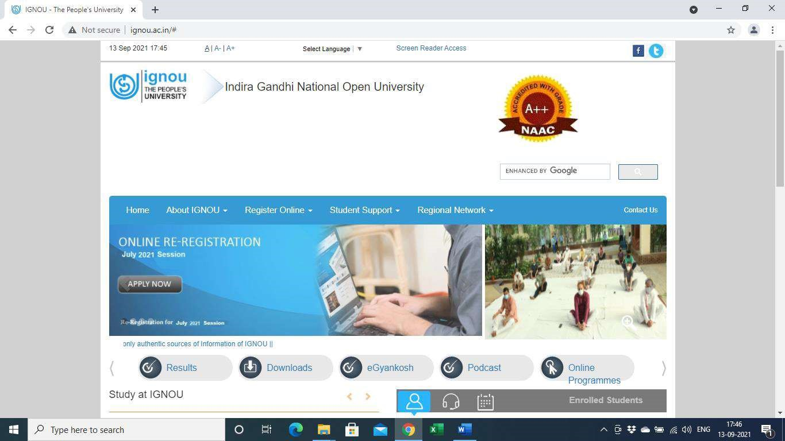
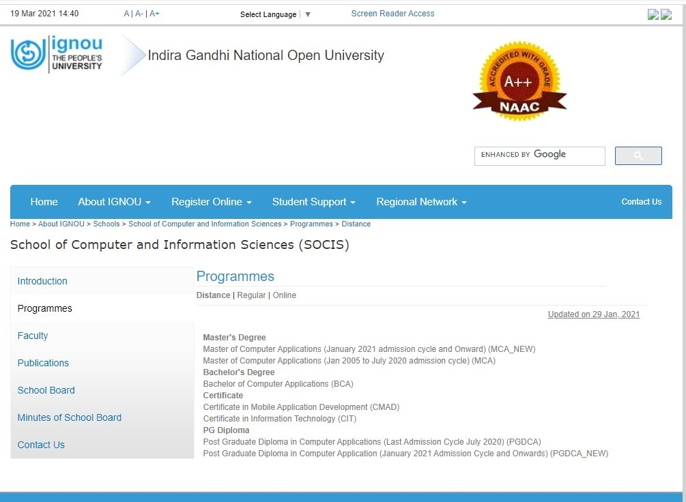
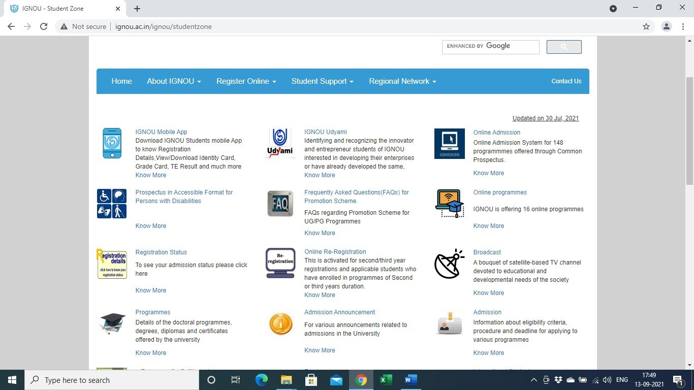
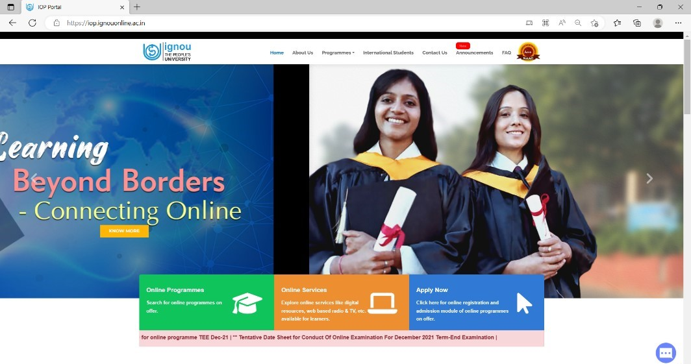
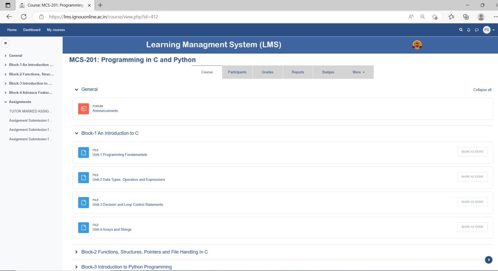
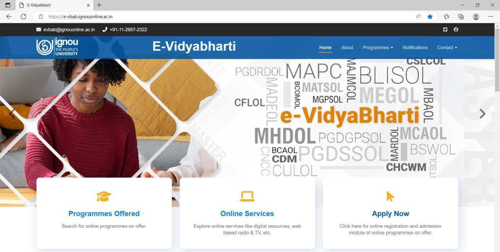

# PROGRAMME GUIDE

## FOR BACHELOR OF COMPUTER APPLICATIONS (Online)

**Programme Code: BCAOL | January 2023**

**SCHOOL OF COMPUTER AND INFORMATION SCIENCES**

**INDIRA GANDHI NATIONAL OPEN UNIVERSITY**

MAIDAN GARHI, NEW DELHI - 110 068 
www.ignou.ac.in

---

**Programme Guide:** January, 2023

This is a Programme Guide for BCAOL Online (Programme Code: BCAOL) offered by IGNOU.

---

© Indira Gandhi National Open University

All rights reserved. No part of this work may be reproduced in any form, by mimeograph or any other means, without permission in writing from the Indira Gandhi National Open University.

Further information on the Indira Gandhi National Open University courses can be obtained from the University's office at Maidan Garhi, New Delhi-110 068 or from its Regional Centres spread across the length and breadth of the country.

---
# TABLE OF CONTENTS

| Section | Page No. |
|---------|----------|
| Message from the BCAOL Programme Coordinator | 4 |
| 1. Basic Information | 5 |
| 1.1 BCAOL Programme Objectives | 5 |
| 1.2 Duration of the Programme | 5 |
| 1.3 Medium of Instruction | 5 |
| 1.4 Credit System | 5 |
| 1.5 BCAOL Programme Structure | 5 |
| 1.6 Recognition | 7 |
| 1.7 Student Support | 7 |
| 1.8 iGRAM | 7 |
| 1.9 Contact information of BCAOL Programme Coordinator | 7 |
| 2. Instructional System | 8 |
| 2.1 Self-instructional Material | 8 |
| 2.2 eGYANKOSH | 8 |
| 2.3 Counselling Sessions | 8 |
| 3. Browsing IGNOU's Website | 11 |
| 3.1 Navigation from Home Page | 11 |
| 3.2 Navigation of BCAOL pages | 14 |
| 4. BCAOL Programme Syllabus | 16 |
| 5. Evaluation Scheme | 61 |
| 5.1 Evaluation and Marking Scheme for BCAOL | 62 |
| 5.2 Instructions for Assignments | 64 |
| 5.3 Guidelines Regarding the Submission of Assignments | 65 |
| 5.4 General Guidelines Regarding the Term-End Examination | 66 |
| 6. Other Useful Information | 67 |
| 6.1 Procurement of Official Transcripts | |
| 6.2 Duplicate Grade Card | |
| 6.3 Disputes on Admission and other University matters | |
| 7. Some Useful Addresses | 68 |
| 8. Pattern of Question Papers | 69 |
| 9. Links to Forms and Enclosures | 69 |

---

# MESSAGE FROM PROGRAMME COORDINATOR

Dear Student,

Welcome to the family of online learners and IGNOU's Bachelor of Computer Applications (BCAOL) Programme. BCAOL is a 3-year (6 semesters) Programme during which you will study a wide range of courses in Computer Science and Applications along with a course of Basic Mathematics, Business Organisation, Accountancy and Communication Skills. The BCAOL Programme is of 99 credits. This online programme's learning content will be made available through the Learning Management System (LMS) of IGNOU's online programmes through the link: https://iop.ignouonline.ac.in/programme/p19. In addition, you may also visit IGNOU websites iop.ignouonline.ac.in -> Announcements and http://www.ignou.ac.in for current information and updates. In your case, IGNOU Regional Centre Delhi-1 is identified as Nodal Centre for academic counseling, practical counselling and other academic activities.

This Programme Guide contains instructional system of IGNOU online BCAOL (3 Years) programme, syllabus of BCAOL (3 Years) programme, details of evaluation scheme. The self-instructional course material will be uploaded on the IGNOU LMS. Assignments are one of the essential components of learning and evaluation. You can download the assignments of the semester in which you have enrolled from the IGNOU website. Each course contains one assignment. All the assignments will be submitted online, and one must submit the assignment of every course before the due date to be eligible to appear for the related Term-end Examination. COE, IGNOU will be facilitating your online learning process. You may contact COE at iopsupport@ignouonline.ac.in and coe@ignou.ac.in. Also, during the study, if you have any feedback, suggestions and comments to make about the LMS, please write to iopsupport@ignouonline.ac.in.

You will be provided online counselling for all the theory and practical courses for which you will get communication from the Nodal Regional Centre (RC)/ Study Center designated by Nodal RC for BCAOL. You must have a computer system with the necessary software for the practical courses. The Nodal RC will communicate the list of software required for BCAOL. You need to have a minimum of 70% attendance for practical counselling sessions to be eligible for appearing for the Term-end Practical Examinations.

For your online counselling and assignments related queries, you may write at bcaol@ignou.ac.in (If you are BCAOL student) and rcdelhi3@ignou.ac.in (If you are BCAOL student under e-VidyaBharati). For any academic feedback, you may write to BCAOL Programme Coordinator at the email bcaolsocis@ignou.ac.in with a CC at bcaol@ignou.ac.in. You can also write to us on iGRAM (http://igram.ignou.ac.in). You must write your enrolment number and mention your Program Code as BCAOL indicating that you are a student of the online mode in every communication with the University.

Programme Guide is a very important document for you, as a distance learner you may have several queries, many of them would be answered by this booklet. Preserve this booklet until you successfully complete the BCAOL Programme. Don't forget to re-register for the semesters as per schedule as you may not be able to pursue your studies without payment of the fee before due dates. Some useful addresses are given in this Programme Guide. In case of any difficulty, communicate to the concerned, on the listed address for fast action. IGNOU reserves the right to change any rule or regulation pertaining to BCAOL Programme that are specified or not specified in the Programme Guide, at any time.

I wish you all the success in pursuing the BCAOL programme.

**Prof. Divakar Yadav** 
BCAOL Programme Coordinator 
Email ID: bcaolsocis@ignou.ac.in

---

# 1. BASIC INFORMATION

## 1.1 BCAOL Programme Objectives

The basic objective of the programme is to open a channel of admission for computing courses for students, who have done the 10+2 and are interested in taking computing/IT as a career. After acquiring the Bachelor's Degree (BCAOL) at IGNOU, there is further educational opportunity to go for an MCA at IGNOU or Master's Programme at any other University/Institute. Also after completing BCAOL Programme, a student should be able to get entry level job in the field of Information Technology or ITES.

## 1.2 Duration of the Programme

- **Minimum:** 3 Years
- **Maximum:** 6 Years

**Re-registration:** You are required to re-register for the subsequent semester by paying the fee, for continuation of your study. You can re-register through online re-registration portal of IGNOU before a specified last date. Last date of Re-Registration is announced on the registration portal of IGNOU. In general, the re-registration is to be done about 2 months prior to the start of the next semester. Follow the updates from Announcements section at:
- https://iop.ignouonline.ac.in/announcements/0
- https://e-vbab.ignouonline.ac.in/announcements/0 (for e-Vidyabharti students)

## 1.3 Medium of Instruction

The medium of instruction is in English.

## 1.4 Credit System

The University follows the 'Credit System' for its programmes. Each credit is worth 30 hours of student study time, comprising all the learning activities. Thus, a three-credit course involves 90 study hours. This helps the student to understand the academic effort one has to put into successfully complete a course. Completion of the programme requires successful completion of both assignments and the Term End Examination of each course in the programme.

## 1.5 BCAOL Programme Structure

The programme has been divided into two semesters per year (January to June and July to December). Consequently, there will be two examinations every year - one in the month of June for the January to June semester courses and the other in December for the July to December semester courses. The students are at liberty to appear for any of the examinations schedule conducted by the University during the year subject to completing the minimum duration and other formalities prescribed for the programme. Student may ensure that s/he paid the requisite fee as well as fulfils other requirements such as prescribed minimum attendance etc. before appearing in the term end examinations. The result may be withheld or may be cancelled in case it is found that the student's registration to the course is invalid or did not register. The following is the programme structure of BCAOL:

### BCAOL Programme Structure

+------------+------------+---------------------------------------+---------+
| Semester | Course  | Course Title            | Credits |
|      | Code   |                    |     |
+:===========+:===========+:======================================+:=======:+
| I    | FEG-02  | Foundation Course in English-2   | 4   |
+------------+------------+---------------------------------------+---------+
|      | ECO-01  | Business Organization        | 4   |
+------------+------------+---------------------------------------+---------+
|      | BCS-011 | Computer Basics and PC Software   | 3   |
+------------+------------+---------------------------------------+---------+
|      | BCS-012 | Basic Mathematics          | 4   |
+------------+------------+---------------------------------------+---------+
|      | BCSL-013 | Computer Basics and PC Software Lab | 2   |
+------------+------------+---------------------------------------+---------+
| II    | ECO-02  | Accountancy-1            | 4   |
+------------+------------+---------------------------------------+---------+
|      | MCS-011 | Problem Solving and Programming   | 3   |
+------------+------------+---------------------------------------+---------+
|      | MCS-012 | Computer Organization and Assembly | 4   |
|      |      | Language Programming        |     |
+------------+------------+---------------------------------------+---------+
|      | MCS-013 | Discrete Mathematics        | 2   |
+------------+------------+---------------------------------------+---------+
|      | MCS-015 | Communication Skills        | 2   |
+------------+------------+---------------------------------------+---------+
|      | BCSL-021 | C Language Programming Lab     | 1   |
+------------+------------+---------------------------------------+---------+
|      | BCSL-022 | Assembly Language Programming Lab  | 1   |
+------------+------------+---------------------------------------+---------+
| III   | MCS-014 | Systems Analysis and Design     | 3   |
+------------+------------+---------------------------------------+---------+
|      | MCS-021 | Data and File Structures      | 4   |
+------------+------------+---------------------------------------+---------+
|      | MCS-023 | Introduction to Database Management | 3   |
|      |      | Systems               |     |
+------------+------------+---------------------------------------+---------+
|      | BCS-031 | Programming in C++         | 3   |
+------------+------------+---------------------------------------+---------+
|      | BCSL-032 | C++ Programming Lab         | 1   |
+------------+------------+---------------------------------------+---------+
|      | BCSL-033 | Data and File Structures Lab    | 1   |
+------------+------------+---------------------------------------+---------+
|      | BCSL-034 | DBMS Lab              | 1   |
+------------+------------+---------------------------------------+---------+
| IV    | BCS-040 | Statistical Techniques       | 4   |
+------------+------------+---------------------------------------+---------+
|      | MCS-024 | Object Oriented Technologies and  | 3   |
|      |      | Java Programming          |     |
+------------+------------+---------------------------------------+---------+
|      | BCS-041 | Fundamentals of Computer Networks  | 4   |
+------------+------------+---------------------------------------+---------+
|      | BCS-042 | Introduction to Algorithm Design  | 2   |
+------------+------------+---------------------------------------+---------+
|      | MCSL-016 | Internet Concepts and Web Design  | 2   |
+------------+------------+---------------------------------------+---------+
|      | BCSL-043 | Java Programming Lab        | 1   |
+------------+------------+---------------------------------------+---------+
|      | BCSL-044 | Statistical Techniques Lab     | 1   |
+------------+------------+---------------------------------------+---------+
|      | BCSL-045 | Introduction to Algorithm Design  | 1   |
|      |      | Lab                 |     |
+------------+------------+---------------------------------------+---------+
| V    | BCS-051 | Introduction to Software      | 3   |
|      |      | Engineering             |     |
+------------+------------+---------------------------------------+---------+
|      | BCS-052 | Network Programming and       | 3   |
|      |      | Administration           |     |
+------------+------------+---------------------------------------+---------+
|      | BCS-053 | Web Programming           | 2   |
+------------+------------+---------------------------------------+---------+
|      | BCS-054 | Computer Oriented Numerical     | 3   |
|      |      | Techniques             |     |
+------------+------------+---------------------------------------+---------+
|      | BCS-055 | Business Communication       | 2   |
+------------+------------+---------------------------------------+---------+
|      | BCSL-056 | Network Programming and       | 1   |
|      |      | Administration Lab         |     |
+------------+------------+---------------------------------------+---------+
|      | BCSL-057 | Web Programming Lab         | 1   |
+------------+------------+---------------------------------------+---------+
|      | BCSL-058 | Computer Oriented Numerical     | 1   |
|      |      | Techniques Lab           |     |
+------------+------------+---------------------------------------+---------+
| VI    | BCS-062 | E-Commerce             | 2   |
+------------+------------+---------------------------------------+---------+
|      | MCS-022 | Operating System Concepts and    | 4   |
|      |      | Networking Management        |     |
+------------+------------+---------------------------------------+---------+
|      | BCSL-063 | Operating System Concepts and    | 1   |
|      |      | Networking Management Lab      |     |
+------------+------------+---------------------------------------+---------+
|      | BCSP-064 | Project               | 8   |
+------------+------------+---------------------------------------+---------+

**No. of Theory Courses:** 24; **No. of Practical Courses:** 14; **Project:** 01; **Total Credits:** 99

## 1.6 Recognition

IGNOU is a Central University established by an Act of Indian Parliament in 1985 (Act No.50 of 1985). IGNOU Degrees/Diplomas/Certificates are recognized by all member Universities of Association of Indian Universities (AIU) and are at par with Degrees/Diplomas/Certificates of all Indian Universities/Deemed Universities/Institutions vide UGC Circulars F-1/8/92(CPP) dated Feb.1992 and F1-52/ 2000 (CPP-II) dated 5 May, 2004 & AIU Circular No. EV/B (449)/94/177115 dated January 14, 1994.

In recognition of the pre-eminence of IGNOU and its quality of education and degrees offered, IGNOU has been exempted from seeking approval from UGC for offering programmes in ODL and Online MODE (as per UGC notification F.No.1-19/2020(DEB-I) dated March 25, 2021).

You may download all the recognition related information from the following web links:
- http://www.ignou.ac.in/ignou/aboutignou/division/srd/new
- http://ignou.ac.in/ignou/aboutignou/division/srd/Recognition

## 1.7 Student Support

For the online learners IGNOU has created a Learning Management System (LMS) for online BCAOL, which is available through the IGNOU online website at the link: https://iop.ignouonline.ac.in/programme/p19. In addition, learners may also visit IGNOU website: http://www.ignou.ac.in for various information.

The University may not be able to communicate to all the students individually; therefore, one should visit the IGNOU online web site and IGNOU website on a regular basis, so as to get the latest information about assignments, submission schedules (assignments and examination forms), declaration of results, etc.

### 1.7.1 BCAOL Nodal Regional Centres

The Nodal Regional center for BCAOL students is RC Delhi-1 (bcaol@ignou.ac.in) and for BCAOL students under e-Vidyabharti Project is RC Delhi-3 (rcdelhi3@ignou.ac.in)

## 1.8 iGRAM

With the objective of putting in place a system for quick resolution of students problems IGNOU has developed iGRAM. For quick response and redressal you may send your query/grievance on iGRAM at http://igram.ignou.ac.in/.

## 1.9 Contact information of BCAOL Programme Coordinator

Students may contact the BCAOL Programme Coordinator by sending a communication through post to The BCAOL Programme Coordinator, SOCIS, Vishveswaraiyah Bhavan, C-Block, IGNOU Academic Complex, IGNOU, Maidan Garhi, New Delhi – 110068, or can send an Email to bcaolsocis@ignou.ac.in

---

# 2. INSTRUCTIONAL SYSTEM

The methodology of instruction for online mode in this University is different from that of the conventional universities. The online learning mode of the University system is more learner-oriented, and the student has to be an active participant in the teaching-learning process. The University follows a multi-channel approach for instruction. After admission is confirmed, learner will receive credentials through email for accessing the learning management system (https://iop.ignouonline.ac.in/programme/p19). In addition to the components, which are placed on the course pages of LMS, learner shall also get the support for learning through the following:

- self-instructional material (SIM) in pdf or other electronic form

- self-assessment questions, as check your progress, which are part of
 SIMs

- recorded video programmes for various courses

- online theory counselling

- compulsory online practical counselling

- eGyankosh

- web-based support

- assignments

- GyanDarshan Channel, including teleconferencing,  GyanVani.

- SWAYAMPRABHA-DTH (channel-19)

## 2.1 Self-Instructional Material

Self-instructional materials and recorded video programmes are the primary form of instructional materials. A basic unit of material is called a block. Each block consists of several units. The size of a unit is such that the material given therein may be expected to be studied by a student in a session of about 4 to 6 hours of study. The fast pace of computer industry necessitates that students must do some additional readings. Students are advised to study reference books without fail. Studying the self-instructional material alone may not be sufficient to write assignments and prepare for the Term-end Examinations. The self-instructional material is made available through LMS on the IGNOU online website at the link: https://iop.ignouonline.ac.in/programme/p19. There is no provision of hard copy of self-instructional material for online students.

## 2.2 eGyankosh, SWAYAMPRABHA-DTH (Channel-19) and IGNOU eContent App

eGyankosh (www.egyankosh.ac.in) is a digital repository consists of the reference links Self instructional materials, recorded videos, YouTube-video archives etc. Various links for the eGyankosh related to SOCIS are:

- **eGyankosh Homepage:** http://www.egyankosh.ac.in/
- **Self-Learning Material:** https://www.egyankosh.ac.in/handle/123456789/401
- **YouTube-Video Archives:** http://www.egyankosh.ac.in/handle/123456789/35748

The SWAYAM PRABHA-DTH Channel-19 (Professional and Vocational Education) is funded by MoE, Govt. of India and Coordinated by IGNOU, New Delhi. This is an exclusive channel covering IGNOUs' Professional and Vocational Education Programmes. This channel broadcasts visually high-quality and graphically enriched video content of IGNOUs' Certificate/Diploma/PG Diploma/PG Certificate/Undergraduate/Postgraduate courses pertaining to Computer Science/Application, Management Studies, Vocational Education, Engineering and Technology, Law Extension and Development Studies, Social Work, Journalism and New Media Studies, Performing Arts and Health Sciences. These video lectures are delivered by Faculty of IGNOU and also from renowned institutional in India, covering basics to advanced courses. Gradually, IGNOU is recording and pooling the videos on Channel-19.

- **SWAYAM PRABHA homepage:** https://www.swayamprabha.gov.in/
- **Professional and Vocational Education (Channel-19):** https://www.swayamprabha.gov.in/index.php/program/current_he/19
- **Archive Video:** https://www.swayamprabha.gov.in/index.php/program/archive_he/19

### IGNOU eContent App

The self-instructional course material of various programmes of IGNOU are made available through IGNOU eContent APP: https://play.google.com/store/apps/details?id=ac.in.ignou.Viewer&hl=en

## 2.3 Counseling Sessions 

For the online BCAOL programme, theory and practical counselling
sessions may be conducted through online mode. Normally, these
sessions will be held online on Saturdays and Sundays. However, the
counselling sessions may be conducted on weekdays too.
The details of the theory and practical counselling sessions are given
in the following sections.
2.3.1 Theory Sessions
In online mode, the interaction between the learners and their
tutors/counsellors is relatively less. The purpose of such a contact
is to answer some of your questions and clarify your doubts that may
not be possible through any other means of communication. There are
academic counsellors to provide online counselling and guidance to you
in the courses that you have chosen for study.
You should note that the counselling sessions would be different from
lectures. Counsellors will not be delivering lectures as in
conventional teaching. They will try to help you to overcome
difficulties that you face while studying for the BCAOL programme. In
these sessions, you must try to resolve your subject-based
difficulties and any other related problems.
2.3.2 Practical counselling Sessions and Compulsory Attendance
The practical counselling sessions will also be held online. The
participants should have their own facility to use the computer and
software packages relevant to the syllabus. No hardware or software
will be provided by IGNOU. The following points regarding the
practical attendance must be noted:

i) 70% attendance is compulsory for each lab course.This is a
  pre-requisite for taking thetermend practical examination in the
  respective lab courses.Student attendance will be recorded
  course-wise in online counseling sessions.

ii) A student who fails to fulfil the 70% attendance requirements will
  be allowed to re-register for that lab course on payment of pro-rata
  fee. Though 70% attendance is compulsory for each lab course.
  However, this condition is not applicablefor the computer time given
  for assignment implementation.

iii) Students are required to prepare a separate lab record for each lab
   course. These lab records should be mailed to practical counselor
   after each session.

iv) Strictly follow the guidelines given in the Lab manuals for the
  respective lab courses.

v) No hardware or software facility will be provided by IGNOU for the
  online students. They have to make their own arrangements.

Before attending the counseling session for each course, please go
through

your course material as per the session schedule and make a plan of the
points to be discussed. Unless you have gone through the Units, there
may not be much to discuss and a counseling session may not be fruitful.

2.3.3 Counseling Session Details:

+-----------------------------------------------------------------------------------+-----------+--------------+
| Course wise Number of Counseling Sessions (Theory/Lab)             |      |       |
+====================+:===================+:========================================+:==========+:============:+
| Sem-       | Course       | Course Title             | Credits | No. of   |
|         |          |                     |      |      |
| Ester      |          |                     |      | Counseling |
|          |          |                     |      |      |
|          |          |                     |      | Sessions  |
+--------------------+--------------------+-----------------------------------------+-----------+--------------+
| I        | FEG-02      | English (Adopted from SOH)      | 4    | 5     |
+--------------------+--------------------+-----------------------------------------+-----------+--------------+
|          | ECO-01      | Business Organization (Adopted from  | 4    | 5     |
|          |          | SOMS)                 |      |       |
+--------------------+--------------------+-----------------------------------------+-----------+--------------+
|          | BCS-011     | Computer Basics and PC Software    | 3    | 9     |
+--------------------+--------------------+-----------------------------------------+-----------+--------------+
|          | BCS-012     | Basic Mathematics           | 4    | 12     |
+--------------------+--------------------+-----------------------------------------+-----------+--------------+
|          | BCSL-013     | Computer Basics and PC Software Lab  | 2    | 20     |
+--------------------+--------------------+-----------------------------------------+-----------+--------------+
| II        | ECO-2      | Accountancy-1 (Adopted from SOMS)   | 4    | 5     |
+--------------------+--------------------+-----------------------------------------+-----------+--------------+
|          | MCS-011     | Problem Solving and Programming    | 3    | 5     |
+--------------------+--------------------+-----------------------------------------+-----------+--------------+
|          | MCS-012     | Computer Organization and Assembly  | 4    | 8     |
|          |          | Language Programming         |      |       |
+--------------------+--------------------+-----------------------------------------+-----------+--------------+
|          | MCS-015     | Communication Skills         | 2    | 2     |
+--------------------+--------------------+-----------------------------------------+-----------+--------------+
|          | MCS-013     | Discrete Mathematics         | 2    | 3     |
+--------------------+--------------------+-----------------------------------------+-----------+--------------+
|          | BCSL-021     | C Language Programming Lab      | 1    | 10     |
+--------------------+--------------------+-----------------------------------------+-----------+--------------+
|          | BCSL-022     | Assembly Language Programming Lab   | 1    | 10     |
+--------------------+--------------------+-----------------------------------------+-----------+--------------+
| III       | MCS-021     | Data and File Structures       | 4    | 8     |
+--------------------+--------------------+-----------------------------------------+-----------+--------------+
|          | MCS-023     | Introduction to Database Management  | 3    | 5     |
|          |          | Systems                |      |       |
+--------------------+--------------------+-----------------------------------------+-----------+--------------+
|          | MCS-014     | Systems Analysis and Design      | 3    | 5     |
+--------------------+--------------------+-----------------------------------------+-----------+--------------+
|          | BCS-031     | Programming in C++          | 3    | 9     |
+--------------------+--------------------+-----------------------------------------+-----------+--------------+
|          | BCSL-032     | C++ Programming Lab          | 1    | 10     |
+--------------------+--------------------+-----------------------------------------+-----------+--------------+
|          | BCSL-033     | Data and File Structures Lab     | 1    | 10     |
+--------------------+--------------------+-----------------------------------------+-----------+--------------+
|          | BCSL-034     | DBMS Lab               | 1    | 10     |
+--------------------+--------------------+-----------------------------------------+-----------+--------------+
| IV        | BCS-040     | Statistical Techniques (To be adopted | 4    | 5     |
|          |          | from SOS)               |      |       |
+--------------------+--------------------+-----------------------------------------+-----------+--------------+
|          | MCS-024     | Object Oriented Technologies and Java | 3    | 5     |
|          |          | Programming              |      |       |
+--------------------+--------------------+-----------------------------------------+-----------+--------------+
|          | BCS-041     | Fundamentals of Computer Networks   | 4    | 12     |
+--------------------+--------------------+-----------------------------------------+-----------+--------------+
|          | BCS-042     | Introduction to Algorithm Design   | 2    | 6     |
+--------------------+--------------------+-----------------------------------------+-----------+--------------+
|          | MCSL-016     | Internet Concepts and Web Design   | 2    | 20     |
+--------------------+--------------------+-----------------------------------------+-----------+--------------+
|          | BCSL-043     | Java Programming Lab         | 1    | 10     |
+--------------------+--------------------+-----------------------------------------+-----------+--------------+
|          | BCSL-044     | Statistical Techniques Lab      | 1    | 10     |
+--------------------+--------------------+-----------------------------------------+-----------+--------------+
|          | BCSL-045     | Algorithm Design Lab         | 1    | 10     |
+--------------------+--------------------+-----------------------------------------+-----------+--------------+
| V        | BCS-051     | Introduction to Software Engineering | 3    | 9     |
+--------------------+--------------------+-----------------------------------------+-----------+--------------+
|          | BCS-052     | Network Programming and        | 3    | 9     |
|          |          | Administration            |      |       |
+--------------------+--------------------+-----------------------------------------+-----------+--------------+
|          | BCS-053     | Web Programming            | 2    | 10     |
+--------------------+--------------------+-----------------------------------------+-----------+--------------+
|          | BCS-054     | Computer Oriented Numerical      | 3    | 9     |
|          |          | Techniques              |      |       |
+--------------------+--------------------+-----------------------------------------+-----------+--------------+
|          |          |                     |      |       |
+--------------------+--------------------+-----------------------------------------+-----------+--------------+
|          | BCS-055     | Business Communication        | 2    | 6     |
+--------------------+--------------------+-----------------------------------------+-----------+--------------+
|          | BCSL-056     | Network Programming and        | 1    | 10     |
|          |          | Administration Lab          |      |       |
+--------------------+--------------------+-----------------------------------------+-----------+--------------+
|          | BCSL-057     | Web Programming Lab          | 1    | 10     |
+--------------------+--------------------+-----------------------------------------+-----------+--------------+
|          | BCSL-058     | Computer Oriented Numerical      | 1    | 10     |
|          |          | Techniques Lab            |      |       |
+--------------------+--------------------+-----------------------------------------+-----------+--------------+
| VI        | BCS-062     | E-Commerce               | 2    | 6     |
+--------------------+--------------------+-----------------------------------------+-----------+--------------+
|          | MCS-022     | Operating System Concepts and     | 4    | 8     |
|          |          | Networking Management         |      |       |
+--------------------+--------------------+-----------------------------------------+-----------+--------------+
|          | BCSL-063     | Operating System Concepts and     | 1    | 10     |
|          |          | Networking Management Lab       |      |       |
+--------------------+--------------------+-----------------------------------------+-----------+--------------+
|          | BCSP-064      | Project                | 8    | 10     |
+--------------------+--------------------+-----------------------------------------+-----------+--------------+

2.3.4 Semester wise Counseling Sessions:

+---------------------+-----------------------------------------------------+
| Semester     | No. of Sessions                  |
+:====================+:========================+:==========================+
|           | Theory        | Practical        |
+---------------------+-------------------------+---------------------------+
| I         | 31          | 20           |
+---------------------+-------------------------+---------------------------+
| II        | 23          | 20           |
+---------------------+-------------------------+---------------------------+
| III        | 27          | 30           |
+---------------------+-------------------------+---------------------------+
| IV        | 28          | 50           |
+---------------------+-------------------------+---------------------------+
| V         | 43          | 30           |
+---------------------+-------------------------+---------------------------+
| VI         | 14          | 20           |
+---------------------+-------------------------+---------------------------+
| TOTAL       | 166          | 170           |
+---------------------+-------------------------+---------------------------+

[Note:] For ECO-01, ECO-02, and FEG-02 courses, number of
counseling sessions will be as per existing decisions / rules of
therespective schools.

Note: 70% attendance is compulsory in Practical Lab
CounselingSessions. However, this condition is not
applicable for the time given for assignment implementation.

# 3. BROWSING IGNOU'S WEBSITE 

The IGNOU's website is a dynamic source of latest information and is
subject to continuous updates. Thus, various pages shown here may
change in future. IGNOU itself is continuously changing to bring about
improvement in quality of its services. You must visit IGNOU website
for all the latest information, filling up or downloading various
form, downloading of assignments, results etc.

## 3.1 Navigation from Home Page 

The learners can have access to IGNOU's website at the following
address (URL) http://www.ignou.ac.in.As students get connected to this
site, the following page displays the HomePage of IGNOU's web site
(Figure 1). Students need to click on various options to get the
related information.

{width="6.161666666666667in"
height="3.465in"}

Figure 1: IGNOU Website

From this Home page Select about IGNOU which will display an Option
List select School of Studies. It will show you a page of all the
schools of studies of IGNOU, Select School of Computer and Information
Sciences (SOCIS) to display page of SOCIS (Figure 2).
School of Computer and Information Sciences (SOCIS) offers the
Computer Programmes: PhD, MCA_New, MCAOL, BCA, BCAOL, CIT, CITOL as
PGDCA_New and CMAD shown in
Figure 2.
{width="5.925in" height="4.34in"}

Figure 2: SOCIS Page on IGNOU Website

One of the most important link for students is Student Zone which can
be reached from Home page by selecting Student Zone option on the
Student Support Option List (Link address:
http://www.ignou.ac.in/ignou/studentzone). Figure 3 displays the
options of the Student Zone page. The question paper pattern for MCAOL
is different from MCA_NEW. Hence, please donot rely on old question
papers patterns.

{width="5.541666666666667in"
height="3.328333333333333in"}

Figure 3: Student Zone page

13

## 3.2 Navigation from IGNOU's online Home Page 

The learners can have access to IGNOU's online website at the
following address (URL) https://iop.ignouonline.ac.in/.As students get
connected to this site, the following page displays the Home Page of
IGNOU's online web site (Figure 4). Students need to click on online
program inside the programmes tab.
{width="4.548333333333333in"
height="2.4in"}

Figure 4: IGNOU's Online prograrmme home page

After successful login Students can go through Self Learning Materials
and assignments course wise, as shown in Figure 5.

{width="6.163334426946632in" height="3.36in"}

Figure 5: IGNOU's BCA Online prograrmme home page

Navigation from eVidyaBharti Project

The learners can have access to eVidyaBharti online website at the
following address (URL) https://evbab.ignouonline.ac.in/. As students
get connected to this site, the following page displays the Home Page of
eVidyaBharti web site (Figure 6). Students need to click on online
program inside the programmes tab.

{width="6.163334426946632in" height="3.11in"}

Figure 6: Home page of eVidyaBharti portal.

# 4. BCAOL PROGRAMME SYLLABUS 

The following is the syllabus of all the six semesters of BCAOL
programme.

## 4.1 Detailed Syllabus of BCAOL First Semester 

+--------------------------------------------------------------+-----------+
| 1. FEG-02 : Foundation Course in English -2         | 4    |
|                               | Credits |
+:=============================================================+:==========+
| Block 1                           |      |
+--------------------------------------------------------------+-----------+
| Unit 1 : Writing paragraph-1,                |      |
+--------------------------------------------------------------+-----------+
| Unit 2 : Writing paragraph-2, the development of a paragraph |      |
+--------------------------------------------------------------+-----------+
| Unit 3 : Writing a composition                |      |
+--------------------------------------------------------------+-----------+
| Unit 4 : Expository composition               |      |
+--------------------------------------------------------------+-----------+
| Unit 5 : Note-taking 1                    |      |
+--------------------------------------------------------------+-----------+
| Unit 6 : Writing reports-I, reporting events         |      |
+--------------------------------------------------------------+-----------+
| Block 2                           |      |
+--------------------------------------------------------------+-----------+
| Unit 7 : Argumentative composition-1, techniques of argument |      |
+--------------------------------------------------------------+-----------+
| Unit 8 : Argumentative composition-1, logical presentation  |      |
+--------------------------------------------------------------+-----------+

Unit 9 : Note taking-2, use of tables and diagrams
Unit 10: Writing reports-2, reporting meetings and speeches
Unit 11: Writing summaries-1
Unit 12: Writing summaries-2
Block 3
Unit 13: Writing paragraphs-2
Unit 14: Narrative composition-1
Unit 15: Narrative composition-2
Unit 16 :Writing reports-3, reporting interviews
Unit 17 :Writing reports-4, reporting surveys
Unit 18:Writing summaries-3

Block 4

Unit 19 : Descriptive composition-1, describing persons

Unit 20 : Descriptive composition-2, describing places and objects

Unit 21 : Descriptive composition-3, describing conditions and processes

Unit 22 : Note-taking-3,

Unit 23 : Writing reports-5, reporting experiments

Unit 24 : Summing up

2. ECO-01: Business Organisation 4 Credits

This course consists of five blocks containing 18 units in all. After
studying this course, you should be able to:
 Explain the nature of business organisation and identify various
forms of organisation learn how business units are set up and
financed


 Under the ways and means of marketing the goods



 Explain how aids-to-trade facilitate the business operations



 Evaluation the role of government in business

BLOCK 1 : Basic Concepts and Forms of Business Organisation
Unit 1: Nature and scope of Business
Unit 2: Forms of Business Organisation -- I
Unit 3: Forms of Business Organisation -- II
Unit 4: Business Promotion
BLOCK 2 : Financing of Business
Unit 5: Methods of Raising Finance
Unit 6 : Long-term Financing and Underwriting,
Unit 7:Stock Exchanges
BLOCK 3: Marketing
Unit 8:Advertising
Unit 9:Advertising Media
Unit 10:Home Trade and Channels of Distribution
Unit 11 :Wholesalers and Retailers
Unit 12 :Procedure for Import and Export Trade
BLOCK 4: Business Services
Unit 13 :Banking
Unit 14 :Business Risk and Insurance
Unit 15:Transport and Warehousing
BLOCK 5: Government and Business Unit 16 : Government and Business

Unit 17 : Forms of Organisation in Public Enterprises

Unit 18 : Public Utilities

3. BCS-011: Computer Basics and PC Software 3 Credits

Objectives:
This is the first course in Computer Science for the BCAOL students;
therefore, it deals with the basic concepts of computers. It discusses
about the computer hardware, its components and basic computer
architecture. The course also deals with the basic computer software
including the operating system and its concepts. This course also
highlights some of the open source software technologies. Finally, the
course highlights the applications of computers that include web
applications, social networking and wiki.
BLOCK 1: Basics of Computer Hardware
Unit 1: Computer their Origin and Applications
A bit of history highlighting the concepts, Abacas, Difference Engine,
Electromagnetic Computers, Discrete components, IC circuits, Current
hardware Platforms, Description of current applications of computer
highlighting role of computers, Limitations of Computers.
Unit 2: Functioning of a Computer
Components of a computer and their role, Number system, Codes ASCII
Unicode. Concept of Instruction -- a simple example, Role of ALU and
CU with the help of an example.
Unit 3: Memory System
Type of memories and their characteristics, What is the need of memory
hierarchy? Memory Hierarchy with examples of each level, Current
trends in memory.
Unit 4: I/O Devices and their Functions
I/O devices, Current trends in I/O
Unit 5: My Personal Computer
Explain the configuration of PC and its components in respect of
identification of various components so that a student can relate all
the terms discussed in Unit 1 to 4 to this configuration.
BLOCK 2: Basics of Computer Software
Unit 1: Software Evolution
Different type of software and its evolution, System and application
software, Utility software, Perverse software, Open Source software.
Unit 2: Operating System Concepts
Need and Functions, Type of OS starting from Batch, Multi-programming
and real time Network and distributed OS, Web OS, Examples of OS and
their features.
Unit 3: Concept of Programming Languages
Some basic constructs, Editors, Compilers and interpreters,
Assemblers.
Unit 4: Computer Applications
Concepts of Open Source Software, Philosophy -- licensing, copyright.
Project
Management Software, Timesheet system, Office Applications, Word
Processing -- Creating a Memo for a number of people, Spreadsheet --
Creating a sheet of Income & deduction and calculation of IT Database
-- a small application with data records, a form, a query and a
report. Email -- Sending mail to a number of people in a group.
BLOCK 3: Internet Technologies
Unit 1: Networking and Internet
Basic of Networking Concepts, Advantages of Networking, Basic model of
Networks, Network Devices, TCP/IP, Web addresses, DNS, IP addresses.
Unit 2: Web Applications I
Browsing, E-mail, Messenger/Chat
Unit 3: Web Applications II
Blogging, E-Learning and wiki, Collaboration, Social Networking.

## 4. BCS-012: Basic Mathematics 4 Credits 

Objectives:
The primary objective of this course is to introduce students some of
the mathematics through which they can develop some mathematical
maturity, that is enhance their ability to understand and create
mathematical arguments. The secondary objective of this course is to
prepare students for mathematical oriented courses in computer science
such as discrete mathematics, database theory, analysis of algorithms
etc.
BLOCK-1: Algebra I
Unit-1: Determinants
Determinants of order 2 and 3, properties of determinants; evaluation
of determinants. Area of triangles using determinants, cramer's rule.
Unit-2: Matrices-1
Definition, equality, addition and multiplication of matrices. Adjoint
and inverse of a matrix. Solution of a system of linear equations --
homogeneous and nonhomogeneous.
Unit-3: Matrices-2
Elementary row operations; rank of a matrix, reduction to normal
form,Inverse of a matrix using elementary row operations.
Unit-4: Mathematical Induction
Principle of mathematical induction 1 and 2.
BLOCK 2 : Algebra II
Unit 1: Sequence and Series
Definition of sequence and series; A.P, G.P, H.P and A.G.P. ?n, ?n^2^
and ?n^3^,Idea of limit of a sequence. Unit 2: Complex Number
Complex number in the form of a+ib. Addition, multiplication, division
of complex numbers. Conjugate and modulus of complex numbers. De
Moivre's Theorem.
Unit 3: Equations
Quadratic, cubic and biquadratic equations. Relationship between roots
and co-efficient. Symmetric functions of roots.
Unit 4: Inequalities
Solution of linear and quadratic inequalities.
BLOCK 3: Calculus (Without Trigonometry)
Unit 1: Differential Calculus
Concept of limit and continuity; differentiation of the sum,
difference, product and quotient of two functions, chain rule.
Differentiation of parametric functions. 2^nd^ order derivatives.
Unit 2: Simple Application of Differential Calculus
Rate of change; monotoncity-increasing and decreasing; maxima and
minima.
Unit 3: Integration
Integration as an anti-derivative. Integration by substitution and by
parts.
Unit 4: Application of Integration
Finding area under a curve. Rectification.
BLOCK 4: Vectors and Three-Dimensional Geometry
Unit 1: Vector-1
Vectors and scalars, magnitude and direction of a vector. Direction
cosines/ratio of vectors. Addition of two vectors. Multiplication of a
vector by a scalar. Position vector of a point and section formula.
Unit 2: Vector-2
Scalar (Dot) product of vectors, Vector (Cross) product of vectors.
Scalar triple product and vector triple product.
Unit 3: Three& Dimensional Geometry-1
Introduction, Distance formula. Direction cosines/ratio of a line
passing through two points. Equations of a line in different forms;
angle between two lines; Coplanar and skew lines. Distance between
skew lines.
Unit 4: Linear Programming
Introduction, definition and related terminology such as constrains,
objective function, optimization. Mathematical Formulation of LPP.
Graphical method of solving LPP in two variables. Feasible and
inferring solution (up to three non-trivial constraints).

## 5. BCSL-013: Computer Basics and PC Software Lab 2 Credits 

Objectives:
The main objectives of PC Software Lab course are to familiarize with
basic operations of:
i) Operating systems such as Windows and Linux. ii) Word Processor
such as Open Office and MSWord. iii) Workbook, worksheet, graphics and
Spreadsheets. iv) PowerPoint including animation and sounds.
v) Address book, Spam and Filtering in E-mail. vi) Browsing, Search,
Discussion forum and Wiki's.
Section 1 : Operating System
Session 1 : Familiarization (Keyboard, Memory, I/O Port),
Session 2: Windows (2 Session)
Session 4 : Linux (2 Session)
Section 2 : Word Processor (Open Office and MS Word)

Session 1 : Basic Operations (Font selection, Justification, Spell
check, Table, Indentation).

Session 2: Table of Contents, Track Changes and Commenting,
Session 3: Mail Merge, Printing, Practice session.

Section 3 : Spread Sheet (Concept of Worksheet, Workbook and Cell)

Session 1 : Data entry, Data editing and Formula,

Session 2: Functioning,
Session.3: Graphics and Practice session.

Section 4 : PowerPoint

Session 1 : Basics operation,

Session 2: Animation and Sounds.

Section 5 : E-mail

Session 1 : Basic Operation, Session 2: Address Book, Spam and
Filtering.

Section 6 : Browsing and Discussion Forum

Session1 : Browsing and Search (2 Sessions),

Session 3: Discussion Forum, Wiki and GoogleDoc (3 Sessions).
4.2 Detailed Syllabus of BCAOL Second Semester

## 1. ECO-02: Accountancy-I 4 Credits 

This course consists of five blocks containing 22 units in all. This
course introduces you to the basic accounting concepts and framework.
It also covers the preparation of accounts of nontrading and those
from incomplete records. After studying this course, you should be
able to:

+-----+------------------------------------------------------------------+
|  | Understand the whole process of accounting;           |
|   |                                 |
|   |                                 |
+:====+==================================================================+
|  | Work out the net result of business operations by preparing   |
|   | final accounts for both trading and non-trading concerns;    |
|   |                                 |
+-----+------------------------------------------------------------------+
|  | Appropriate special features of accounting fro consignments and |
|   | joint ventures;                         |
|   |                                 |
+-----+------------------------------------------------------------------+
|  | Describe different methods of providing depreciation, and    |
|   |                                 |
|   |                                 |
+-----+------------------------------------------------------------------+
|  | Explain the need for making provisions and various kinds of   |
|   | reserves.                            |
+-----+------------------------------------------------------------------+

BLOCK 1: Accounting Fundamentals
Unit 1 : Basic Concepts of Accounting
Unit 2 :The Accounting Process
Unit 3 :Cash Book and Bank Reconciliation
Unit 4 :Other Subsidiary Books
Unit 5 :Bills of Exchange
BLOCK 2: Final Accounts
Unit 6 : Concepts Relating to Final Accounts
Unit 7 : Final Accounts -- I
Unit 8: Final Accounts -- II
Unit 9: Errors and their Rectification
BLOCK 3: Consignment and Joint Ventures
Unit 10: Consignments Accounts -- I
Unit 11:Consignments Accounts -- II
Unit 12:Consignments Accounts -- III
Unit 13:Joint Venture Accounts
BLOCK 4: Accounts from Incomplete Records Unit 14: Self Balancing
System
Unit 15: Accounting from Incomplete Records -- I
Unit 16: Accounting from Incomplete Records -- II
Unit 17: Accounting from Incomplete Records -- III
BLOCK 5: Accounts of Non-trading Concerns, Depreciation, Provisions
and Reserves
Unit 18: Accounts of Non-trading Concerns -- I
Unit 19 : Accounts of Non-trading Concerns -- II
Unit 20 :Depreciation -- I
Unit 21 :Depreciation -- II
Unit 22 :Provisions and Reserves

## 2. MCS - 011: Problem Solving and Programming 3 Credits 

Objectives
The course is aimed to develop problem-solving strategies, techniques
and skills that can be applied to computers and problems in other
areas which give students an introduction to computer and analytical
skills to use in their subsequent course work and professional
development. Emphasis of this course is to act as an introduction to
the thinking world of computers, to help students develop the logic,
ability to solve the problems efficiently using C programming.
Knowledge in a programming language is prerequisite to the study of
most of computer science courses. This knowledge area consists of
those skills and concepts that are essential to problem solving and
programming practice independent of the underlying paradigm. The
student will learn various concepts and techniques for problem solving
and will implement those ideas using C programs.
Syllabus
BLOCK 1: An Introduction to C
Unit 1: Problem Solving
Problems Solving Techniques, Steps for Problem -- Solving, Using
Computer as a Problem-Solving Tool, Design of Algorithms, Definition,
Features of Algorithm, Criteria to be followed by an Algorithm, Top
Down Design, Analysis of Algorithm Efficiency, Analysis of Algorithm
Complexity, Flowcharts, Basic Symbols used in Flowchart Design.
Unit 2: Basics of C
What is a Program and what is a Programming Language? C Language,
History of C, Salient Features of C, Structure of a C Program, A
Simple C Program, Writing a C Program, Compiling a C Program, Link and
Run the C Program, Run the C Program through the Menu, Run from an
Executable File, Linker Errors, Logical and Runtime Errors,
Diagrammatic Representation of Program, Execution Process.
Unit 3: Variables and Constants
Character Set, Identifiers and Keywords, Rules for Forming
Identifiers, Keywords, Data Types and Storage, Data Type Qualifiers,
Variables, Declaring Variables, Initialising Variables, Constants,
Types of Constants.
Unit 4: Expressions and Operators
Assignment Statements, Arithmetic Operators, Relational Operators,
Logical Operators, Comma and Conditional Operators, Type Cast
Operator, Size of Operator, C Shorthand, Priority of Operators.
BLOCK 2: Control Statements, Arrays and Functions
Unit 5: Decision and Loop Control Statements
Decision Control Statements, The if Statement, The switch Statement,
Loop Control Statements, The while Loop, The do-while Statement,
Thefor Loop, The Nested Loop, The Goto Statement, The Break Statement,
The Continue Statement.
Unit 6: Arrays
Array Declaration, Syntax of Array Declaration, Size Specification ,
Array
Initialization, Initialization of Array Elements in the Declaration,
Character Array Initialization, Subscript, Processing the Arrays,
Multi-Dimensional Arrays, MultiDimensional Array Declaration,
Initialization of Two-Dimensional Arrays.
Unit 7: Strings
Declaration and Initialization of Strings, Display of Strings Using
Different Formatting Techniques, Array of Strings, Built-in String
Functions and Applications, StrlenFunction, Strcpy Function, Strcmp
Function, Strcat Function, Strlwr Function, Strrev Function, Strspn
Function, Other String Functions.
Unit 8: Functions
Definition of a Function, Declaration of a Function, Function
Prototypes, The Return Statement, Types of Variables and Storage
Classes, Automatic Variables, External Variables, Static Variables,
Register Variables, Types of Function Invoking, Call by Value,
Recursion.
BLOCK 3: Structures, Pointers and File Handling
Unit 9: Structures and Unions
Declaration of Structures, Accessing the Members of a Structure,
Initializing Structures, Structures as Function Arguments, Structures
and Arrays, Unions, Initializing an Union, Accessing the Members of an
Union.
Unit 10: Pointers
Pointers and their Characteristics, Address and Indirection Operators,
Pointer Type Declaration and Assignment, Pointer Arithmetic, Passing
Pointers to Functions, A Function Returning More than One Value,
Function Returning a Pointer, Arrays and Pointers, Array of Pointers,
Pointers and Strings.
Unit 11: The C Preprocessor
# define to Implement Constants, # define to Create Functional
Macros, Readingfrom Other Files using # include ,Conditional
Selection of Code using #ifdef, Using #ifdeffor different computer
types.
Using #ifdef to temporarily remove program statements, Other
Preprocessor Commands, Predefined Names Defined by Preprocessor,
MacrosVs Functions.
Unit 12: Files
File Handling in C Using File Pointers, Open a file using the function
fopen ( ), Close a file using the function fclose( ), Input and Output
using file pointers, Character Input and Output in Files, String Input
/ Output Functions, Formatted Input / Output Functions, Block Input /
Output Functions, Sequential Vs Random Access Files, Positioning the
File Pointer, the Unbufferred I/O - The UNIX like File Routines.

## 3. MCS-012: Computer Organisation and Assembly Language 

Language Programming 4 Credits

Objectives
In the modern era, Computer system is used in most aspects of life.
You may use many different types of software on a computer system for
particular applications ranging from simple document creation to space
data processing. But, how does the Software is executed by the
Computer Hardware? The answer to this basic question is contained in
this Course.This course presents an overview of the Computer
Organisation. After going through this course, you will not only
acquire the conceptual framework of Computer Organisation and
Architecture but also would be able to use the concepts in the domain
of Personal Computers. In specific, you will be able to design digital
circuits; describe the functions of various components of computers
and their construction; and write simple assembly programs.
Structure
BLOCK 1: Introduction to Digital Circuits
Unit 1: The Basic Computer
The von Neumann Architecture, Instruction Execution: An Example,
Instruction Cycle Interrupts, Interrupts and Instruction Cycle,
Computers: Then and Now, The Beginning, First Generation Computers,
Second Generation Computers, Third Generation Computers, Later
Generations.
Unit 2: The Data Representation
Data Representation, Number Systems, Decimal Representation in
Computers, Alphanumeric Representation, Data Representation for
Computation, Error Detection and Correction Codes.
Unit 3: Principles of Logic Circuits I
Logic Gates, Logic Circuits, Combinational Circuits, Canonical and
Standard Forms, Minimization of Gates, Design of Combinational
Circuits, Examples of Logic Combinational Circuits, Adders, Decoders,
Multiplexer, Encoder, Programmable Logic Array, Read Only Memory ROM.
Unit 4: Principles of Logic Circuits II
Sequential Circuits: The Definition, Flip Flops, Basic Flip-Flops,
Excitation Tables, Master Slave Flip Flops, Edge Triggered Flip-flops,
Sequential Circuit Design, Examples of Sequential Circuits, Registers,
Counters -- Asynchronous Counters, Synchronous Counters, RAM, Design
of a Sample Counter.
BLOCK 2: Basic Computer Organisation
Unit 1: The Memory System
The Memory Hierarchy, RAM, ROM, DRAM, Flash Memory, Secondary Memory
and Characteristics, Hard Disk Drives, Optical Memories, CCDs, Bubble
Memories, RAID and its Levels, The Concepts of High Speed Memories,
Cache Memory, Cache Organisation, Memory Interleaving, Associative
Memory, Virtual Memory, the Memory System of Micro-Computer.
Unit 2: The Input/Output System
Input / Output Devices or External or Peripheral Devices, The Input
Output Interface, the Device Controllers and its Structure, Device
Drivers, Input Output
Techniques, Programmed Input /Output, Interrupt-Driven Input /Output,
Interrupt-
Processing, DMA (Direct Memory Access).Input Output Processors,
External Communication Interfaces.
Unit 3: Secondary Storage Techniques
Secondary Storage Systems , Hard Drives & Its Characteristics,
Partitioning & Formatting: FAT, Inode, Drive Cache , Hard Drive
Interface: IDE, SCSI, EIDE,
Ultra DMA & ATA/66, Removable Drives, Floppy Drives, CD-ROM & DVDROM,
Removable Storage Options, Zip, Jaz& Other Cartridge Drives,
Recordable CDs & DVDs, CD-R vs CD-RW, Tape Backup.
Unit 4: I/O Technology
Keyboard, Mouse , Video Cards, Monitors, Liquid Crystal Displays
(LCD), Digital Camera, Sound Cards, Printers , Classification of
Printers, Modems, Scanners, Scanning Tips, Power Supply, SMPS
(Switched Mode Power Supply).
BLOCK 3: The Central Processing Unit
Unit 1: Instruction Set Architecture
Instruction Set Characteristics, Instruction Set Design
Considerations, Operand Data Types, Types of Instructions, Number of
Addresses in an Instruction, Addressing Schemes, Types of Addressing
Schemes, Immediate Addressing, Direct Addressing, Indirect Addressing,
Register Addressing, Register Indirect Addressing, Indexed Addressing
Scheme, Base Register Addressing, Relative Addressing Scheme, Stack
Addressing, Instruction Set and Format Design Issues, Instruction
Length, Allocationof Bits Among Opcode and Operand, Variable Length of
Instructions, Example of Instruction Format.
Unit 2: Registers, Micro-Operations and Instruction Execution
Basic CPU Structure, Register Organization, Programmer Visible
Registers, Status and Control Registers, General Registers in a
Processor, Micro-operation Concepts, Register Transfer
Micro-operations, Arithmetic Micro-operations, Logic Microoperations,
Shift Micro-operations, Instruction Execution and Micro-operations,
Instruction Pipelining.
Unit 3: ALU Organisation
ALU Organisation, A Simple ALU Organization, A Sample ALU Design,
Arithmetic Processors.
Unit 4: The Control Unit
The Control Unit, The Hardwired Control, Wilkes Control, The
Micro-Programmed Control, The Micro-Instructions, Types of
Micro-Instructions, Control Memory Organisation, Micro-Instruction
Formats, The Execution of Micro-Program.
Unit 5: Reduced Instruction Set Computer Architecture
Introduction to RISC, RISC Architecture, The Use of Large Register
File, Comments on RISC, RISC Pipelining.
BLOCK 4: Assembly Language Programming
Unit 1: Microprocessor Architecture
Microcomputer Architecture, Structure of 8086 CPU, Register Set of
8086, Instruction Set of 8086, Data Transfer Instructions, Arithmetic
Instructions, Bit Manipulation Instructions, Program Execution
Transfer Instructions, String Instructions, Processor Control
Instructions, Addressing Modes, Register Addressing Mode, Immediate
Addressing Mode, Direct Addressing Mode, Indirect Addressing Mode.
Unit 2: Introduction to Assembly Language Programming
The Need and Use of the Assembly Language, Assembly Program Execution,
An Assembly Program and its Components, The Program Annotation,
Directives, Input Output in Assembly Program, Interrupts, DOS Function
Calls (Using INT 21H), The Types of Assembly Programs, COM Programs,
EXE Programs, How to Write Good Assembly Programs.
Unit 3: Assembly Language Programming (Part -- I)
Simple Assembly Programs, Data Transfer, Simple Arithmetic
Application, Application Using Shift Operations, Larger of the Two
Numbers, Programming With Loops and Comparisons, Simple Program Loops,
Find the Largest and the Smallest Array Values, Character Coded Data,
Code Conversion, Programming for Arithmetic and String Operations,
String Processing, Some More Arithmetic Problems.
Unit 4: Assembly Language Programming (Part -- II)
Use of Arrays in Assembly, Modular Programming, The stack, FAR and
NEAR Procedures, Parameter Passing in Procedures, External Procedures,
Interfacing Assembly Language Routines to High Level Language,
Programs, Simple Interfacing, Interfacing Subroutines With Parameter
Passing, Interrupts, Device Drivers in Assembly.

## 4. MCS-013: Discrete Mathematics 2 Credits 

**Objectives**
Discrete mathematics, also known as finite mathematics, focuses on mathematical structures that are fundamentally discrete, meaning they do not involve the concept of continuity. The study of discrete sets has become increasingly important due to their wide-ranging applications in computer science and engineering. In computer science, concepts from discrete mathematics are essential for analyzing and expressing objects or problems in algorithms and programming languages. For example, improving the efficiency of computer programs often requires analyzing their logical structure, which consists of a finite number of steps, each taking a certain amount of time. Areas such as combinatorics and graph theory—key components of discrete mathematics—provide the tools needed for such analysis. Studying these topics enhances and complements the understanding of courses related to algorithms and problem solving.
This course is designed to give basic concepts of propositions,
predicates, Boolean algebra, logic circuit, sets, relations,
functions, combinatorics, partitions and distributions.
BLOCK 1: Elementary Logic
Unit 1: Prepositional Calculus
Propositions, Logical Connectives, Disjunction, Conjunction, Negation,
Conditional Connectives, Precedence Rule, Logical Equivalence, Logical
Quantifiers.
Unit 2: Methods of Proof
What is a Proof? Different Methods of Proof, Direct Proof, Indirect
Proofs, Counter
Examples, Principle of Induction.
Unit 3: Boolean Algebra and Circuits
Boolean Algebras, Logic Circuits, Boolean Functions.
BLOCK 2: Basic Combinatorics
Unit 1: Sets, Relations and Functions
Introducing Sets, Operations on Sets, Basic Operations, Properties
Common to Logic and Sets Relations, Cartesian Product, Relations and
their types, Properties of Relations, Functions, Functions, Operations
on Functions.
Unit 2: Combinatorics -- An Introduction
Multiplication and Addition Principles, Permutations, Permutations of
Objects not Necessarily Distinct, Circular Permutations, Combinations,
Binomial Coefficients, Combinatorial Probability.
Unit 3: Some More Counting Principles
Pigeonhole Principle, Inclusion-Exclusion Principle, Applications of
Inclusion -- Exclusion, Application to Surjective Functions,
Application to Probability, Application to Derangements.
Unit 4: Partitions and Distributions
Integer Partitions, Distributions, Distinguishable Objects into
Distinguishable Containers, Distinguishable Objects into
Indistinguishable Containers, Indistinguishable Objectsinto
Distinguishable Containers, Indistinguishable Objects into
Indistinguishable Containers.

## 5. MCS-015: Communication Skills 2 Credits 

Objectives
This course is aimed to develop the communication skills at the work
place. In this course, we concentrate on English at the workplace. You
are probably wondering whether business English (as it is also called)
is a separate language to general English. Certainly not, business
English is not a separate language. It is English used at the
workplace using specific vocabulary, and in certain situations having
a different discourse. Every profession uses a certain 'jargon' and
the business context in no different. While Business English is firmly
rooted in general English, nevertheless there are certain
distinguishing features which are evident. In this course, you will
learn some theoretical inputs into the process of communication, its
different types, the difference between written and oral
communication. We then concentrate on the structure of conversation--
its characteristics and conventions, effectively speaking over the
telephone, preparing Curriculum vitae for jobs and interviews,
preparing and participating in the Group Discussions, presentation
skills, making negotiations and many more.
Syllabus
BLOCK 1: Skills Needed at the Work Place-I
Unit 1: The Process of Communication
Introduction: What is Communication? The Process of Communication,
Barriers to Communication, Different Types of Communication, Written
vs. Oral Communication, Different Types of Face-to-Face Interactions,
Characteristics and Conventions of Conversation, Conversational
Problems of Second/Foreign Language
Users, Difference between Conversation and Other Speech Events.
Unit 2: Telephone Techniques

Warm Up, Speaking and Listening: Commonly Used Phrases in Telephone

Conversations, Reading: Conference Calls, Vocabulary, Writing and
Listening: Leaving a Message, Grammar and Usage: The Perfect Tenses,
Pronunciation: Contracted Forms.
Unit 3: Job Applications and Interviews
Warm up, Reading, Vocabulary: Apply for a Job, Curriculum Vitae,
Language Focus: Some Useful Words, Study Skills: Preparing for an
Interview, Listening, Speaking, Writing.
Unit 4: Group Discussions
Reading, Writing Skills, Listening: How to be Successful in a Group
Discussion, Study Skills, Language Focus, Vocabulary, Speaking,
Grammar: Connectives, Pronunciation.
Unit 5: Managing Organisational Structure

Warm Up: Ability to Influence and Lead, Reading: The Role of a Manager,
Vocabulary:

Leadership, Speaking and Listening, Language Focus: Degree of
Probability, Grammar: Modals, Writing: Reports, Pronunciation.
Unit 6: Meetings
Reading: A Successful Meeting, Speaking: One to One Meetings, Language
Focus: Opening, Middle and Close, Study Skills: Editing, Listening:
Criteria for Successful
Meetings, Vocabulary, Grammar: Reporting Verbs, Writing: Memos,
Pronunciation: Stress According to Part of Speech.
Unit 7: Taking Notes and Preparing Minutes

Taking Notes, The Note-taking Skill: The Essential Components, The
Note-taking

Skill: An Example Preparing Minutes, Format of Minutes, Language and
Style of Minutes, Grammar: Using the Passive Voice.
Unit 8: Presentation Skills-I
Reading: Presentation Skills, Grammar: Verbs often required in
Presentations, Language Focus, Listening: Importance of Body Language
in Presentations, Speaking: Preparing an Outline of a Presentation,
Pronunciation.
Unit 9: Presentation Skills-II

Reading: Structure of Presentation, Study Skills: Visual Aids, Ending
the Presentation.

Language Focus: Talking about Increase and Decrease, Grammar:
Prepositions, Listening: Podium Panic, Speaking, Pronunciation:
Emphasizing the Important Words in Context.
Unit 10: Negotiation Skills
Language Focus: Idiomatic Expressions, Study Skills: Process of
Negotiations, Grammar: Phrasal Verbs, Listening: Effective
Negotiations, Speaking, Writing.

## 6. BCSL -021: C Language Programming Lab (Lab Course) 1 Credit 

Objectives
This lab course is completely based on MCS-011 .The basic objective of
the course is to provide the hands on experience on C Programming and
improve the practical skill set. Also to apply all the concepts that
has been covered in the theory course MCS-011. The learner will try to
apply the alternate ways to provide the solution to a given problem.
The learner will be able to develop the logic for the given problem,
recognize and understand the syntax and construction of C code, gains
experience of C , know the steps involved in compiling, linking and
debugging C code, feel more confident about writing the C functions,
write some complex programs.
Syllabus

+-------------+--------------------------------------------------------+
| Section 1  | : C Programming Lab                  |
|       |                            |
|       |  Salient Features of C               |
|       |                           |
|      |  C Programming Using Borland Compiler       |
|      |                           |
|      |  Using C with UNIX                 |
|      |                           |
|      |  Running C Programs using MS Visual C++      |
|       |                           |
|       |  Program Development Life Cycle          |
|       |                           |
|       |  List of Lab Assignments -- Session wise      |
+=============+========================================================+



## 7. BCSL -022: Assembly Language Programming Lab (Lab Course) 1 Credit 

Objectives
This lab course is completely based on MCS-012.The basic objective of
the course is to provide the hands on experience on Assembly language
programming and improve the practical skill set. Also to apply all the
concepts that have been covered in the theory course MCS-012. The
learner will try to apply the alternate ways to provide the solution
to a given problem. The learner will be able to develop the logic for
the given problem, recognize and understand the syntax and
construction of Assembly language code, gains experience of Assembly
language programming, know the steps involved in compiling, linking
and debugging Assembly language Program.
Syllabus
Section 1: Digital Logic Circuits

- Logic Gates Circuit Simulation Program

- Making a Logic Circuit Using Logic

- A Revisit of Steps of Logic Circuit Design

- Session-wise problem

Section 2 Assembly Language Programming

 Assemblers

- Turbo Assembler (TASM)

- MASM

- Emu 8086

- The DEBUG Program

 Assembly Programming File
 Session-wise List of Programs

### 4.3 Detailed Syllabus of BCAOL 3^rd^ Semester 

## 1. MCS-014: Systems Analysis and Design 3 Credits 

Objectives
The objectives of the course include the enabling of learner to
identify the Software projects in an organization after studying
various functionalities in the organization. Also, they should be able
to structure various requirements, do the design and select the best
method to develop the system.
They should be able to implement and maintain the system. The learners
should also get acquainted with different quality standards as well as
learn about Management Information Systems.
Syllabus
BLOCK 1: Introduction to Systems Development
Unit 1: Introduction to SAD
Fundamentals of System, Important Terms related to Systems,
Classification of Systems, Real Life Business Subsystems, Real Time
Systems, Distributed Systems, Development of a successful System,
Various Approaches for development of Information Systems. Structured
Analysis and Design Approach, Prototype, Joint Application
Development.
Unit 2: Systems Analyst-A Profession
Why do Businesses need Systems Analysts? Users, Analysts in various
functional areas, Systems Analyst in Traditional Business, Systems
Analyst in Modern Business, Role of a Systems Analyst Duties of a
Systems Analyst, Qualifications of a Systems Analyst,
Analytical Skills, Technical Skills, Management Skills, Interpersonal
Skills.
Unit 3: Process of System Development
Systems Development Life Cycle, Phases of SDLC, Project Identification
and Selection, Project Initiation and planning, Analysis, Logical
Design, Physical Design, Implementation, Maintenance, Product of SDLC
Phases, Approaches to Development,
Prototyping, Joint Application Design, Participatory Design, Case
Study.
Unit 4: Introduction to Documentation of Systems
Concepts and process of Documentation, Types of Documentation, System
Requirements Specification, System Design Specification, Test Design
Document, User Manual, Different Standard for Documentation,
Documentation and Quality of Software, Good Practices for
Documentation.
BLOCK 2: Planning and Designing Systems
Unit 5: Process of System Planning
Fact finding Techniques, Interviews, Group Discussion, Site Visits,
Presentations, Questionnaires, Issues involved in Feasibility Study,
Technical Feasibility, Operational Feasibility, Economic Feasibility,
Legal Feasibility, Cost Benefit Analysis, Preparing Schedule,
Gathering Requirements of System, Joint Application Development,
Prototyping.
Unit 6: Modular and Structured Design
Design Principles, Top Down Design, Bottom Up Design, Structure
Charts, Modularity, Goals of Design, Coupling, Cohesion.
Unit 7: System Design and Modelling
Logical and Physical Design, Process Modeling, Data Flow Diagrams,
Data Modeling, E-R Diagrams, Process Specification Tools, Decision
Tables, Decision Trees, Notation Structured English, Data Dictionary.
BLOCK 3: More Design Issues and CASE Tools
Unit 8: Forms and Reports Design
Forms, Importance of Forms, Reports, Importance of Reports,
Differences between Forms and Reports, Process of Designing Forms and
Reports, Deliverables and Outcomes, Design Specifications, Narrative
Overviews, Sample Design, Testing and Usability Assessment, Types of
Information, Internal Information, External Information, Turnaround
Document, General Formatting Guidelines, Meaningful Titles, Meaningful
Information, Balanced Layout, Easy Navigation, Guidelines for
Displaying Contents, Highlight Information, Using Colour, Displaying
Text, Designing Tables and Lists, Criteria for Form Design,
Organization, Consistency, Completeness, Flexible Entry,
Economy, Criteria for Report Design, Relevance, Accuracy, Clarity,
Timeliness, Cost.
Unit 9: Physical File Design and Database Design
Introduction to Database design, Flat files vs. Database, Steps in
Database Design, ER model to Database Design, Inputs to Physical
Database Design, Guidelines for Database Design, Design of Data Base
Fields, Types of Fields, Rules for Naming Tables and Fields, Design of
Physical Records, Design of Physical Files, Types of Files, File
Organization, Design of Database, Case Study.
Unit 10: CASE Tools for Systems Development
Use of CASE tools by organizations, Definition of CASE Tools, Use of
CASE tools by Organizations, Role of CASE Tools, Advantages of CASE
Tools, Disadvantages of CASE Tools, Components of CASE, Types of CASE
Tools, Classification of CASE Tools, Reverse and Forward Engineering,
Visual and Emerging CASE tools, Traditional systems development and
CASE based systems development, CASE environment, Emerging CASE Tools,
Objected oriented CASE tools, Creating documentation and reports using
CASE tools, Creating and executable prototype using Object Oriented
CASE tools, Sequence Diagrams.
BLOCK 4: Implementation and Security of Systems & MIS
Unit 11: Implementation and Maintenance of Systems
Implementation of Systems, Conducting System Tests, Preparing
Conversion Plan, Installing Databases, Training the end users,
Preparation of User Manual, Converting to the new System, Maintenance
of Systems, Different Maintenance activities, Issues involved in
Maintenance.
Unit 12: Audit and Security of Computer Systems
Definition of Audit, Objectives of Audit, Responsibility and Authority
of the System Auditor, Confidentiality, Audit Planning, Audit of
Transactions on Computer, Transaction Audit, Audit of Computer
Security, Audit of Application, Benefits of Audit, Computer Assisted
Audit Techniques, Audit Software, Test Data, Audit Expert Systems,
Audit Trail, Computer System and Security issues, Analysis of Threats
and Risks, Recovering from Disasters, Planning the contingencies,
Viruses, Concurrent Audit Techniques, Need for Concurrent Audit,
Techniques, An Integrated Test Facility, Techniques, The Snapshot
Techniques, SCARF, Continuous and
Intermittent, Simulation Technique.
Unit 13: Management Information Systems
Role of MIS in an organization, Different kinds of Information
Systems, Transaction Processing System, Management Information System,
Decision Support System, Expert System.

## 2. MCS-021: Data and File Structures 4 Credits 

Objectives
The learner should be well versed with the fundamentals of Algorithms,
learn various data structures, should be able to use them
appropriately as per need during development of programs. Also, the
learner should know different sorting and searching techniques so that
correct techniques can be used in different programs so that the
complexity of the program does not increase due the sorting/ search
technique employed. The learner should have the knowledge about file
structures and finally, s/he should also know the concepts of advanced
data structures.
Syllabus
BLOCK 1 : Introduction to Algorithms and Data Structures
Unit 1: Analysis of Algorithms
Mathematical Background, Process of Analysis, Calculation of Storage
Complexity, Calculation of Run Time Complexity.
Unit 2: Arrays
Arrays and Pointers, Sparse Matrices, Polynomials, Representation of
Arrays, Row Major Representation, Column Major Representation,
Applications.
Unit 3: Lists
Abstract Data Type-List, Array Implementation of Lists, Linked
ListsImplementation, Doubly Linked Lists-Implementation, Circularly
Linked ListsImplementation, Applications.
BLOCK-2: Stacks, Queues and Trees
Unit 4: Stacks
Abstract Data Type-Stack, Implementation of Stack, Implementation of
Stack using Arrays, Implementation of Stack using Linked Lists,
Algorithmic Implementation of Multiple Stacks, Applications.
Unit 5: Queues
Abstract Data Type-Queue, Implementation of Queue, Array
Implementation, Linked List Implementation, Implementation of Multiple
Queues, Implementation of Circular Queues, Array Implementation,
Linked List Implementation of a circular queue, Implementation of
DEQUEUE, Array Implementation of a dequeue, Linked List Implementation
of a dequeue.
Unit 6: Trees
Abstract Data Type-Tree, Implementation of Tree, Tree Traversals,
Binary Trees, Implementation of Binary Tree, Binary Tree Traversals,
Recursive Implementation of Binary Tree Traversals, Non Recursive
Implementations of Binary Tree Traversals, Applications.
BLOCK 3: Graph Algorithms and Searching Techniques
Unit 7: Advanced Trees
Binary Search Trees, Traversing a Binary Search Trees, Insertion of a
node into a Binary Search Tree, Deletion of a node from a Binary
Search Tree, AVL Trees, Insertion of a node into an AVL Tree, Deletion
of a node from and AVL Tree, AVL tree rotations, Applications of AVL
Trees, B-Trees, Operations on B-Trees , Applications of B-Trees.
Unit 8: Graphs
Definitions, Shortest Path Algorithms, Dijkstra's Algorithm, Graphs
with Negative Edge costs, Acyclic Graphs, All Pairs Shortest Paths
Algorithm, Minimum cost Spanning Trees, Kruskal's Algorithm, Prims's
Algorithm, Applications, Breadth First Search , Depth First Search,
Finding Strongly Connected Components.
Unit 9: Searching
Linear Search, Binary Search, Applications.
BLOCK 4: File Structures and Advanced Data Structures
Unit 10: Sorting
Internal Sorting, Insertion Sort, Bubble Sort, Quick Sort, 2-way Merge
Sot, Heap
Sort, Sorting on Several Keys.
Unit 11: Advanced Data Structures
Splay Trees, Splaying steps, Splaying Algorithm, Red-Black trees,
Properties of a Red Black tree, Insertion into a Red-Black tree,
Deletion from a Red-Black tree, AATrees.
Unit 12: File Structures
Terminology, File Organisation, Sequential Files, Structure,
Operations, Disadvantages, Areas of use, Direct File Organisation,
Indexed Sequential File Organisation.

## 3. MCS 023: Introduction to Database Management Systems 3 Credits 

Objectives
Database systems are pervasive. They are present in every segment of
commercial, academic and virtual world. They are required as the
backbone of any information system, enterprise resource planning,
research activities and other activity that require permanence of data
storage. This course provides the basic introduction to database
system technologies; and concurrency, security and recovery issues of
database management systems.
This course also provides the basic conceptual background necessary to
design and develop simple database systems. The major focus in this
course is the Relational database model; however, it also discusses
about the ER model and distributed databases. This course enables you
to write good queries using a standard query language called SQL.
Syllabus
BLOCK 1 : The Database Management System Concepts
Unit 1: The Basic Concepts
Need for a Database Management System, The file based system,
Limitations of file based system, The Database Approach, The Logical
DBMS Architecture, Three level architecture of DBMS or logical DBMS
architecture, Mappings between levels and data independence, The need
for three level architecture, Physical DBMS Architecture, DML
Precompiler, DDL Compiler, File Manager, Database Manager, Query
Processor, Database Administrator, Data files indices and Data
Dictionary, Commercial Database Architecture, Data Models.
Unit 2: Relational and ER Models
The Relational Model, Domains, Attributes, Tuple and Relation, Super
keys Candidate keys and Primary keys for the Relations, Relational
Constraints, Domain Constraint, Key Constraint, Integrity Constraint,
Update Operations and Dealing with Constraint Violations, Relational
Algebra, Basic Set Operation, Cartesian Product, Relational
Operations, Entity Relationship (ER) Model, Entities, Attributes,
Relationships, More about Entities and Relationships, Defining
Relationship for College Database, E-R Diagram, Conversion of E-R
Diagram to Relational Database.
Unit 3: Database Integrity and Normalisation
Relational Database Integrity, The Keys, Referential Integrity, Entity
Integrity, Redundancy and Associated Problems, Single-Valued
Dependencies, Single-Valued Normalisation, The First Normal Form, The
Second Normal Form, The Third Normal Form, Boyce Codd Normal Form,
Desirable Properties of Decomposition, Attribute Preservation,
Lossless-join Decomposition, Dependency Preservation, Lack of
redundancy, Rules of Data Normalisation, Eliminate Repeating Groups,
Eliminate Redundant Data, Eliminate Columns Not Dependent on Key.
Unit 4: File Organisation in DBMS
Physical Database Design Issues, Storage of Database on Hard Disks,
File Organisation and Its Types, Heap files (Unordered files),
Sequential File Organisation, Indexed (Indexed Sequential) File
Organisation, Hashed File Organisation, Types of Indexes, Index and
Tree Structure, Multi-key File Organisation, Need for Multiple Access
Paths, Multi-list File Organisation, Inverted File Organisation,
Importance of File Organisation in Databases..
BLOCK 2: Structured Query Language and Transaction Management
Unit 1: The Structures Query Language
What is SQL? Data Definition Language, Data Manipulation Language,
Data Control, Database Objects: Views, Sequences, Indexes and
Synonyms, Table Handling, Nested Queries.
Unit 2: Transactions and Concurrency Management
The Transactions, The Concurrent Transactions, The Locking Protocol,
Serialisable Schedules, Locks. Two Phase Locking (2PL), Deadlock and
its Prevention, Optimistic Concurrency Control.
Unit 3: Database Recovery and Security
What is Recovery? Kinds of failures, Failure controlling methods,
Database errors, Recovery Techniques, Security & Integrity,
Relationship between Security and Integrity,
Difference between Operating System and Database Security,
Authorization.
Unit 4: Distributed and Client Server Databases
Need for Distributed Database Systems, Structure of Distributed
Database, Advantages and Disadvantages of DDBMS, Advantages of Data
Distribution, Disadvantages of Data Distribution, Design of
Distributed Databases, Data Replication, Data Fragmentation, Client
Server Databases, Emergence of Client Server Architecture, Need for
Client Server Computing, Structure of Client Server
Systems, Advantages of Client Server Systems.
BLOCK 3: Application Development: Development of a Hospital Management
System
Need to Develop the Hospital Management System (An HMS), Creating a
Database for HMS, Developing Front End Forms, Reports, Using Queries
and Record set.
BLOCK 4: Study Centre Management System: A Case Study
Software Development Process: Analysis, System Designing, Issues
relating to Software Development, Testing and Maintenance.

## 4. BCS-031: Programming inC++ 3 Credits 

Objectives:
The object oriented programming paradigm is one of the popular
programming paradigms of today. Due to its characteristics object
orientation has added new dimensions in the software development
process. In this course concept of Object Oriented Programming (OOP)
isintroduced and for this purpose C++ programming language is being
used. C++ a very powerful general purpose programming language, which
supports object oriented programming paradigm. This course covers
basics of C++ programming language which includes data types,
variables, operators, and array and pointers. Also object oriented
features such as class and objects, inheritance, polymorphism are
covered in this course. Finally exceptions handling, I/O operations
and STL are explained.
BLOCK 1: Basics of Object Oriented Programming & C++
Unit 1: Object Oriented Programming
Structured vs. Object Oriented Programming, Object Oriented
Programming
Concepts, Benefits of Object oriented programming, Object Oriented
Languages.
Unit 2: Introduction to C++
Genesis of C++, Structure of a C++ program, Data Types, Operators and
Control
Structures.
Unit 3: Objects and Classes
Classification, Defining Classes, Encapsulation, Instantiating
Objects, Member Functions, Accessibility labels, Static Members.
Unit 4: Constructors and Destructors
Purpose of Constructors, Default Constructor, Parameterized
Constructors, Copy
Constructor, Destructor, Memory Management.
BLOCK 2: Inheritance and Polymorphism in C++
Unit 1: Inheritance
Concept of Reusability, Types of Inheritance, Single and Multiple
Inheritance, Multilevel Inheritance.
Unit 2: Operator Overloading
Function and Operator Overloading, Overloading Unary and Binary
Operators.
Unit 3: Polymorphism and Virtual Function
Abstract Class, Function Overriding, Dynamic Binding, Pure Virtual
Functions.
BLOCK 3: Advanced Features of C++
Unit 1: Streams and Files
Stream Classes, Types of I/O, Formatting Outputs, File Pointers,
Buffer.
Unit 2: Templates and STL
Function and Class Templates, Use of Templates, Standard Template
Library.
Unit 3: Exception Handling
Exceptions in C++ Programs, Try and Catch Expressions, Exceptions with
arguments.
Unit 4: Case Study
A Case Study to implement a real world problem.

## 5. BCSL-032: C++ Programming Lab 1 Credit 

Objectives:
Objective of this course is to provide hands on experience to the
learners in C++ programming. Learners will write program in C++ based
on concepts learned in C++ programming course. In this course
programming to be done for implementation of OO features such as
class, objects, inheritance, polymorphism.
Syllabus and Sessions Allocation:
Session1: Basics of C++, data type, I/O, Control Structures etc.,
Session 2: Class and Objects, function calling, Session 3: Constructor
and Destructor, Session 4: Inheritance, Session 5: Operator
Overloading, Session 6: Polymorphism, Session 7: Template class and
function, Session 8:I/O and streaming,Session9: Exception Handling,
Session10:STL.

## 6. BCSL-033: Data and File Structures Lab 1 Credit 

Objectives:
This lab is based on the courses MCS-021. This lab course involves the
development of the practical skills in Data structures using C
programming. Theoretical aspects were already covered in the
respective theory courses.
This course is an attempt to upgrade and enhance your theoretical
skills and provide the hands on experience. By the end of these
practical sessions of this course, you will be able to write programs
using basic data structures such as Arrays etc. as well as advanced
data structures such as trees etc.
Syllabus
SECTION 1: Data and File Structures Lab Manual

 Arrays



 Structures

 Linked Lists

Stacks

 Queues
 Trees
 Advanced Trees

 Graphs

 Searching

Sorting

## 7. BCSL-034: DBMS Lab 1 Credit 

Objectives: This lab is based on the courses MCS-023,. This lab course
involves the development of the practical skills in DBMS using
MS-Access , Theoretical aspects were already covered in the respective
theory courses. This course is an attempt to upgrade and enhance your
theoretical skills and provide the hands on experience. By the end of
these practical sessions of this course, you will be able to create
databases and use DBMS Tools in the areas of Database applications.
Syllabus
SECTION 1: DBMS Lab

+---------------------------------------------------------------+---------+
|  Introduction to MS-Access                 |     |
|                                |     |
|                                |     |
|                                |     |
|  Database Creation                     |     |
|                                |     |
|                                |     |
|                                |     |
|  Use of DBMS Tools/Client-Server Mode  Forms and     |     |
| Procedures                         |     |
|                               |     |
|                               |     |
|                               |     |
|                               |     |
|                                |     |
| 4.4 Detailed Syllabus of BCAOL Forth Semester         |     |
+:==============================================================+=========+
| 1. BCS-040: Statistical Techniques              | 4    |
|                                | Credits |
+---------------------------------------------------------------+---------+

BLOCK 1: Statistics and Probability
Unit 1: Descriptive Statistics
Collecting Data, Kinds of Data, Frequency Distribution of a Variable,
Graphical Representation of Frequency Distribution, Summarisation of
Data, Measures of Central Tendency, Measures of Dispersion or
Variability.
Unit2: Probability Concepts
Preliminaries, Trials, Sample Space, Events, Algebra of Events,
Probability Concepts, Probability of an Event, Probability of Compound
Events, Conditional Probability and Independent Events.
Unit 3: Probability Distributions
Random Variable, Discrete Random Variable, Continuous Random Variable,
Binomial
Distribution, Poisson Distribution, Uniform Distribution, Normal
Distribution.
BLOCK2: Statistical Inference
Unit 4: Sampling Distributions
Population and Samples, What is a Sampling Distribution,
t-distribution, Chi-Square distribution F-distribution.
Unit 5: Estimation
Point Estimation, Criteria For a Good Estimator, Interval Estimation,
Confidence Interval for Mean with Known Variance, Confidence Interval
for Mean with Known Variance, Confidence Interval for Proportion.
Unit 6: Tests of Significance
Some Basic Concepts, Tests About the Mean, Difference in the Means of
Two Populations Test About the Variance.
Unit 7: Applications of Chi-Square in Problems with Categorical Data
Goodness-of-fit, Test of Independence.
BLOCK3: Applies Statistical Methods
Unit 8: Analysis of Variance: One-Way Classification
Analysis of Variance: Basic Concepts, Source of Variance, One-Way
Classification Model for One-Way Classification, Test Procedure, Sums
of Squares, Preparation of ANOVA Table, Pairwise Comparisons,
Unbalanced Data, Random Effects Model.
Unit 9: Regression Analysis
Simple Linear Regression, Measures of Goodness of Fit, Multiple Linear
Regression, Preliminaries, Regression with Two Independent Variables.
Unit 10: Forecasting and Time Series Analysis
Forecasting, Time Series and Their Components, Long-term Trend,
Seasonal Variations, Cyclic Variations, Random Variations/Irregular
Fluctuations, Forecasting Models, the Additive Model, the
Multiplicative Model, Forecasting Long-term Trends, The Methods of
Least Squares, the Methods of Moving Averages, Exponential Smoothing.
Unit 11: Statistical Quality Control
Concept of Quality, Nature of Quality Control, Statistical Process
Control, Concepts of Variation, Control Charts, Control Charts For
Variables, Process Capability Analysis, Control Charts For Attributes,
Acceptance Sampling, Sampling Plan Concepts, Single Sampling Plans.
BLOCK 4: Sampling
Unit 12: Simple Random Sampling and Systematic Sampling
Sampling- What and Why? Preliminaries, Simple Random Sampling,
Estimation of Population Parameters Systematic Sampling, Linear
Systematic Sampling, Circular Systematic Sampling, Advantages and,
Limitations of Systematic Sampling.
Unit 13: Stratified Sampling
Stratified Sampling, Preliminaries, Advantages, Estimation of
population parameters,
Allocation of sample size, Construction of strata,
Post-Stratification.
Unit 14: Cluster Sampling and Multistage Sampling
Cluster Sampling, Preliminaries, Estimation of population mean,
Efficiency of cluster sampling Multistage sampling, Preliminaries,
Estimation of mean in two stage sampling.
Note: There may be some minor changes in the syllabus of BCS-040.

## 2. MCS-024: Object Oriented Technologies and Java Programming 3 Credits 

Objectives:
Today almost every branch of computer science is feeling presence of
object- orientation. Object oriented technology is successfully
incorporated in various fields of computer science. Since its arrival
on the scene in 1995, the Java has been accepted as one of the primary
programming language.
This course is designed to give you exposure to basic concepts of
object-oriented technology. This course will help in learning to write
programs in Java using object-oriented paradigm. Approach in this
course is to take Java as a language that is used as a primary tool in
many different areas of programming work.
Syllabus
BLOCK 1:Object Oriented Technology and Java
Unit 1: Object Oriented Methodology-1
Paradigms of Programming Languages, Evolution of OO Methodology, Basic
Concepts of OO Approach, Comparison of Object Oriented and Procedure
Oriented Approaches,
Benefits of OOPs, Introduction to Common OO Language, Applications of
OOPs.
Unit 2: Object Oriented Methodology-2
Classes and Objects, Abstraction and Encapsulation, Inheritance,
Method Overriding and Polymorphism.
Unit 3: Java Language Basics
Introduction To Java, Basic Features, Java Virtual Machine Concepts, A
Simple Java Program, Primitive Data Type And Variables, Java Keywords,
Integer and Floating Point Data Type, Character and Boolean Types,
Declaring and Initialization Variables, Java Operators.
Unit 4: Expressions, Statements and Arrays
Expressions, Statements, Control Statements, Selection Statements,
Iterative
Statements, Jump Statements, Arrays.
BLOCK 2: Object Oriented Concepts and Exceptions Handling
Unit 1: Class and Objects
Class Fundamentals, Creating objects, Assigning object reference
variables, Introducing Methods, Static methods, Constructors,
Overloading constructors, This Keyword, Using Objects as Parameters,
Argument passing, Returning objects,
Method Overloading, Garbage Collection, The Finalize ( ) Method.
Unit 2: Inheritance and Polymorphism
Inheritance Basics, Access Control, Multilevel Inheritance, Method
Overriding,
Abstract Classes, Polymorphism, Final Keyword.
Unit 3: Packages and Interfaces
Package, Defining Package, CLASSPATH, Package naming, Accessibility of
Packages, Using Package Members, Interfaces, Implementing Interfaces,
Interface and Abstract Classes, Extends and Implements Together.
Unit 4: Exceptions Handling
Exception, Handling of Exception, Using try-catch, Catching Multiple
Exceptions, Using finally clause, Types of Exceptions, Throwing
Exceptions, Writing Exception
Subclasses.
BLOCK 3: Multithreading, I/O and String Handling
Unit 1: Multithreaded Programming
Multithreading: An Introduction, The Main Thread, Java Thread Model,
Thread Priorities, Synchronization in Java, Interthread Communication.
Unit 2: I/O in Java
I/O Basics, Streams and Stream Classes, Byte Stream Classes, Character
Stream Classes, The Predefined Streams, Reading from, and Writing to,
Console, Reading and Writing Files, The Transient and Volatile
Modifiers, Using Instance of Native
Methods.
Unit 3: Strings and Characters
Fundamentals of Characters and Strings, The String Class, String
Operations, Data
Conversion using Value Of ( ) Methods, String Buffer Class and
Methods.
Unit 4: Exploring Java I/O
Java I/O Classes and Interfaces, I/O Stream Classes, Input and Output
Stream, Input Stream and Output Stream Hierarchy, Text Streams, Stream
Tokenizer, Serialization, Buffered Stream, Print Stream, Random Access
File.
BLOCK 4: Applets Programming and Advance Java Concepts
Unit 1: Applets
The Applet Class, Applet Architecture, An Applet Skeleton:
Initialization and Termination, Handling Events, HTML Applet Tag.
Unit 2: Graphics and User Interfaces
Graphics Contexts and Graphics Objects, Color Control, Fonts,
Coordinate System, User Interface Components, Building User Interface
with AWT, Swing-based GUI, Layouts and Layout Manager, Container.
Unit 3: Networking Features
Socket Overview, Reserved Parts and Proxy Servers, Internet
Addressing: Domain Naming Services (DNS), JAVA and the net: URL,
TCP/IP Sockets, Datagrams.
Unit 4: Advance Java
Java Database Connectivity, Establishing A Connection, Transactions
with Database, An Overview of RMI Applications, Remote Classes and
Interfaces, RMI Architecture, RMI Object Hierarchy, Security, Java
Servlets, Servlet Life Cycle, Get and Post Methods, Session Handling,
Java Beans.

## 3. BCS-041: Fundamental of Computer Networks 4 Credits 

Objectives:
This course introduces the basics of data communication and
networking. Students will develop an understanding of the general
principles of data communication and networking as used in networks.
It also includes an activity of setting up a small local area network.
The goal of this course is that the student will develop an
understanding of the structure of network, its elements and how these
elements operate and communicate with each other.
BLOCK 1:Concepts of Communication and Networking
Unit 1: Basics of Data Communication
Concept of communication system, Analog and Digital Communication,
Data communication modes, Synchronous and asynchronous transmission,
Simplex, halfduplex, full duplex communication, Networking Protocols
and Standards, Layering, OSI reference model, encapsulation,
End-to-end argument. Protocol design issues, Applications.
Unit 2: Modulation and Encoding
Analog Modulation (AM, FM, PM), AM Demodulation (one technique only),
Advantages and Disadvantages of each., Analog to Digital
(Digitization), Sampling, Quantization, Digital to Analog, Digital
Modulation (ASK, FSK, PSK, QPSK).
Unit 3: Multiplexing and Switching
Concept, FDM, TDM, SDM, Multiplexing Applications, Circuit and Packet
Switching.
Unit 4: Communication Mediums
Digital data transmission, Serial and Parallel Transmission, Guided
and Unguided mediums, Wireless Communication, Coaxial Cables, Twisted
Pair Cables, Fiber Optic Cables, Connectors.
BLOCK 2: Networks and Devices
Unit 1: Network Classifications and Topologies
Network Concept, LAN overview, LAN Topologies, LAN access methods,
Network Types based on size like PAN, LAN, MAN, WAN, Functional
Classification of Networks, Peer to Peer, Client Server. Wide Area
Network, WAN Topologies, WAN Access Methods.
Unit 2: OSI and TCP/IP Models
Introduction of OSI Model, Need of such Models, Basic functions of
each OSI layer,
Introduction to TCP/IP, Comparisons with TCP/IP layers. (At the
beginner's level).
Unit 3: Physical and Data link Layer
Error detection and correction, CRC, Framing, Retransmission
strategies, Multiaccess communication, CSMA/CD, Ethernet, Addressing,
ARP and RARP.
Unit 4: Internetworking Devices
Network Interface Cards, Modems, Repeaters, Hubs, Bridges, Switch (L2
and L3 differences) and gateways.
BLOCK 3: Network, Transport and Application Layer
Unit 1: Network layer
Circuit and packet switching, Routing, Congestion control, Routing
protocols: distance vector vs link-state routing, DV problems, Network
Addressing, Forwarding, Fragmentation, Error Messaging Services.
Unit 2: Transport layer
Addressing and multiplexing, Flow control, congestion control, data
transport, Port numbers, service models, Intro to reliability, QoS.
Unit 3: Application Layer
DNS, Remote Logging, File transfer, Network Management, client-server
applications, WWW, E-mail, MIME.
Unit 4: Network Applications
Internet Applications like emails, chatting, social networking, Rail
Reservations, Information Sharing, e-governance, Online Processing and
Collaborations, etc., Mobile Applications.
BLOCK 4: Network Design and Security
Unit 1: Building a Simple Network
Examples of designing the developing small networks, Structure
Cabling, Integrating home computers and devices, creating a small
Networking.
Unit 2: Introduction to Network Architectures
X.25, Frame relay, Telephone network, ATM network, ISP, IPv4 and IPv6
overview
Unit 3: Introduction to Wireless and Mobile Networks
Introduction to wireless communication systems, modern wireless
communication systems and generations, Introduction to cellular mobile
systems, CDMA, cellular system design fundamentals.
Unit 4: Network Security
Introduction to computer security, Security services, Authentication
and Privacy, Block and Stream Ciphers, Public and Private key
Cryptography, Introduction to RSA, MD5 and DES at the beginner's
level.

## 4. BCS-042: Introduction toAlgorithms Design 2 Credits 

Objectives:
To learn about properties of algorithm and how to design an algorithm,
discuss asymptotic notations, Design and measure time complexity
analysis of searching, sorting and Graph traversal algorithms. Make
comparison of different type of algorithm likes Linear, Quadratic,
Polynomial and Exponential, Describe how greedy approach facilitate
solving the problem. Discuss Divide and Conquer approach for solving
the problem.
BLOCK 1:Introduction to Algorithm
Unit 1: Basics of an Algorithm
Definition and Example of an algorithm, Characteristics of an
algorithm, Steps in Designing of Algorithms, Growth of function,
Recurrence, Problem Formulation (Tower of Hanoi), Substitution Method,
Iteration Method, Master Method.
Unit 2: Asymptotic Bounds
Asymptotic Notations, Concept of efficiency of analysis of an
algorithm Comparative efficiencies of algorithms: Linear, Quadratic,
Polynomial and Exponential.
Unit 3: Analysis of simple Algorithms
Euclid's algorithm for GCD, Horner's Rule for polynomial evaluation,
Simple Matrix (n x n) Multiplication, Exponent evaluation e.g. a^n,^
Searching, Linear Search, Sorting, Bubble sort, Insertion Sort,
Selection sort.
BLOCK 2: Design Techniques
Unit 1: Greedy Technique
Elements of Greedy strategy, Activity Selection Problem, Continuous
Knapsack Problem, Coin changing Problem, More Examples.
Unit 2: Divide and Conquer Approach
General Issues in Divide and Conquer, Binary Search, Merge Sort, Quick
Sort, Integer Multiplication, More Examples.
Unit 3: Graph Algorithm
Representation of Graphs, Adjacency Matrix, Adjacency List, Depth
First Search and Examples, Breadth First Search and Examples.

## 5. MCSL-016: Internet Concepts and Web Design (Lab Course) 2 Credits 

Objectives:
The main objective of the course is to introduce the whole range of
web technologies starting from HTML, DHTML, Java Script, VBScript, and
Dreamweaver. It also gives a brief description on Internet. Through
the various examples the course will describe how to design specific
page, dynamic web page, forms and frames. It also focuses on the
practical aspects of these technologies.
Syllabus
BLOCK 1: Scripting Languages
Unit 1: The Internet
Classification of Networks, Networking Models, What is Packet
Switching, Accessing the Internet, Internet Protocols, Internet
Protocol (IP), Transmission Control Protocol (TCP), Internet Address,
Structure of Internet Servers Address, Address Space, How does the
Internet work, Intranet & Extranet, Internet
Infrastructure, Protocols and Services on Internet, Domain Name
System, SMTP and
Electronic Mail, Http and World Wide Web, Usenet and Newgroups, FTP,
Telnet, Internet Tools, Search Engines, Web Browser.
Unit 2: Introduction to HTML
What is HTML, Basic Tags of HTML, HTML Tag, TITLE Tag, BODY Tag,
Formatting of Text, Headers, Formatting Tags, PRE Tag, FONT Tag,
Special Characters, Working with Images, META Tag.
Unit 3: Advanced HTML
Links, Anchor tag, Lists, Unordered Lists, Ordered Lists, Definition
Lists, Tables, TABLE, TR and TD Tags, Cell Spacing and Cell Padding,
Colspan and Rowspan, Frames, Frameset, FRAME Tag, NOFRAMES Tag, Forms,
FORM and INPUT Tag, Text Box, Radio Button, Checkbox, SELECT Tag and
Pull Down Lists, Hidden, Submit and Reset, Some Special Tags,
COLGROUP, THREAD, TBODY, TFOOT, _blank,
_self, _parent, _top, IFRAME, LABEL, Attribute for <SELECT>,
TEXTAREA.
Unit 4: Introduction to JavaScript
JavaScript Variables and Data Types, Declaring Variables, Data Types,
Statements and Operators, Control Structures, Conditional Statements,
Loop Statements, ObjectBased Programming, Functions, Executing
Deferred Scripts, Objects, Message box in JavaScript, Dialog Boxes,
Alert Boxes, Confirm Boxes, Prompt Boxes, JavaScript with HTML,
Events, Event Handlers, Forms, Forms Array.
Unit 5: VB Script
What is VBScript? Adding VBScript Code to an HTML Page, VB Script
Basics, VBScript Data Types, VBScript Variables, VBScript Constants,
VBScript Operators, Using Conditional Statements, Looping Through
Code, VBScript Procedures, VBScript Coding Conventions, Dictionary
Object in VBScript, Methods: VBScript Dictionary Object, VBScript
Dictionary Object Properties, Err Object, Methods: VBScript Err
Object, Properties: VBScript Err Object.
Unit 6: Dreamweaver
Using Dreamweaver, Create a Site Home Page, Design a Page in Layout
View, Insert

Images, Insert Text, Work in Standard View, View the Site Files, Link
your Documents.

BLOCK 2: Lab Manual
Section 1:HTML (Hypertext Markup Language)

 Basic of HTML



 How to Create HTML Document



 Steps for Creating a Simple HTML Program

Section 2: Advanced HTML

 Advanced Topics of HTML

Section 3: JavaScript

 Script Basics



 Incorporating JavaScript into a Web Page

Section 4: VBScript

 VBScript Basics



 Incorporating VBScript into HTML Page

Section 5: Dreamweaver

+-------------------------------------+--------------------------------------------------------------+
|                  | How to Work in Dreamweaver??                |
|                   |                               |
|                   |                               |
+:===================================:+:============================================================:+
|                  | How to save your file?                   |
|                   |                               |
|                   |                               |
+-------------------------------------+--------------------------------------------------------------+
|                  | Adding Layers to the Timeline and Giving Motion to the    |
|                   | Layer                            |
|                   |                               |
+-------------------------------------+--------------------------------------------------------------+
|                  | Inserting Scripts                      |
|                   |                               |
|                   |                               |
+-------------------------------------+--------------------------------------------------------------+
|                  | Inserting External Media in the Web Page          |
|                   |                               |
|                   |                               |
+-------------------------------------+--------------------------------------------------------------+
|                  | Adding SSI(Server-side include to the Page)         |
|                   |                               |
|                   |                               |
+-------------------------------------+--------------------------------------------------------------+
|                  | Adding CSS Style to your Page                |
|                   |                               |
|                   |                               |
+-------------------------------------+--------------------------------------------------------------+
|                  | Adding XML Files to your Page                |
|                   |                               |
|                   |                               |
+-------------------------------------+--------------------------------------------------------------+
|                  | To Export a Dreamweaver Document as XML File, checking    |
|                  | entries, working in frames, windows control, the Java script |
|                  | URL.                            |
|                   |                               |
|                   |                               |
+-------------------------------------+--------------------------------------------------------------+
| 6. BCSL-043: Java Programming Lab 1 Credit                            |
+----------------------------------------------------------------------------------------------------+

Objectives
This lab is based on the course MCS-024. This lab course involves the
development of the practical skills in Java Programming. Theoretical
aspects were already covered in the respective theory courses. This
course is an attempt to upgrade and enhance your theoretical skills
and provide the hands on experience in Java programming. By the end of
these practical sessions of this course, you will be able to write
programs using java programming language.
SECTION 1: Java Programming Lab

 Programming with Java



 PATH and CLASSPATH Setting



 Example Programs



 List of Lab Assignments

## 7. BCSL-044: Statistical Techniques Lab 1 Credit 

This course is based on Statistical Techniques course.
Objectives:
This lab course will provide opportunity to the learners to implement
the concepts and techniques learned in Statistical Techniques course
in C/C++ Language and/or in MS-Excel.
Session wise coverage:

Session 1 : Frequency distribution, central tendency and dispersion.

Session 2,3, 4 : Hypothesis testing, t distribution, chi square
distribution of distribution, normal distribution.

Session 5 : Regression and correlation coefficient-univariate,
multivariate.

Session 6 : Anova test.

Session 7 : Central charts.

Session 8 : Time series.

Session 9, 10 : Sampling for a problem domain and analyse -- Case
Study.

## 8. BCSL-045: Analysis and Design of Algorithms Lab 1 Credit 

This course will cover practical implementations of several algorithms
covered in BCS-042 course.
4.5 Detailed Syllabus of BCAOL Fifth Semester

## 1. BCS-051: Introduction to Software Engineering 3 Credits 

Objectives:
After studying the course, the student should:

a) Be able to develop SRS as per any of the existing standards;

b) Know various Function and Object oriented modeling & design
  techniques;

c) Know various testing techniques;

d) Know different Software Development Life Cycle models; and

e) Know the concepts of Software Project Management.

BLOCK 1: Development of SRS
Unit 1: Characteristics of SRS
Completeness, Unambiguity, Inconsistency, IEEE SRS.
Unit 2: Function oriented Modeling
DFD, ERD, Structure Chart, SRS, Data Dictionaries.
Unit 3: Object Oriented Modeling
UML Introduction, Use Case Diagrams, Class Diagrams.
BLOCK2: Design and Testing
Unit 1: Function Oriented Design
Constructing solution to problem, Identifying components and their
interaction, Visualizing the solution, Characteristics of a good
function oriented design (Coupling,
Cohesion etc.).
Unit 2: Object Oriented Design
Identification & Specification problem domain static objects, Working
out the application logic objects, Identification of necessary utility
objects, Methodology of identification of objects, Case Study.
Unit 3: Testing Techniques
Different testing techniques with examples.
Unit 4: Development and Execution of test cases
Debugging, Testing tools & Environments, Types of test cases and test
plans.
BLOCK3: Software Engineering Concepts
Unit 1: Software Development Models
Program vs Software, Definition of Software Engineering, SDLC models.
Unit 2: Software Project Management Concepts
Planning, Execution, Monitoring, Control of Software Projects,
Software Metrics, Application of PERT and GANTT charts.
Unit 3: Software Engineering Fundamentals
Software Configuration Management, Software Maintenance, Software
Quality Assurance.

## 2. BCS-052: Network Programming and Administration 3 Credits 

BLOCK 1: TCP/IP Protocols

Unit 1: Introduction to TCP/IP
Origin of TCP/IP and Internet, Communication ,Why do we Need the
Internet, Need of Protocol on Communication, Problems in Computer
Communication, Dealing with
Incompatibility, A Brief History of the Internet, Architecture of the
Internet,
TCP/IP Layer and Protocols, Network Access Layer, Internet Layer, Need
for IP Address, Classes of IP Address, Special Meanings, Who Decides
the IP Addresses, Internet Protocol, Address Resolution Protocol
(ARP),Reverse Address Resolution Protocol (RARP), Internet Control
Message Protocol (ICMP), Transport Layer, Transmission Control
Protocol, User Datagram Protocol (UDP), Application Layer, Electronic
Mail, Domain Name System (DNS), How does the DNS Server Works? Simple
Network Management Protocol (SNMP), Remote Login: TELNET, World Wide
Web: HTTP, Networking Example.
Unit 2: Internet Protocol
Overview of Internet Protocol, IP Header, IP Address, IP Address
Classes, Subnet Masks and CIDR Networks (Classless IP Addresses),
Internet-Legal Versus Private Addressing, IP Routing, Routing
Protocol, Routing Algorithms.
Unit 3: Transport Layer Protocols
Overview of TCP, Transmission Control Protocol (TCP), TCP Header, TCP
Connection Establishment and Termination, TCP Connection
Establishment, TCP Connection Termination, User Datagram Protocol
(UDP).
Unit 4: Application Layer Protcols
Domain Name System (DNS), Hierarchical Name Space, Domain Servers, How
does DNS Work in Internet, Domain Name Resolution, Messages Used in
DNS, Dynamic DNS (DDNS), Electronic Mail, Simple Mail Transfer
Protocol (SMTP),Message Transfer Agent, User Agent, Post Office
Protocol (POP), Internet Mail Access Protocol (IMAP),Multipurpose
Internet Mail Extension (MIME), Telnet , File Transfer Protocol (FTP).
BLOCK 2: Fundamentals of TCP/IP Programming
Unit 1: TCP/IP Programming Concepts
Client Server Communication, Designing Client/Server Programs, Socket
Concepts, IP Address and Ports, Byte Ordering, Sketch of Networking
Connection, Active and Passive Sockets, Socket Fundamentals,
Networking Example.
Unit 2: Socket Interface
Elementary Socket System Calls, Socket System Call, Bind System Call,
Connect System Call, Listen System Call, Accept System Call,
Elementary Data Transfer Calls, Closing a Socket, TCP and UDP
Architectures, Networking Example.
Unit 3: Socket Programming
Advance System call, Data Transfer, Byte Operations and Addressing,
Socket Options, Select System Call Raw Socket, Multiple Recipients,
Unicasting, Broadcasting, Multicasting, Quality of Service Issues.
BLOCK 3: Network Administration Using Linux
Unit 1: Introduction To Network Administration
Role and responsibilities of Network Administrator, Linux and TCP/IP
Internetworking concepts, Using Network Clients, Understanding System
Initialization, Use Remote Administration Services and Tools.
Unit 2: Network Administration Activities
Managing software packages and File systems, Managing users, System
and kernel management, Basic Troubleshooting.
Unit 3: Network Configuration and Setting
Configuring Networks, Dynamic Host Configuration Protocol, Domain Name
System (DNS), Network File System (NFS), Web Server (Prefer Samba
Server).
Unit 4:Network Management and Security
Networks and Security, User Security Management, Disk Security
Management, Security Configuration and Analysis, Account Policies,
Permissions and Restrictions, Configuring Network Settings, Advance
Troubleshooting.

+---------------------------------------------------------------------------------------------+---------+
| 3. BCS-053: Web Programming                                | 2    |
|                                               | Credits |
| Objectives:                                         |     |
|                                               |     |
| After going through this course a student should be able to:                |     |
+---------------------------------+-----------------------------------------------------------+     |
|                 |                              |     |
+:================================+:==========================================================+:========+
|                | Use XHTML tags to create simple static web pages;    |     |
|                 |                              |     |
|                 |                              |     |
+---------------------------------+-----------------------------------------------------------+---------+
|                | format a simple Web page using Cascading Style sheets;  |     |
|                 |                              |     |
|                 |                              |     |
+---------------------------------+-----------------------------------------------------------+---------+
|                | state the concepts applicable to web programming;    |     |
|                 |                              |     |
|                 |                              |     |
+---------------------------------+-----------------------------------------------------------+---------+
|                | create an interactive and dynamic Web site using     |     |
|                 | JavaScript;                       |     |
|                 |                              |     |
+---------------------------------+-----------------------------------------------------------+---------+
|                | represent data over the Web using XML;          |     |
|                 |                              |     |
|                 |                              |     |
+---------------------------------+-----------------------------------------------------------+---------+
|                | appreciate the use of Ajax and Rich Internet       |     |
|                 | Applications, and                    |     |
|                 |                              |     |
+---------------------------------+-----------------------------------------------------------+---------+
|                | perform server side scripting using Java Server Pages   |     |
|                 | (JSP).                          |     |
+---------------------------------+-----------------------------------------------------------+---------+

BLOCK 1: Client Side
Unit 1: Web 2.0 and XHTML
What Is Web 2.0? Introduction to Web 2.0 terms: Search, Content
Networks, Blogging, Social Networking, Social Media, Rich Internet
Applications (RIAs), Web Services, Mashups, Widgets and Gadgets,
Introduction to XHTML and WML, Syntactic Differences between HTML and
XHTML, Standard XHTML Document Structure, An example of XHTML covering
Basic Syntax, Images, Hypertext Links, Lists and Tables, Creation of
an XHTML Form, Internal Linking and Meta Elements.
Unit 2: Using Style Sheets
CSS: Inline Styles, Embedded Style Sheets, Linking External Style
Sheets, Style Specification Formats Selector Forms, Colour, Property
Value Forms, Font Properties, List Properties, Alignment of Text, The
Box Model, Background Image ,The  and 
 Tags.
Unit 3: Introduction to XML
XML Basics, XML Document Structure, XML Namespaces, Document Type
Definitions, XML Schemas, Displaying XML Documents.
Unit 4: Programming with Java Script -- DOM and Events
The Document Object Model, Element Access in JavaScript, Traversing
and Modifying a DOM Tree, DOM Collections and Styles, Events, Examples
of Event Handling from Body, Button, Text Box and Password Elements,
Dynamic Documents using JavaScript -- element moving, visibility,
positioning etc., Example program (s),Introduction and example of
AJAX.
Unit 5: Introduction to WAP and WML
WAP and WML Basics, WML formatting and links, WML input, WML tasks,
WML timer, WML variables, Example.
BLOCK 2: Server Side
Unit 1: The Server Side Scripting
Server side scripting and its need ,Two-Tier, Three-Tier, N-Tier and
Enterprise Architecture, Various Languages/ Technologies for server
scripting ,HTTP Methods (such as GET, POST, HEAD, and so on) , Purpose
,Technical characteristics,
Method selection, Use of request and response primitives, Web
container -- Tomcat.
Unit 2: JSP -- Basic
Basic JSP Lifecycle, JSP Directives and Elements, Scriptlets,
Expressions, Action Elements, Standard Actions, Comments and Template
Data, JSP variables, The out
Object, Request, response, sessions and application objects.
Unit 3: JSP -- Applications
Exceptions and exception handling using JSP, Cookies and sessions,
Managing
Email using JSP.
Unit 4: JSP Application Development
Example applications using JSP, What is JDBC? Need for JDBC, Database
Drivers, Connection using JDBC API, Application development and
deployment.

## 4. BCS-054: Computer Oriented Numerical Techniques 3 Credits 

Introduction and Objectives:In today's world the practical problems
are quite complex and it may not be possible to find their analytical
solutions. Hence we have to resort to computer oriented numerical
methods for solving them. Numerical analysis provides knowledge of
various techniques to get mathematical entities involved in solving
the problems.
BLOCK 1: Computer Arithmetic and Solution of Linear and Non-linear
Equations
Unit 1: Computer Arithmetic
Floating--Point Arithmetic and Errors, Rounding and Chopping of a
Number and Associated Errors, Floating Point Representation of
Numbers, Truncation errors and Taylor's Series.
Unit 2: Solution of Linear Algebraic Equations
Preliminaries, Direct Methods, Gauss Elimination Method (Basic), Gauss
Elimination Method (Row Interchanges: Pivotal condensation),Iterative
Methods, Gauss Jacobi Iterative Method, The Gauss-Seidel Iteration
Method, Comparison of Direct and Iterative Methods.
Unit 3: Solution of Non-linear Equations
Non Linear Equations, Solution of Non Linear Equations, Successive
Substitution Method(Fixed point method), Bisection Method
,Newton-Raphson Method, Regulafalsi Method, Secant Method.
BLOCK 2: Interpolation
Unit 1: Operator
What is Interpolation, Some Operators and their Properties,
Interrelation between operators, Applications of operators on some
functions.
Unit 2: Interpolation with Equal Intervals
Difference Table, Interpolation Methods, Newton Forward Difference
Formula, Newton Backward Difference Formula, Central Difference
Formula, Stirling's Formula, Bessle's Formula.
Unit 3: Interpolation with Unequal Intervals
Lagrange's Method, Divided Difference Method, Divided Difference
Table,
Newton's Divided Difference Method.
BLOCK 3: Differentiation, Integration and Differential Equations
Unit 1: Numerical Differentiation
Differentiation by Forward/Backward Difference Formula,
Differentiation by Central
Difference Formula.
Unit 2: Numerical Integration
Methodology's of Numerical Integration, Rectangular Rule, Trapezoidal
Rule,
Simpsons (1/3) Rule.
Unit 3: Ordinary Differential Equation
Initial Value and Boundary Value Problem, Euler's Method, Improved
Euler's Method, RungeKutta (R-K) Methods (of Order 2 and 4).

+-------------------------------------------------------------------------------------------+---------------------------------+
| 5. BCS-055: Business Communication                           | 2 Credits            |
|                                             |                 |
| Objectives:                                       |                 |
+---------------------------------+---------------------------------------------------------+                 |
|                 |                             |                 |
+:===============================:+:=======================================================:+:================================+
|                | Making students aware of the importance of social   |                 |
|                 | skills in business.                 |                 |
|                 |                             |                 |
+---------------------------------+---------------------------------------------------------+---------------------------------+
|                | Preparing them for the job market.          |                 |
|                 |                             |                 |
|                 |                             |                 |
+---------------------------------+---------------------------------------------------------+---------------------------------+
|                | Sensitizing them to implications of communicating in |                 |
|                 | multi-cultural settings.               |                 |
+---------------------------------+---------------------------------------------------------+---------------------------------+
|                | Making students aware of difference between oral &   |                 |
|                 | written communication.                 |                 |
|                 |                             |                 |
+---------------------------------+---------------------------------------------------------+---------------------------------+
|                | Facilitating understanding & practice of in company and external business         |
|                 | correspondence.                                     |
|                 |                                              |
+---------------------------------+-------------------------------------------------------------------------------------------+
|                | Dealing with requirements of effective reports & proposals.               |
|                |                                              |
|                |                                              |
+---------------------------------+-------------------------------------------------------------------------------------------+

BLOCK 1: Business Social Skills & the Recruitment Process
Unit 1: Greetings & Introductions
Small talk, Corporate Entertainment.
Unit 2: Company Profiles/Jobs & responsibilities

Business Organisations, Jobs and Responsibilities

Unit 3: Getting Ready for the Job Market and Organising a Portfolio
Preparing a Portfolio.
Unit 4: Responding to Advertisements
Writing a CV/Resume, Covering Letter, Accepting & Declining Job
Offers.
BLOCK2: Interviews
Unit 1: Preparing for Interview
Preparing for Interviews,
Unit 2: Facing Interview
How to face interviews
Unit 3: Phone and Walk-in-Interviews

How to face interviews, Star Structure

Unit 4: Group Discussions
Essential requirements for GD, How are GD different from Conversation
and Debates.
BLOCK 3: Business Writing
Unit 1: Features of Written & Oral Communication
Making a choice, In Company Communication: notices, notes, messages,
memos, e mails etc.
Unit 2: External Communication
Types of Letters, faxes, emails,Conventions & Practices.
Unit 3: Writing Reports
Types of reports -- Informative & analytical, Contents & Structures.
Unit 4: Writing Proposals
Basic Features, Types of proposals.
BLOCK 4: Cross Cultural Communication
Unit 1: Communication Across Cultures
Culture in Business Communication, Cultural Aspects of behavior at
meetings in the US, Cultural Profile of India
Unit 2: Business Travel
Preparation for business travel, International travel, do's and don't
of business travel, how to avoid travel related problems, travel
itineraries, making arrangements
Unit 3: Business Events
What are business events, the importance of business events, planning
for business events, vocabulary associated with business events,
polite expressions, writing an emil to expo organizers

## 6. BCSL-056: Network Programming and Administration Lab 1 Credit 

Section 1: Introduction to UNIX
Overview of Unix,Unix Commands.
Section 2: Introduction to Linux
Overview of Linux,Exploring Desktop,Using the Shell,Understanding
users and file systems, Understanding text processing,Managing
processes.
Section 3: Network Programming Using C
Introduction to C.
Section 4: Network Programming and Administration Exercises
Lab Sessions.

## 7. BCSL-057: Web Programming Lab 1 Credit 

This lab course based on course Web programming.
Session wise coverage:

+----------------+-----------------------------------------------------+
| Session 1 :  | Using Web 2.0 and creating pages using XHTML.   |
+:===============+:====================================================+
| Session 2 :  | Creating Style Sheets for the web pages created  |
|        | in session.                    |
+----------------+-----------------------------------------------------+
| Session 3 :  | Creating sample XML document and displaying it.  |
+----------------+-----------------------------------------------------+
| Session 4 :  | WML.                       |
+----------------+-----------------------------------------------------+
| Session 5 and | Using and writing JavaScript in web pages,     |
| 6 :      | including events and Ajax.             |
+----------------+-----------------------------------------------------+
| Session 7, 8 : | Using JSP.                     |
+----------------+-----------------------------------------------------+

Session 9, 10 : Writing simple applications using JSP and JDB and
deploying it.
8. BCSL-058: Computer Oriented Numerical Techniques Lab 1 Credit
This course is based on Computer Oriented Numerical Techniques.
Objectives:
This lab course will provide opportunity to the learners to implement
the concepts and techniques learned in course Computer Oriented
Numerical Techniques in C/C++ Language and/ or in MS-
Excel/Any Spread Sheet.
Session wise coverage:
Session 1,2,3: for Based on problems discussed in Block 1
Session 4,5,6: for Based on problems discussed in Block 2

Session7,8,9,10 : for Based on problems discussed in Block 3

4.6 Detailed Syllabus of BCAOL Sixth Semester

## 1. BCS-062: E-Commerce 2 Credits 

Objectives:
The Objectives of the Course are:

1. To make the student aware about the basics of E-commerce, its
  processes and some of the

services/products supporting these processes.

2. After studying this course, the students shall be able to understand
  the basic related business processes like B2B, C2B & B2C involved in
  the area of E-Commerce with an overview of the technical support for
  the processes.

BLOCK 1: E-Commerce Concept and Models
Unit 1: Introduction to E-Commerce
Definition and scope of E-Commerce and M-Commerce, E-Commerce trade
cycle, Electronic Markets, Internet Commerce, Benefits and Impacts of
E-Commerce.
Unit 2: Elements of E-Commerce
Various elements, e-visibility, e-shops, Delivery of goods and
services, Online payments, After - sales services, Internet E-Commerce
security.
Unit 3: EDI and Electronic Payment Systems
Introduction and definition of EDI, EDI layered Architecture, EDI
technology and standards, EDI communications and transactions,
Benefits and applications of EDI with example, Electronic Payment
Systems: credit/debit/smart cards, e-credit accounts, e-money.
Unit 4: Introduction to EC models
Inter-organization and intra-organization E-Commerce, E-Commerce
Models: B2B, B2C, C2B, C2C, G2C, C2G.
BLOCK 2: Practices in E-Commerce
Unit 5: E-Business
Introduction to Internet bookshops, Grocery Suppliers, Software
Supplies and support, Electronic newspapers, Virtual auctions, Online
share dealing, e-diversity.
Unit 6: E-Security and Legal Issues
Security concerns in E-Commerce, Privacy, integrity, authenticity,
non-repudiation, confidentiality, SSL, Digital Signatures and fire
walls, IT Act 2000,Cyber crimes and cyber laws.
Unit 7: Mobile Commerce and Future of E-Commerce
Introduction to Mobile Commerce, Benefits of Mobile Commerce,
Impediments of M-Commerce, M-Commerce framework, Emerging and future
trends.
Unit 8: Case Study

## 2 . MCS-022: Operating System Concepts and Networking Management 

4 Credits

Objectives:
This course is intended to introduce the concepts, structure,
features, trends and design mechanism of Operating system. The
Operating System has seen consistent innovations and developments like
other fields of computer science. In this course efforts have been to
capture these changes. The trend is towards GUI based free, platform
independent, secure and network-based operating system. Linux and
Windows 2000 have got very wide coverage in the course. Security and
network management, a part of modern Operating System design, have
also been taken up.
Syllabus
BLOCK 1: Operating System Fundamentals Networking
Unit 1: Graphical User Interface
What is Graphical User Interface, Evolution of Human and Machine
Interaction, Common Graphical User Interfaces, Functionality of
Graphical User Interface, GUI Design Consideration: psychological
factors, GUI Design Consideration: standards, GUI Example, Microsoft
Windows, Macintosh Toolbox, X-windows, NeXT.
Unit 2: Introduction to Operating System
What is an Operating System? Evolution of Operating System, Serial
Processing, Batch Processing, Multiprogramming, Operating System
Structure, Layered Structure Approach, Virtual Machine, Client-Server
Model, Kernel Approach, Classification of Advanced Operating System,
Architecture Driven Operating System, Application Driven Operating
System, Characteristics of Modern Operating System, Microkernel
Architecture, Multithreading, Symmetric Multiprocessing.
Unit 3: Introduction to Networking Concepts
Why Computer Networks, The Topologies, Characteristics of the OSI
Layers, OSI Models and Communication between Systems, Interaction
between OSI Model Layers, Protocols Types of Networks, Local Area
Network (LANs), Metropolitan Networks (MANs), Wide Area Network
(WANs), Medium, Data Flow,
Physical Connection, Transmission Media, Connecting Devices,
Repeaters, Hubs, Bridges, Routers, Gateways.
Unit 4: Internetworking: Concept, Architecture and Protocols
Architecture and Protocols, History of internetworking, Packet
Switching, Internetworking Concepts, Internet Addresses Object-Based
Programming, Configuring IP Addresses, TCP/ IP, Additional TCP/ IP --
Related Protocols, Application Layer Protocols, File Transfer
Protocols, Trivial File Transfer Protocol (TFTP), TELNET, Remote
login, Electronic Mail (Email),World Wide Web, Domain Name System,
SNMP and UDP.
BLOCK 2: Linux Operating System
Unit 1: Introduction to Linux Operating System
Features of Linux, Drawbacks of Linux, Components of Linux, Memory
Management Subsystems, Linux Process and Thread Management, File
Management System, Device Drivers.
Unit 2: Linux Commands and Utilities
Entering the Machine, User Names and Groups, Logging In, Correcting
Typing Mistakes, Format of Linux Commands, Changing Your Password,
Characters with
Special Meanings, Linux Documentation, The File System, Current
Directory, Looking at the Directory Contents, Absolute and Relative
Pathnames, Some Linux Directories and Files.
Unit 3: Linux Utilities and Editor
Some Useful Commands, Permission Modes and Standard Files, Pipes,
Filters and Redirection, Shell Scripts, Graphical User Interface,
Editor.
Unit 4: User-to-User Communication
On-Line Communication, Off-Line Communication, Apache Server Settings,
Network Server Settings, Domain Name Server, Network File Server.
Unit 5: UNIX System Administration
System Administration, Installing Linux, Choosing an Installation
Method, Choosing an Installation Class, Pre-installation checks,
Installation, Booting the System, Maintaining
User Accounts, File Systems and Special Files, Backups and
Restoration.
BLOCK 3: Windows 2000
Unit 1: Windows 2000 Networking
Windows 2000 Operating System Architecture, Peer-To-Peer Network,
Domains, Network Protocols, File Services, Shared Folders, Distributed
File System, Print Services, Using the Mapped Drive, Printing a Mapped
Drive, Disconnecting a Mapped Drive, Viewing Directory Information,
Creating a Shared Folder, Logging off a Client, A Few Important Facts
About Windows 2000 Usages.
Unit 2: Managing Windows 2000 Server
Using Windows 2000 and Client, Logging on to the Network, Browsing
Network Resources 1, Accessing Network Resources Using My Network
Places, Mapping a Folder.
Unit 3: Advanced Windows 2000 Networking
Windows 2000 Domains, Workgroups & Trusted Relationships, Concept of
Domains,
Trust Relationships, Building Domains, User Administration, Remote
Access.
Unit 4: Windows XP Networking
Introduction to Windows XP Networking, TCP/IP Protocol Setting for
Windows XP, To Select a Network Protocol, Virtual Private Networks and
Remote Networking, Windows XP in File System, Sharing Network
Resources in Windows XP, Sharing Files in Windows XP, Sharing Folders
in Windows XP, Sharing Drives in Windows XP, Enabling Offline File
Features.
BLOCK 4: Security and Management
Unit 1: Security Concepts
Goals of Computer Security, Integrity, Confidentiality, Availability,
Security Problem and Requirements, Identifying the Assets, Identifying
the Threats, Identifying theImpact, Threat and Vulnerabilities, User
Authentication, Security System and Facilities, System Access Control,
Password Management, Privileged User Management, User Account
Management, Data Resource Protection, Sensitive System Protection,
Cryptography,
Intrusion detection, Computer-Security Classifications.
Unit 2: Computer Security
Hardening Operating System and Application Code, Hardening File System
Security, Hardening Local Security Policies, Hardening Services,
Hardening Default Accounts, Hardening Network Activity, Malicious
Code, Firewall, Fault Tolerant System, BACKUP and UPS.
Unit 3: Security and Management-I
Main Issues In Windows Security Management, Physical Security
Management, Logon Security Management, Users and Groups Management,
Managing Local and Global Groups, Managing User Accounts, Windows NT
Domain Management, Domain Controller, The Primary Domain Controller
(PDM), Backup Domain Controller (BDC), Windows Resources Management,
Registry Management, Removing Registry Access, Managing Individual
Keys, Audit Registry Access, Printer Management, Managing Windows 2000
Operating System, Active Directory, Logical Structure, Physical
Structure, Windows 2000 DNS Management, Managing Group Policy.
Unit 4: Security and Management-II
User Authentication Management, Subsystems Component Management,
Kerberos Management, User and Group Management, Configuring User
Accounts, Creating Domain User Accounts, Managing Logon Hours,
Managing Expiry Date for a User Account, Windows 2000 Groups
Management, Default Group Types, Security Configuration Management
Tool, Resource Management, Files and Folder Management, Files and
Folder Permission, Inheritances and Propagation, Moving Data and
Permission, Shared Resources Management, The NULL Session, Registry
Management,
Default Registry Configurations, Registry Backup Managements, Printer
Security Management, Windows 2000 Network -- Security and Management,
NAT and ICS,
RRAS, RADIUS and IAS, IPSec, Encrypting File System Management,
Encrypting File System (EFS), EFS and Users Management, Data Recovery
Management, EFS
Cryptography Management.

## BCSL-063: Lab (Operating System concepts and Networking Management) 

1 Credit Objectives :
This lab is based on the course MCS-022. This lab course involves the
development of the practical skills in OS and Networking. Theoretical
aspects were already covered in the respective theory courses. This
course is an attempt to upgrade and enhance your theoretical skills
and provide the hands on experience. By the end of these practical
sessions of this course, you will be able use Unix and Linux OS
commands, write scripting and Installation and Configuration of the
networking services like TCP/IP, DNS, DHCP, FTP, SMTP etc.
Structure
SECTION 1: Operating Systems and Networking Lab

+---+--------------------------------------------------------------------+
|  | Overview of Windows 2000                     |
+:==+:===================================================================+
|  | Unix and Linux                          |
+---+--------------------------------------------------------------------+
|  | Advanced concepts of Local Area Network              |
+---+--------------------------------------------------------------------+
|  | Network administration of Windows 2000              |
+---+--------------------------------------------------------------------+
|  | LINUX administration                       |
+---+--------------------------------------------------------------------+
|  | Unix Networking                          |
+---+--------------------------------------------------------------------+
|  | Installation and Configuration of the networking services like   |
|  | TCP/IP, DNS, DHCP, FTP,                      |
|  |                                  |
|  | SMTP                                |
+---+--------------------------------------------------------------------+

## BCSP-064: Project 8 Credits 

The objective of the BCAOL project work is to develop a quality
software solution by following the software engineering principles and
practices. During the development of the project the students should
involve in all the stages of the software development life cycle
(SDLC). The main objective of this project course is to provide
learners a platform to demonstrate their practical and theoretical
skills gained during five semesters of study in BCAOL Programme.
During project development students are expected to define a project
problem, do requirements analysis, systems design, software
development, apply testing strategies and do documentation with an
overall emphasis on the development of a robust, efficient and
reliable software systems. The project development process has to be
consistent and should follow standard. For example database tables
designed in the system should mach with the E-R Diagram. SRS documents
to be created as per IEEE standards.
Students are encouraged to spend maximum time of the sixth semester
working on a project preferably in a software industry or any research
organization. Topics selected should be complex and large enough to
justify as a BCAOL final semester project. The courses studied by the
students during the BCAOL Programme provide them the comprehensive
background knowledge on diverse subject areas in computer science such
as computer programming, data structure, DBMS, Computer Organization,
SAD, Software Engineering, Computer Networks etc., which will be
helping students in doing project work.Students may download Project
Guidelines from IGNOU Website. Students should strictly follow and
adhere to the BCSP-064 project guidelines.

# 5. EVALUATION SCHEME 

Completion of the programme requires successful completion of both
assignment component and the Term-end Examination component for each
of the courses in the programme. The total numbers of courses in BCAOL
are 39 (including a Project Course) and the total number of credits
are 99.
Evaluation for each course covers two aspects:

a) Continuous evaluation through Assignment with a weightage of 25%in
  all courses except ECO-01, ECO-02, FEG-02, and BCSP-064. The
  Weightage for assignment in ECO-01, ECO-02 and FEG-02 is 30%. There
  is no assignment component in BCSP-064(Project Course). Wherever
  marks for viva-voce are mentioned in the assignment of any of the
  courses, viva-voce is compulsory. If the student submits assignment
  and does not attend viva-voce, then the submission of the assignment
  becomes NULL and VOID. Student will be awarded ZERO marks for the
  assignment.

b) Term-end examination with a weightage of 75%for all the courses
  except ECO-01, ECO02, FEG-02 and BCSP-064. The wightage for term end
  examination for ECO-01, ECO-02, and FEG-02 is 70%. In the case of
  BCSP-064, Project Report evaluation is having a weightage of 75% and
  viva-voce is having a weightage of 25%.

Note: A learner should not apply for appearing at the term-end
examination of any coursewithout getting registered for the same and
that if s/he does so, her/his result would be withheld. The result may
be cancelled and the onus shall be on the student.
Assignments and Term -- End Examination
The main purpose of assignments is to test student's comprehension of
learning the materials they receive from the University and also to
help them get through the courses by providing feedback to them. The
information given in the course materials should be sufficient for
answering the assignments. However, as Computer Science is an
ever-enhancing area, the students should make an attempt and work with
extra reading material through websites. This will enhance your
learning capabilities. Mostly the assignments are designed in such a
way as to help you concentrate mainly on the course material, exploit
their personal experiences and apply the knowledge gained from various
sources.
Assignments
The main objective of assignments is to keep student spend time in
studying the course material and other materials such as reference
books, related websites etc. Hence, students are advised not to copy
the answers for the assignments from the course materials.
Unfair means in attempting the assignments
If the learners copy the assignments, which is an important component
of the online programme, such assignments will be awarded "zero" and
such students will be directed to re-attempt the fresh assignments
pertaining to the next year which will indirectly delay the award of
degree by a semester/ year.

## Evaluation for BCAOL 

Table following table shows the semester-wise courses with their
course codes and the credits.

+---------+------------+---------------------------------------------+---------+
| Sem- | Course  | Course Title               | Credits |
|    | Code   |                       |     |
| ester |      |                       |     |
+:========+:===========+:============================================+:=======:+
| I   | *    | Foundation course in English -2      | 4    |
|     | FEG-02  |                       |     |
+---------+------------+---------------------------------------------+---------+
|     | *ECO-01 | Business Organization           | 4    |
+---------+------------+---------------------------------------------+---------+
|     | BCS-011 | Computer Basics and PC Software      | 3    |
+---------+------------+---------------------------------------------+---------+
|     | BCS-012 | Basic Mathematics             | 4    |
+---------+------------+---------------------------------------------+---------+
|     | BCSL-013 | Computer Basics and PC Software Lab    | 2    |
+---------+------------+---------------------------------------------+---------+
| II  | *    | Accountancy-1               | 4    |
|     | ECO-02  |                       |     |
+---------+------------+---------------------------------------------+---------+
|     | MCS-011 | Problem Solving and Programming      | 3    |
+---------+------------+---------------------------------------------+---------+
|     | MCS-012 | Computer Organization and         | 4    |
|     |      | AssemblyLanguage Programming       |     |
+---------+------------+---------------------------------------------+---------+
|     | MCS-013 | Discrete Mathematics           | 2    |
+---------+------------+---------------------------------------------+---------+

+-------+------------+---------------------------------------------+------+
|    | MCS-015 | Communication Skills           | 2 |
+:======+:==========:+:============================================+:====:+
|    | BCSL-021  | C Language Programming Lab        | 1 |
+-------+------------+---------------------------------------------+------+
|    | BCSL-022  | Assembly Language Programming Lab     | 1 |
+-------+------------+---------------------------------------------+------+
| III | MCS-021 | Data and File Structures         | 4 |
+-------+------------+---------------------------------------------+------+
|    | MCS-023 | Introduction to Database Management    | 3 |
|    |      | Systems                  |   |
+-------+------------+---------------------------------------------+------+
|    | MCS-014 | Systems Analysis and Design        | 3 |
+-------+------------+---------------------------------------------+------+
|    | BCS-031 | Programming in C++            | 3 |
+-------+------------+---------------------------------------------+------+
|    | BCSL-032  | C++ Programming Lab            | 1 |
+-------+------------+---------------------------------------------+------+
|    | BCSL-033  | Data and File Structures Lab       | 1 |
+-------+------------+---------------------------------------------+------+
|    | BCSL-034  | DBMS Lab                 | 1 |
+-------+------------+---------------------------------------------+------+
| IV | BCS-040 | Statistical Techniques          | 4 |
+-------+------------+---------------------------------------------+------+
|    | MCS-024 | Object Oriented Technologies and     | 3 |
|    |      | JavaProgramming              |   |
+-------+------------+---------------------------------------------+------+
|    | BCS-041 | Fundamentals of Computer Networks     | 4 |
+-------+------------+---------------------------------------------+------+
|    | BCS-042 | Introduction to Algorithm Design     | 2 |
+-------+------------+---------------------------------------------+------+
|    | MCSL-016  | Internet Concepts and Web Design     | 2 |
+-------+------------+---------------------------------------------+------+
|    | BCSL-043  | Java Programming Lab           | 1 |
+-------+------------+---------------------------------------------+------+
|    | BCSL-044  | Statistical Techniques Lab        | 1 |
+-------+------------+---------------------------------------------+------+
|    | BCSL-045  | Algorithm Design Lab           | 1 |
+-------+------------+---------------------------------------------+------+
| V  | BCS-051 | Introduction to Software Engineering   | 3 |
+-------+------------+---------------------------------------------+------+
|    | BCS-052 | Network Programming and Administration  | 3 |
+-------+------------+---------------------------------------------+------+
|    | BCS-053 | Web Programming              | 2 |
+-------+------------+---------------------------------------------+------+
|    | BCS-054 | Computer Oriented Numerical Techniques  | 3 |
+-------+------------+---------------------------------------------+------+
|    | BCS-055 | Business Communication          | 2 |
+-------+------------+---------------------------------------------+------+
|    | BCSL-056  | Network Programming Lab          | 1 |
+-------+------------+---------------------------------------------+------+
|    | BCSL-057  | Web Programming Lab            | 1 |
+-------+------------+---------------------------------------------+------+
|    | BCSL-058  | Computer Oriented Numerical Techniques  | 1 |
|    |      | Lab                    |   |
+-------+------------+---------------------------------------------+------+
| IV | BCS-062 | E-Commerce                | 2 |
+-------+------------+---------------------------------------------+------+
|    | MCS-022 | Operating System Concepts and       | 4 |
|    |      | NetworkingManagement           |   |
+-------+------------+---------------------------------------------+------+
|    | BCSL-063  | Operating System Concepts and       | 1 |
|    |      | NetworkingManagement Lab         |   |
+-------+------------+---------------------------------------------+------+
|    | BCSP-064 | Project**                | 8 |
+-------+------------+---------------------------------------------+------+

Note:
i) Practical examination will be conducted for the lab courses only.
The letter 'L' in the course code represents the lab course. Pass in
each and every part in the practical course of Term-End Practical
Examination is compulsory in order to get it declared successful in
the respective course. The practical examination includes Viva Voce
only.
(i) ** The Project consist of 2 components namely project report
evaluation and viva. Viva-voce is compulsory and forms part of
evaluation. A student in order to be declared successful in the
project must secure 40% marks in each component Project Evaluation and
(ii)Viva-voce.

i) * For these courses existing rules of the university will be
  applicable.

ii) *For FEG-02,ECO-01 and ECO-02 maximum marks and duration will be as
  per existing rules of the University, for details please see:

For FEG-02:
http://www.ignou.ac.in/ignou/aboutignou/school/soh/programmes/detail/683/2
For ECO-01 and ECO-02:
http://www.ignou.ac.in/ignou/aboutignou/school/soms/programmes/detail/191/2
In order to be able to appear for the Term-end examination, it is a
requirement that the student submit all the assignments according to
the prescribed schedule. All students will be required to give an
undertaking to this effect, and should it be later found that they had
in fact not submitted the assignments as prescribed; the results for
the Termend examination will be withheld and may be cancelled.
The following is the evaluation methodology of various courses of
BCAOL:
In the following methodology, Min. Marks indicate Qualifying
Marks/Passing Marks. It is essential to pass in each of the components
of the course individually to be declared as successful in the
respective course.

I) Evaluation Methodology of BCS-011, BCS-012, BCS-031, BCS-041,
  BCS-042, BCS-051,

BCS-052, BCS-053, BCS-054, BCS-055,BCS-062, MCS-011, MCS-012, MCS-013,
MCS014,MCS-015, MCS-021, MCS-023, MCS-024, MCS-022

a) Continuous Evaluation: Max. Marks: 100, Min. Marks: 40, Weightage :
  25%

b) Term End Examination: Max. Marks: 100, Min. Marks 40, Weightage: 75%
  Duration of TEE: 3 hours

<!-- -->

II) Evaluation Methodology of BCS-040

  a) Continuous Evaluation: Max. Marks: 100, Min. Marks: 35
    Weightage: 25%

  b) Term End Examination: Max. Marks: 100, Min. Marks 35, Weightage:
    75% Duration of TEE: 3 hours

III) Evaluation Methodology of BCSL-013, BCSL-021, BCSL-022, BCSL-032,
   BCSL-033, CSL-034, BCSL-043, BCSL-044, BCSL-045, BCSL-56, BCSL-057,
   BCSL-058, BCSL063

   a) Continuous Evaluation: Max. Marks: 50, Min. Marks: 20,
     Weightage: 25%

   b) Term End Practical Examination: Max. Marks: 50, Min. Marks 20,
     Weightage: 75%

IV) Evaluation Methodology of MCSL- 016

  a) Continuous Evaluation: Max. Marks: 100, Min.Marks: 40,
    Weightage: 25%

  b) Term End Practical Examination: Max. Marks: 50, Min. Marks 20,
    Weightage: 75%

V) Evaluation Methodology of ECO-01, ECO-02, and FEG-02

  a) Continuous Evaluation: Max. Marks 100, Min.Marks: 35, Weightage:
    30%

  b) Term End Examination: Max. Marks: 100, Min. Marks:35, Weightage:
    70%, Duration of TEE: 3hours

VI) Evaluation Methodology of BCSP-064

  a) Project Report Evaluation: Max. Marks: 150, Min. Marks:60,
    Weightage: 75%

  b) Project Viva: Max. Marks: 50, Min. Marks: 20, Weightage: 25%

The total marks secured in a course will be the sum of marks secured
in Assignment and Term End Examinations. It is essential to secure
minimum marks in each of the components of the course. That is, the
student should secure minimum marks in assignment as well as interm
end examination to be declared as successfully completed the
respective course. To pass a course, the student needs to secure at
least 40% in each of the components of the course individually except
for BCS-040, ECO-01, ECO-02 and FEG-02. The student needs to secure at
least 35% in each of the components to pass in BCS-040, ECO-01, ECO-02
and FEG-02. In the case of BCSP-064, the minimum passing marks in each
of the project report evaluation and viva-voce are 40%
Award of Final Division:
The final division of a student is awarded as follows:

+-----------------------------------+----------------------------------+
| Marks Range           | Division             |
+:==================================+:=================================+
| 75% and above          | First Division with Distinction |
+-----------------------------------+----------------------------------+
| 60% or more but less than 75%  | First Division         |
+-----------------------------------+----------------------------------+
| 50% or more but less than 60%  | Second Division        |
+-----------------------------------+----------------------------------+
| 40% or more but less than 50%  | Third Division         |
+-----------------------------------+----------------------------------+

### 5.2 Instructions for Assignments 

While answering Assignments, the following guidelines are required to
be followed:
1. The word limits for answering most of the questions are mentioned
with them. If no word limit is prescribed, then assume it to be about
300 words. You will find it useful to keep the following points in
mind:

i) Planning: Read the assignment carefully. Go through the units on
  which they are based. Make some points regarding each question and
  rearrange these in logical order. Also, use appropriate examples if
  any required in support of your answer. Use program code/diagram
  wherever required.

ii) Organisation: Be a little more selective and analytical before
  drawing up a rough outline of your answer. In an essay-type question
  give adequate attention to your introduction and conclusion. The
  introduction must offer brief interpretation of the question and how
  you propose to develop it. The conclusion must summarize your
  response to the question. Make sure that youranswer:

  a) is logical andcoherent;

  b) has clear connection between sentences andparagraphs;

  c) is written correctly giving adequate consideration to your
    expression, style andpresentation;

  d) does not exceed the number of words indicated (if any) in your
    questions.

iii) Presentation: Once you are satisfied with your answers, you can
   write down the final version for submission, writing each answer
   neatly and underlining the points you want toemphasize.

<!-- -->

2. The following format is to be followed for submission of the
  assignment:

The top of the first page of your response sheet for each assignment
should look like this:

+------------------------------------------------------------+--------------------------------------------------------------------------+
| PROGRAMME TITLE:.............................   | ENROLMENT No. :................................       |
+:===========================================================+:=========================================================================+
| COURSE                           | NAME                                  |
| CODE:....................................... | :................................................... |
+------------------------------------------------------------+--------------------------------------------------------------------------+
| COURSE                           | ADDRESS:................................................ |
| TITLE:....................................... |                                     |
+------------------------------------------------------------+--------------------------------------------------------------------------+
| ASSIGNMENT CODE :.............................  | SIGNATURE :........................................    |
+------------------------------------------------------------+--------------------------------------------------------------------------+
| ONLINE ASSIGNMENT SUBMISSION                | DATE :                                 |
|                              | ...................................................  |
+------------------------------------------------------------+--------------------------------------------------------------------------+

3. Read instructions for submission of assignments given here. The
  assignments response sheets should be preferably handwritten.
  However, the software coding, snapshots, test-cases, etc. can be in
  the printed form. Students should not reproduce their answers from
  the content of the Units of the courses, as given on the LMS. If
  they reproduce from the Units, they will get poor marks for the
  respective question.

4. The students should write each assignment response separately. All
  the assignments should not be written in continuity in the same
  assignment response. You must write page numbers on each page

5. The students should write the question number with each answer.
  Answer the question in sequential order. The submitted assignment is
  to be retained by the student for his or her own record and future
  reference, if any.

6. The students should use only A4 size paper for their response and
  tag all the pages carefully. Avoid using very thin paper. Keep a
  4-cm. margin on the left and at least 4 lines in between each
  answer.

7. The students should not copy the assignments from others. If copying
  is noticed, the assignments of such students will be rejected, and
  disciplinary action will be taken against the students as per rules
  of the University.

8. The handwritten assignment response of a specific course should be
  scanned by a good scanner and sent to the email id specified for
  that course. Student must make sure that the scanned assignment
  response is readable. Under no circumstances should they be sent to
  the SED Division or the School at Headquarters, for evaluation.

### 5.3 Guidelines Regarding the Submission of Assignments 

1. It is compulsory for the students to submit all the prescribed
  assignments. They will not be allowed to appear for the term-end
  examination of a course if they do not submit the specified number
  of assignments in time for thatcourse.

2. Students should download the latest assignment from the
  IGNOU/IGNOU's online programmes website.

3. The assignment responses should be complete in all respects. Before
  submission, the students should ensure that they have answered all
  the questions in all assignments. Incomplete answer sheets bring
  poorgrades.

4. IGNOU has the right to reject the assignments received after the due
  date. Therefore, the students are advised to submit their
  assignments before the due date.

5. In case any student fails to submit the assignments or fails to
  score minimum qualifying marks, s/he has to wait for fresh
  assignments meant for the current batch of students.

6. For their own record, students should retain a scanned copy of all
  the assignment responses, which they submitted.

7. As per the University norms, once the student's scores pass marks in
  an assignment, they cannot re-submit it for improvement ofmarks.

8. Assignments are not subject to re-evaluation except for factual
  errors, if any. The discrepancy noticed by the students in the
  evaluated assignments should be brought to the notice, so that the
  correct score to the SED at theHeadquarters.

10 The students should not enclose or express doubts for
clarification, if any, along with the assignments. They should send
their doubts in a separate email. While doing so they should give
their complete Enrolment number, name, address, programme code.
.
Note: Please submit your duly scanned Assignment response on or before
the due date at the specified email ID.

11. In case, you have not successfully completed an assignment, you
  should resubmit the assignment, if your registration for that course
  is valid.

12. Assignments should not be resubmitted to improve your score if you
  have secured minimum qualifying score in a course.

13. Please do not submit your assignment responses twice.

14. There is no provision for reevaluation of Assignments, practical
  examination and project evaluation.

Note

:

Please submit your Assignments on or before the due date at the
specified email ID.

### 5.4 General Guidelines Regarding the Term-End Examination 

Please refer the Announcements section in the online portal.
[https://iop.ignouonline.ac.in/announcements/0]

# 6. OTHER USEFUL INFORMATION 

## 6.1Procurement of Official Transcripts 

The University provides the facility of obtaining official transcripts
on request, made by the learners in prescribed application form for
official transcript, which provides details of fee, where to apply
etc. Link to this form is given in the Section9.

### 6.2 Duplicate Grade Card 

The learner can apply for obtaining duplicate Grade Card in case the
same has been lost/misplaced/damaged, by making a request in
prescribed application form for Duplicate Grade card, which provides
details of fee, where to apply etc. Link to this form is given in the
Section 9

### 6.3 Disputes on Admission and other University Matters 

In case of any dispute, the place of jurisdiction for filing of a
suit/plaint/petition will be only at New Delhi / Delhi.
Term End Examination Form and other forms can be downloaded from
http://www.ignou.ac.in
67

# 7. SOME USEFUL ADDRESSES 

Telephone numbers of the Divisions/ Schools are provided on the
website under the "Contact Us" option.
Students are advised to be in touch with their Nodal Regional Center
for advance / timely / day-to-day information at
[bcaol@ignou.ac.in](If you are BCAOL student) and
[rcdelhi3@ignou.ac.in] (If you are BCAOL student under
e-VidyaBharati) or visit the website with URL
[www.ignou.ac.in]
For your information, the following officers deal with different
educational aspects:

+------------+-------------------------------+------------------------------------------+
| (i)  | Student Registration    | Registrar (SRD) Indira Gandhi National |
|      | related issues       | Open                  |
|      |                |                    |
|      |                | University , MaidanGarhi New Delhi   |
|      |                | -110068,                |
|      |                |                    |
|      |                | 011-29532741 (SRD), 1302 (SRD), Email: |
|      |                | [registrarsrd@ignou.ac.in] |
+:===========+:==============================+:=========================================+
| (ii)  | Exam Centres, Results,    | Registrar (SED), Indira Gandhi     |
|      | Rechecking of answer scripts, | National Open             |
|      | Discrepancies in Result,   |                    |
|      | marks update etc.       | University , MaidanGarhi New Delhi   |
|      |                | -110068, Phone             |
|      |                |                    |
|      |                | No: 011-29535828/2482 (SED), Phone No. |
|      |                | 01129572204/2205(SED),         |
|      |                | [registrarsed@ignou.ac.in] |
+------------+-------------------------------+------------------------------------------+
| (iii) | Assignments, Admission,   | Regional Director of concerned Nodal  |
|      | Fees,            | Regional Centre:            |
|      |               |                    |
|      | Scholarship,        | IGNOU RC Delhi-1            |
|      |               |                    |
|      | Change of Course/Programme, | IGNOU Regional Centre         |
|      |               |                    |
|      | Change of Address, Study  | J-2/1, Block B-1            |
|      | Centre/           |                    |
|      |               | Mohan Cooperative Industrial Estate  |
|      | Regional Centre, Isssue of |                    |
|      |               | Mathura Road, New Delhi - 110044    |
|      | Bonafide Certificate,    |                    |
|      |               | Contact No.: 011-26990085,011-26990089 |
|      | Migration Certificate,   |                    |
|      |               | Email:                 |
|      | Duplicate Identity Card and | [rcdelhi1@ignou.ac.in],  |
|      |               | [bcaol@ignou.ac.in]    |
|      | Non-receipt of       |                     |
|      | Self-learning/       |                     |
|      |               |                     |
|      | Study Materials,      |                     |
|      | Assignments etc.      |                     |
+------------+-------------------------------+------------------------------------------+
| (iv)  | Academic Matters      | BCAOL Programme Coordinator      |
|      |                |                    |
|      |                | SOCIS, C-Block, New Academic Complex  |
|      |                | IGNOU,                 |
|      |                |                    |
|      |                | MaidanGarhi, New Delhi - 110 068    |
|      |                |                    |
|      |                | Phone No. 011-29572902,        |
|      |                |                    |
|      |                | Email:                 |
|      |                | [bcaolsocis@ignou.ac.in]  |
+------------+-------------------------------+------------------------------------------+
| (v)  | Issue of          | Dy. Registrar (Exam-I)         |
|      | Degree/Diploma/Certificate, |                    |
|      | Dispatch of returned    | Examination --I            |
|      | Degrees, verification of  |                    |
|      | Degree           | Indira Gandhi National Open      |
|      |                | University,              |
|      |                |                    |
|      |                | MaidanGarhi New Delhi -110068,     |
|      |                |                    |
|      |                | Phone No.011-29535438 Intercom     |
|      |                | No.2224/2213 e-mail          |
|      |                | [exam1@ignou.ac.in]    |
+------------+-------------------------------+------------------------------------------+
| (vi)  | Issue of Provisional    | Dy Registrar (Exam-3)         |
|      | Certificates and Grade   |                    |
|      | Cards            | Phone No: 011-29536743; Intercom No.  |
|      |                | 2201                  |
+------------+-------------------------------+------------------------------------------+
| (vii) | Declaration of pending   | Dy. Registrar (Exam-3)         |
|      | results of TEE,       |                    |
|      |               | Phone No: 011-29536103/6743      |
|      | Incorporation of practical | 011-29572201/2211           |
|      | marks, Verification of   |                     |
|      | provisional certificate and |                     |
|      | grade card, Issue of    |                     |
|      | transcripts         |                     |
+------------+-------------------------------+------------------------------------------+
| (viii) | Non incorporation of    | Assistant Registrar (Assignment)    |
|      | assignment marks      |                    |
|      |                | Phone No: 011-29532294         |
|      |                |                    |
|      |                | Intercom No. 1319/1325         |
|      |                |                    |
|      |                | E-mail: assignments@ignou.ac.in    |
+------------+-------------------------------+------------------------------------------+
| (ix)  | Online students grievances | http://igram.ignou.ac.in/       |
|      | Portal           |                     |
+------------+-------------------------------+------------------------------------------+
| (x)  | Students General Enquiries | Student Support Centre         |
|      |                |                    |
|      |                | Indira Gandhi National Open      |
|      |                | University,              |
|      |                |                    |
|      |                | MaidanGarhi New Delhi -110068,     |
|      |                |                    |
|      |                | Phone: 011-29535714, 29572512,     |
|      |                | 29572514,               |
|      |                |                    |
|      |                | 29533869 and 29533870 e-mail :     |
|      |                | [ssc@ignou.ac.in]     |
+------------+-------------------------------+------------------------------------------+

Telephone numbers of the Divisions/ Schools are also provided on the
website under the "Contact Us" option. Students are advised to be in
touch with their Regional Centre/Study Centre for
advance/timely/day-to-day information or visit the website with URL
[www.ignou.ac.in].

# 8 . PATTERN OF QUESTION PAPERS 

TERM-END EXAMINATION FOR COURSES OF ONLINE PROGRAMMES Question Paper
Sample

+-------+-------------------+-------------+--------------+------------+-----------+
| Sl. | Characteristics | No. of  | No. of   | Maximum | Total  |
| No. |          | Questions | questions |     | Marks  |
|    |          | to be set | to be   | marks  |      |
|    |          |       | attempted | for each |      |
|    |          |       | by the   | question |      |
|    |          |       | Student  |      |      |
+:======+:==================+:============+:=============+:===========+:==========+
| 1. | Short Answer  | 07    | 05     | 04    | 5X4=20 |
+-------+-------------------+-------------+--------------+------------+-----------+
| 2. | Medium Answer  | 07    | 05     | 10    | 5X10=50 |
+-------+-------------------+-------------+--------------+------------+-----------+
| 3. | Long Answer   | 03    | 02     | 15     | 2X15=30 |
+-------+-------------------+-------------+--------------+------------+-----------+
|    | Total      | 17    | 12     |      |      |
+-------+-------------------+-------------+--------------+------------+-----------+

N.B. 12 questions will be required to attempt by the students out of
total 17 question set in a question paper.

# 9 . LINK TO FORMS AND ENCLOSURES 

In this section, we are enclosing the IGNOU website links to various
forms, which are useful for you. Whenever you have to correspond with
the university, please download the form from the Website and fill it
carefully and send as per instructions therein. The detailed
instructions for all these-forms are provided in form itself. Some of
these links may change, in those cases please use search option to
find the desired link.
{width="6.125in" height="0.51in"}Note: You
must Download the Forms from the Website

## Forms and Useful links 

- Link to Application form for Improvement of Division/Class
 http://www.ignou.ac.in/userfiles/Improvement%20form.pdf

- Link to form for Duplicate Grade Card/Mark-sheet
 http://www.ignou.ac.in/userfiles/Duplicate%20mark%20sheet%20form.pdf

- Link to form for Issue of Official Transcript
 http://www.ignou.ac.in/userfiles/Official%20Transcript%20form.pdf

- Link to form for Issue of Migration Certificate
 http://ignou.ac.in/userfiles/Migration%20Certificate.pdf

## Re-registration 

 [Link to Online Re-Registration for proceeding to subsequent
semester.] [https://onlinerr.ignou.ac.in/]
Last date of Re-Registration is announced on the IGNOU website. In
general, the re-registration is to be done 2-3 months prior to the
start of session.
